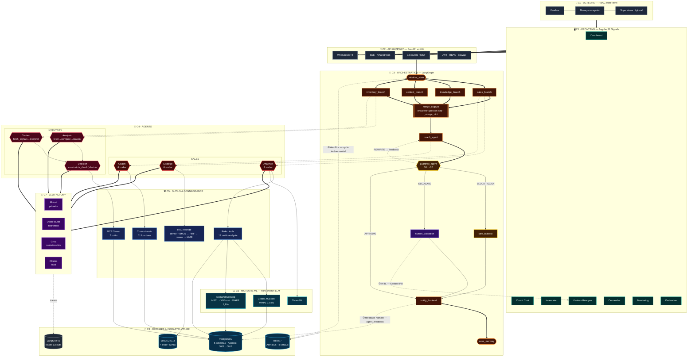

# Architecture Globale — Spécification de Conception

**Moteur Agentique Retail — Ooredoo Tunisie**
Coaching de vente temps réel × Optimisation d'approvisionnement

> **Statut** : source de vérité visuelle. Reconstruit intégralement par lecture
> du code source (`app/`, `db/migrations/`, `docker-compose.yml`,
> `D:/frontend/PFE/src/app/`) — **aucun contenu repris des anciens `docs/ARCHITECTURE_*.md`**.
>
> Branche `refactor/monolith-v2` — 2026-07-21

---

## 0. Principes architecturaux

Cinq décisions structurantes expliquent toute la forme du système. Elles doivent
rester lisibles sur n'importe quelle représentation graphique.

| # | Principe | Conséquence visuelle |
|---|---|---|
| **P1** | **Deux domaines, un état** — Sales et Inventory sont deux sous-systèmes autonomes fusionnés par un état partagé `RetailState`. | Deux colonnes symétriques qui convergent vers un axe central. |
| **P2** | **Le LLM n'est jamais sur le chemin critique du chiffre** — prévisions, gaps et métriques sont calculés par des moteurs déterministes ; le LLM ne fait que raisonner et rédiger. | Les moteurs ML sont une couche *séparée* des agents, pas dedans. |
| **P3** | **Rien ne sort sans passer le garde-fou** — un seul point de sortie, un seul gate. | Un losange unique, en goulot, avant toute notification. |
| **P4** | **L'humain est un nœud du graphe, pas une exception** — `human_validation` est un node LangGraph de première classe. | Le HITL est *dans* le flux, pas en marge. |
| **P5** | **Dégradation gracieuse partout** — chaque dépendance externe a un fallback (Milvus→corpus fichier, Groq→Ollama, Langfuse→silence, LLM→heuristique). | Chaque service externe porte un chemin de repli en pointillés. |

---

## 1. Vue macroscopique — les 8 couches

```
┌─ C0 ── ACTEURS ─────────── Vendeur · Manager · Superviseur (RBAC store-level)
├─ C1 ── FRONTEND ────────── Angular 21 Signals · 7 pages · SSE + 4 WebSockets
├─ C2 ── API GATEWAY ─────── FastAPI v4.0.0 · 13 routers · JWT · slowapi · CORS
├─ C3 ── ORCHESTRATION ───── LangGraph · 3 graphes maîtres + 6 sous-graphes
├─ C4 ── AGENTS ──────────── 7 agents (4 Sales · 3 Inventory)
├─ C5 ── OUTILS ─────────── 12 ReAct tools · 11 cross-domain · 7 MCP · RAG hybride
├─ C6 ── MOTEURS ML ──────── Holt-Winters · MSTL→XGBoost · TimesFM
├─ C7 ── LLM FACTORY ─────── 6 providers · rôles fast/smart · fallback en cascade
└─ C8 ── DONNÉES & INFRA ─── PostgreSQL (5 schémas) · Milvus · Redis · Langfuse
```

---

## 2. Couche 0 — Acteurs et périmètres RBAC

| Acteur | Périmètre | Capacités exclusives |
|---|---|---|
| **Vendeur** | son magasin | Coach chat, objectifs, création de demandes de réappro |
| **Manager magasin** | son magasin | + Kanban PO (approve/reject), validation des demandes, dashboard |
| **Superviseur régional** | multi-magasins | + monitoring agents, KPIs, file HITL, benchmark forecast |

Le cloisonnement est appliqué **au niveau `store_id`**, pas seulement à l'UI :
la résolution d'alias (`STORE_MAP`, extensible via `STORE_ALIASES_JSON`) est
faite côté serveur dans [main.py](../app/main.py) — un id inconnu passe en
pass-through multi-boutique, il n'y a plus de repli forcé vers une boutique unique.

---

## 3. Couche 1 — Frontend Angular 21

**Pages** : Dashboard · Coach Chat · Inventaire · Kanban Réappro · Demandes ·
Monitoring · Évaluation.

**Services cœur** — `D:/frontend/PFE/src/app/core/services/` :
`api.ts` · `auth.ts` · `websocket.service.ts` · `inventory-api.service.ts` ·
`purchase-order-api.service.ts` · `monitoring.service.ts` ·
`monitoring-adapter.service.ts` · `product-request.service.ts` ·
`evaluation-kpi.service.ts` · `conversation-storage.service.ts` · `layout.service.ts`

**Canaux temps réel — 4 WebSockets + 1 SSE** (à représenter distinctement) :

| Canal | Endpoint | Charge utile |
|---|---|---|
| Store feed | `/ws/store/{store_id}` | payload dashboard complet (gap, forecast, urgence) |
| Advisor feed | `/ws/advisor/{advisor_id}` | conseils poussés au vendeur |
| Inventory feed | `/api/inventory/ws/{store_id}` | stock, alertes, ruptures |
| Supply / PO bus | `supply /ws/{store_id}` | mouvements Kanban PO |
| **SSE** | `/chat/stream` | streaming token-par-token du coach |

> Détail important pour le schéma : le store feed est **multi-connexion avec
> broadcast** et **cache du dernier payload** (`_last_payload`) — une nouvelle
> connexion reçoit immédiatement l'état courant sans attendre le cycle suivant.

---

## 4. Couche 2 — API Gateway FastAPI

`Unified Retail AI API` v4.0.0 — 13 routers montés dans [main.py](../app/main.py) :

```
auth · inventory (/api/inventory) · supply · cycle · forecast · stores
monitoring · feedback · kpis · coach_rag · product_requests · hitl · supervisor
```

**Préoccupations transverses** (bandeau horizontal sur le schéma) :

- **JWT + RBAC** store-level
- **Rate limiting** — slowapi, `key_func=get_remote_address`, storage `memory://`
- **CORS** permissif (dev)
- **Sink d'erreurs dédié** — tout `ERROR/CRITICAL` de tous les modules est
  dupliqué dans `logs/errors.log`
- **Langfuse en best-effort** — le SDK est muselé à `CRITICAL` : un Langfuse KO
  ne doit jamais polluer ni ralentir un agent (application de **P5**)

---

## 5. Couche 3 — Orchestration LangGraph

### 5.1 Graphe maître — `SupervisorAgent` sur `RetailState`

Fichier : [supervisor_agent.py](../app/sales/orchestration/supervisor_agent.py)

```
                        initialize_state
                               │
        ┌──────────┬───────────┼───────────┬──────────┐      FAN-OUT PARALLÈLE
        ▼          ▼           ▼           ▼          │      (même superstep)
  sales_branch  knowledge_  context_   inventory_     │
                 branch      branch     branch        │
        └──────────┴───────────┼───────────┴──────────┘
                               ▼
                        merge_outputs          ◄── reducers obligatoires
                               │
                               ▼
                    ┌──▶ coach_agent ◀──┐
                    │          │        │  REWRITE
                    │          ▼        │  (une passe
                    │  ◇ guardrail ◇ ───┘   supplémentaire)
                    │          │
                    │          │            ◄── GOULOT UNIQUE (P3)
        ┌───────────┴──────────┼──────────────────────┐
        ▼                      ▼                      ▼
  safe_fallback         human_validation           (APPROVE)
   (BLOCK)               (ESCALATE)                    │
        └──────────────────────┼──────────────────────┘
                               ▼
                       notify_frontend
                               ▼
                         save_memory  →  END
```

> **Contrainte technique à ne pas masquer sur le schéma** : les 4 branches
> écrivent dans le *même* superstep LangGraph. Sans reducer, le graphe lève
> `InvalidUpdateError`. `RetailState` déclare donc :
> `agents_invoked: Annotated[List[str], operator.add]`,
> `errors: Annotated[List[str], operator.add]`,
> `metrics: Annotated[Dict, _merge_dict]`.
> **Les nodes retournent des deltas, jamais l'état complet.**

### 5.2 Graphe Sales — `CycleOrchestrator` sur `SalesAgentState`

Fichier : [graph.py](../app/sales/orchestration/graph.py)

```
analyste ──(route_after_analyst)──▶ stratege ──(route_after_stratege)──▶ coach ──▶ END
    └────────────────────── court-circuit possible ─────────────────────────┘
```

Le champ `route_to: Literal["strategie","coach","end"]` porte la décision de
routage. Deux arêtes conditionnelles, pas un pipeline linéaire.

### 5.3 Orchestrateur Inventory — par SKU, workers parallèles

Fichier : [orchestrator.py](../app/inventory/services/orchestrator.py)

```
pour chaque SKU (N workers parallèles) :

     analysis_agent  ╗
                     ╠══(asyncio.gather — indépendants)══▶  decision_agent
     context_agent   ╝
```

Deux optimisations à mentionner car elles ont dicté la forme :
1. **Agents singleton** — le graphe compilé est un attribut *de classe*.
   Instancier par worker coûtait `110 SKUs × 3 agents × ~3 s de compilation`.
2. **Analysis ∥ Context** — aucun des deux ne consomme la sortie de l'autre ;
   les paralléliser divise par deux le temps mur par SKU.

Chaque batch ouvre un `agent_run` en base (`inventory.agent_runs`), clôturé en
fin de cycle → traçabilité de bout en bout.

---

## 6. Couche 4 — Les 7 agents et leurs sous-graphes

Chaque agent est lui-même un `StateGraph` compilé. **Six sous-graphes** au total.

### Domaine SALES

| Agent | Sous-graphe (nodes en séquence) |
|---|---|
| **Analyste** | `receive_pos → validate_data → load_memory → ts_analyst → compare_with_memory → build_strategy_query → save_memory → END` |
| **Stratège** | `fetch_context → rag_search → analyze_context → generate_strategy → build_output → self_critique → END` |
| **Coach** | `load_context → rag_search → load_advisor_history → invoke_stratege_for_coach → generate_conseil → save_conseil → END` |
| **Guardrail** | pas un graphe — une fonction pure `evaluate_guardrails()` + `guardrail_node()` + `route_guardrail()` |

### Domaine INVENTORY

| Agent | Sous-graphe |
|---|---|
| **Analysis** | `fetch → compute → reason → END` (le `reason` LLM est optionnel : `use_llm`) |
| **Context** | `fetch_signals → interpret → END` |
| **Decision** | `constraints_check ──◇── decide → END` (arête **conditionnelle** : les contraintes dures peuvent court-circuiter le LLM) |

Chaque agent inventory suit le même quadruplet de fichiers :
`agent.py` · `nodes.py` · `prompts.py` · `tools.py`.

---

## 7. Le Guardrail en détail — 7 règles nommées

Fichier : [guardrail_agent.py](../app/sales/coaching/agents/guardrail/guardrail_agent.py)

C'est le composant le plus important à représenter fidèlement : c'est le seul
point de sortie du système.

| Règle | Contrôle | Sévérité |
|---|---|---|
| **G1** | `stock_available` — produit recommandé à stock zéro | 🔴 **BLOCK** |
| **G2** | `stockout_imminent` — rupture imminente sur le produit poussé | 🟠 |
| **G3** | `rag_source` — recommandation non sourcée par le RAG | 🟠 |
| **G4** | `business_rules` — offre non autorisée | 🔴 **BLOCK** |
| **G5** | `network_eligibility` — éligibilité réseau du client | 🟠 |
| **G6** | `confidence` — score sous le seuil minimum | 🟡 REWRITE |
| **G7** | `budget` — dépassement d'enveloppe | 🟠 |

**Statuts de sortie** et rang de sévérité (`_SEVERITY_RANK`) :

```
BLOCK (3)  ▶ remplacement par safe_fallback, l'original n'est JAMAIS envoyé
ESCALATE(2)▶ requires_human_validation = True  → nœud human_validation
REWRITE (1)▶ guardrail_feedback renvoyé au CoachAgent pour réécriture
APPROVE (0)▶ passage direct à notify_frontend
```

Le statut retenu est le **max** des sévérités déclenchées.
`requires_human_validation = status in ("ESCALATE", "BLOCK")`.

---

## 8. Couche 5 — Outils et connaissance

### 8.1 Outils ReAct de l'Analyste — 12 outils

[react_tools.py](../app/sales/coaching/agents/analyst/react_tools.py)

```
fetch_live_pos · compute_eod_forecast · compute_realtime_gap
get_intraday_trend · get_seasonal_context · get_historical_comparison
get_stock_alerts · detect_sales_anomalies · compute_ts_decomposition
forecast_multi_horizon · analyze_product_velocity · get_purchase_orders_kanban
```

Ces outils accèdent PostgreSQL en **asyncpg** direct, avec cache Redis
(`_redis_get` / `_redis_set` + TTL).

### 8.2 Outils cross-domaine du Coach — 11 fonctions publiques

[cross_domain_tools.py](../app/sales/coaching/agents/coach/cross_domain_tools.py)

```
get_sales_context · get_inventory_snapshot · get_stock_alerts
get_demand_forecast_batch · get_recommendable_products
retrieve_advisor_history · rag_search_scripts · check_promotions
score_product · rank_products
```

C'est **le pont entre les deux domaines** (P1) : le coach, côté Sales, interroge
l'inventaire. `score_product()` puis `rank_products()` produisent les
`scored_products` affichés en chips dans le chat.

### 8.3 Serveur MCP maison — 7 outils

[mcp_server.py](../app/inventory/services/mcp_server.py)

| Outil | Description (verbatim) |
|---|---|
| `get_stock_status` | stock level, lead time, MOQ, costs pour un SKU |
| `get_forecast_summary` | prévision de demande 30 j avec découpage hebdomadaire |
| `compute_inventory_metrics` | métriques de réappro complètes + risque + quantité + coûts |
| `list_purchase_orders` | liste des PO |
| `get_purchase_order` | détail d'un PO par `po_id` |
| `suggest_purchase_order` | crée un PO au statut `SUGGERE` |
| `move_purchase_order` | déplace un PO dans le Kanban |

> La **porte HITL est préservée** : `suggest_purchase_order` ne crée jamais
> qu'une suggestion ; seule une action humaine sur le Kanban la promeut.

### 8.4 RAG hybride

[retriever.py](../app/sales/data/rag/retriever.py) · [schema.py](../app/sales/data/rag/schema.py)

```
requête
  ▶ expansion de vocabulaire
  ▶ hybrid_search Milvus  ── dense FLOAT_VECTOR (client-side embedding)
                          └─ sparse SPARSE_FLOAT_VECTOR (Function BM25 server-side)
  ▶ fusion RRFRanker
  ▶ rerank métier (créneau horaire, boutique, fraîcheur, bonus stock/rupture)
  ▶ MMR (diversité)
```

Le champ `sparse` n'est **jamais fourni à l'insertion** — Milvus le dérive de
`text` via sa Function BM25 native (d'où l'exigence Milvus ≥ 2.5).
**Fallback (P5)** : corpus fichier si Milvus est indisponible ; le retriever ne
lève jamais — « un RAG muet vaut mieux qu'un crash ».

---

## 9. Couche 6 — Moteurs ML déterministes

| Moteur | Méthode | Métrique |
|---|---|---|
| `global_forecaster` | **Modèle global XGBoost** sur cible normalisée, 151 boutiques, rang 0 de la cascade | WAPE **33,4 %** |
| `timeseries_engine` | Holt-Winters saisonnier + backtest WAPE + gap horaire déterministe, repli du modèle global | WAPE **46,3 %** |
| `sensing_model` | **Demand Sensing** : baseline MSTL → correction **XGBoost** | WAPE **9,8 %** (`sensing_model_v1.ubj`) |
| `timesfm_forecaster` | Foundation model TimesFM, préchargé | optionnel |
| `backfill` | reconstruction d'historique | batch |
| `sensing_features` | features saisonnières (1,49 M lignes journalières, 4,5 ans) | — |

Application de **P2** : ces moteurs tournent **hors du LLM**. L'Analyste v4
appelle `analyze_store()` et reçoit `ts_analysis`, `hourly_gaps`,
`next_hours_forecast`, `trend_signal`, `feasibility` — le LLM ne fait que
rédiger `analyst_summary` par-dessus.

---

## 10. Couche 7 — LLM Factory

[llm_factory.py](../app/inventory/utils/llm_factory.py) — point d'entrée unique
`get_llm(provider, role, temperature)`.

| Provider | Rôle | Note |
|---|---|---|
| **Mistral La Plateforme** | primaire | quota indépendant, API compatible OpenAI |
| **OpenRouter** | `smart` / `fast` | routage par rôle |
| **Groq** | inférence rapide | **rotation de clés + fallback Ollama** |
| **Ollama** (local) | offline | `llama3.2` (analyste/stratège), `qwen2.5:0.5b` (coach), `nomic-embed-text` (embeddings) |
| OpenAI / Anthropic | disponibles | — |

---

## 11. Couche 8 — Données et infrastructure

### 11.1 PostgreSQL — 5 schémas métier

```
sales.      transactions · transactions_rt · produits · boutiques · objectifs
            vw_ca_par_boutique · vw_stock_enriched
inventory.  products · stock_levels · stock_history · sales_history
            demand_forecast · forecast_accuracy · recommendations · alerts
            promotions · business_objectives · context_adjustments
            agent_runs · stores · events
supply.     purchase_orders · suppliers · supplier_products
            reorder_params · stock_movements
market.     events · seasonal_patterns
public.     hitl_reviews · agent_feedback · product_requests · coach_interactions
```

**Alembic `0001` → `0012` est la source de vérité unique du schéma.**
Zéro DDL au runtime, zéro CSV, zéro hardcode.

| Migration | Apport |
|---|---|
| `0001` | baseline (stamp du schéma existant) |
| `0002` | suppression des defaults de colonnes I63 |
| `0003` | corrections de données produits |
| `0004` | `supply.supplier_products` |
| `0005` | chaîne causale |
| `0006` | FK manquantes |
| `0007` | commentaires de schéma |
| `0008` | `public.agent_feedback` — boucle d'apprentissage |
| `0009` | mouvements de stock liés aux ventes |
| `0010` | suivi de livraison des PO |
| `0011` | `public.product_requests` — demandes de réappro |
| `0012` | `inventory.forecast_accuracy` — demand sensing |

### 11.2 Services conteneurisés — [docker-compose.yml](../docker-compose.yml)

| Service | Image | Rôle |
|---|---|---|
| `milvus-standalone` | `milvusdb/milvus:v2.5.14` | vector store RAG (BM25 natif + `hybrid_search` + RRF) |
| `milvus-etcd` | `quay.io/coreos/etcd:v3.5.5` | métadonnées Milvus |
| `milvus-minio` | `minio:RELEASE.2023-03-20` | object store Milvus |
| `retail-redis` | `redis:7-alpine` | **Alert Bus Pub/Sub** + cache (256 Mo, `allkeys-lru`, persistance désactivée) |
| `langfuse` | `langfuse/langfuse:2` | observabilité LLM — traces, coûts |
| `langfuse-db` | `postgres:15` | backing store Langfuse (isolé) |

---

## 12. Les mécanismes transverses (à tracer en pointillés)

### 12.1 Alert Bus — 4 canaux Redis Pub/Sub

[alert_bus.py](../app/sales/core/alert_bus.py)

| Canal | Émetteur | Charge utile |
|---|---|---|
| `stock` | InventoryAnalysis | `sku`, `stock_qty`, `risk_level`, `days_to_stockout`, `revenue_at_risk`, `is_top_seller`, `alternative_sku` |
| `sales` | AnalystAgent | `urgency`, `gap_amount`, `gap_pct`, `hours_remaining`, `advisor_idle` |
| `cross` | transverse | `title`, `message`, `severity`, `data` |
| `cycle` | orchestrateur | événements de cycle (`cycle_id`, `event`) |

C'est la **boucle ①** : une rupture détectée publie sur le canal `stock`, le
subscriber déclenche un cycle agent — sans intervention humaine.

### 12.2 Circuit Breaker par agent

[circuit_breaker.py](../app/sales/core/circuit_breaker.py)

```
CLOSED ──(3 échecs consécutifs)──▶ OPEN ──(60 s)──▶ HALF_OPEN ──(1 succès)──▶ CLOSED
                                                          └──(1 échec)──▶ OPEN
```
`half_open_max = 1` appel simultané. L'état est exposé au monitoring
(`circuit_states` dans `SalesAgentState`).

### 12.3 HITL — boucle ②

Nœud `human_validation` + table `public.hitl_reviews` + Kanban PO.
Un PO suggéré (`SUGGERE`) attend approbation ; la boucle se ferme au statut
`RECU`, qui réinjecte le stock réel.

### 12.4 Apprentissage — boucle ③

`public.agent_feedback` (migration `0008`) + `feedback_score` + `procedural_rules`
dans l'état → règles apprises réinjectées dans les prompts.

### 12.5 Feature flags

[config.py](../app/sales/core/config.py) — le système est activable par morceaux :
`enable_state_bus` · `enable_circuit_breaker` · `enable_inventory_sync` ·
`enable_critique_agent` (avec `critique_min_score = 0.80`, `critique_max_cycles = 2`) ·
`enable_supervisor`.

### 12.6 Suite d'évaluation

`evals/` — 5 runners : `run_guardrail` (100 %) · `run_models` (benchmark
providers) · `run_coach` (E2E) · `run_rag` · `run_ragas`.
Plus `judge.py` (LLM-as-judge), `metrics.py`, `langfuse_sink.py`, `report.py`.

---

## 13. Diagramme Mermaid de référence



---

## 14. Charte graphique normative

Toute image générée **doit** respecter ce système. Fond sombre, palette froide,
un seul accent chaud (le rouge Ooredoo) réservé aux agents Sales.

| Rôle sémantique | Couleur | Trait | Fond |
|---|---|---|---|
| Agents **Sales** | Rouge Ooredoo | `#E30613` | `#450A0A` |
| Agents **Inventory** | Rose profond | `#FB7185` | `#4C0519` |
| **Orchestration** LangGraph | Orange brûlé | `#FB923C` | `#431407` |
| **Guardrail** (le plus épais) | Ambre | `#FACC15` | `#422006` |
| **HITL / humain** | Violet | `#A78BFA` | `#2E1065` |
| **Outils & RAG** | Bleu | `#60A5FA` | `#172554` |
| **ML / Forecasting** | Cyan | `#22D3EE` | `#083344` |
| **LLM Providers** | Pourpre | `#C084FC` | `#3B0764` |
| **Données & Infra** | Bleu ciel | `#38BDF8` | `#082F49` |
| **Observabilité** | Gris | `#9CA3AF` | `#1F2937` |
| **Frontend** | Sarcelle | `#14B8A6` | `#042F2E` |
| **Acteurs** | Ardoise | `#64748B` | `#1E293B` |
| Fond général | Ardoise nuit | `#0B1220` | — |
| Texte principal | Blanc cassé | `#F1F5F9` | — |
| Texte secondaire | Gris ardoise | `#94A3B8` | — |

### Grammaire de tracé

| Signification | Tracé |
|---|---|
| Flux synchrone principal | trait **plein épais** (2,5 px), flèche pleine |
| Flux synchrone secondaire | trait plein fin (1,5 px) |
| Rattachement agent ↔ node | **pointillé** fin |
| Boucle de rétroaction | **tireté courbe**, ambre 60 %, badge numéroté ①②③ |
| Fan-out parallèle | flèches divergentes depuis un point unique + accolade « même superstep » |
| Décision conditionnelle | **losange**, arêtes étiquetées par la condition |
| Point d'entrée / sortie | **stade** (rectangle à bouts arrondis) |
| Base de données | **cylindre** |
| Agent | **hexagone** |
| Service / composant | rectangle arrondi 12 px |

### Interdits

Pas de 3D, pas d'isométrie, pas de dégradés sur les formes, pas d'ombres
portées, pas d'icônes de robot ni de cerveau, pas de texture circuit imprimé,
pas de néon cyberpunk. Le rendu vise la **documentation d'ingénierie**
(Stripe, Vercel, Temporal), pas l'illustration marketing.

---

## 15. Index des fichiers sources

| Sujet | Fichier |
|---|---|
| Graphe superviseur | [supervisor_agent.py](../app/sales/orchestration/supervisor_agent.py) |
| Graphe sales | [graph.py](../app/sales/orchestration/graph.py) |
| Orchestrateur inventory | [orchestrator.py](../app/inventory/services/orchestrator.py) |
| `RetailState` | [retail_state.py](../app/sales/core/retail_state.py) |
| `SalesAgentState` | [state.py](../app/sales/core/state.py) |
| Guardrail G1–G7 | [guardrail_agent.py](../app/sales/coaching/agents/guardrail/guardrail_agent.py) |
| Alert Bus | [alert_bus.py](../app/sales/core/alert_bus.py) |
| Circuit Breaker | [circuit_breaker.py](../app/sales/core/circuit_breaker.py) |
| Outils ReAct analyste | [react_tools.py](../app/sales/coaching/agents/analyst/react_tools.py) |
| Outils cross-domaine | [cross_domain_tools.py](../app/sales/coaching/agents/coach/cross_domain_tools.py) |
| Serveur MCP | [mcp_server.py](../app/inventory/services/mcp_server.py) |
| RAG hybride | [retriever.py](../app/sales/data/rag/retriever.py) · [schema.py](../app/sales/data/rag/schema.py) |
| Factory LLM | [llm_factory.py](../app/inventory/utils/llm_factory.py) |
| Feature flags | [config.py](../app/sales/core/config.py) |
| API & WebSockets | [main.py](../app/main.py) |
| Infrastructure | [docker-compose.yml](../docker-compose.yml) |
| Migrations | [db/migrations/versions/](../db/migrations/versions/) |
