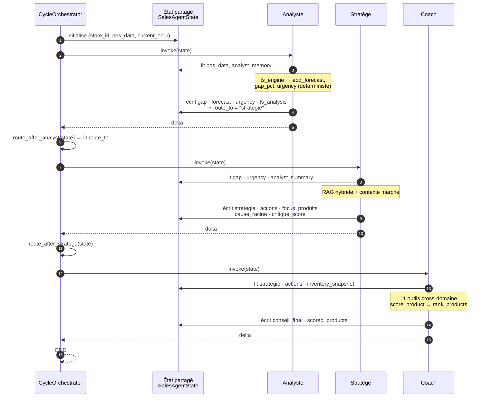
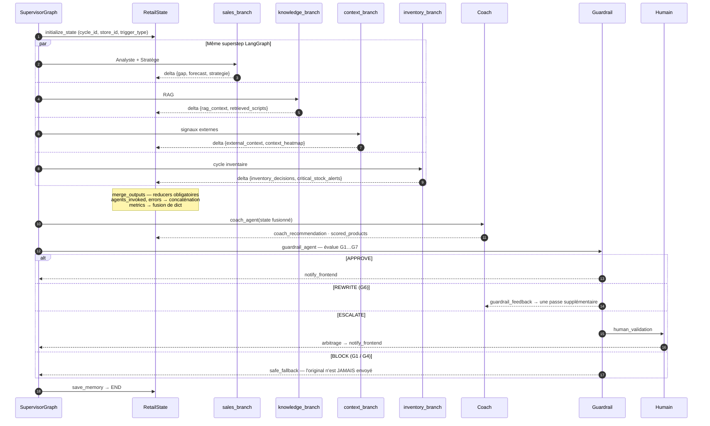
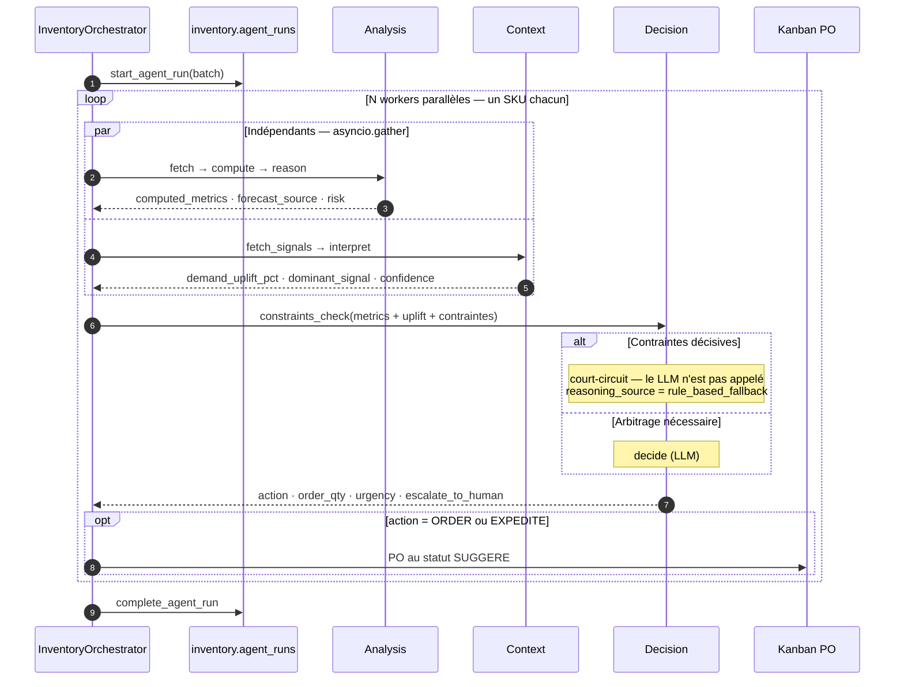
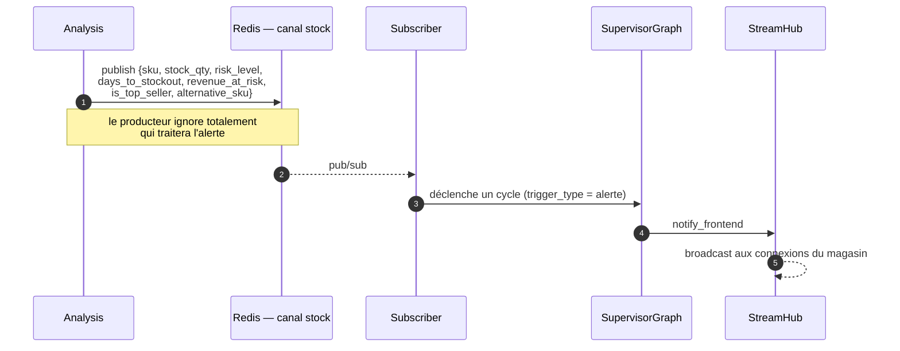
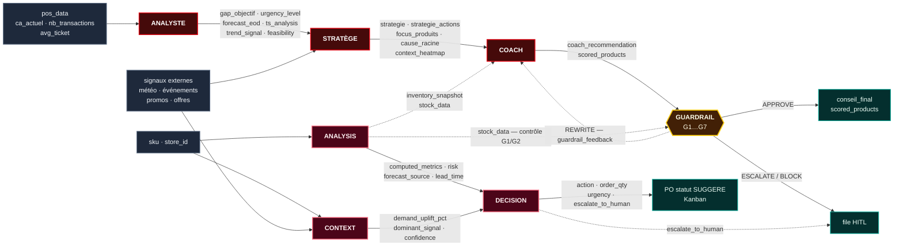

# Architecture Multi-Agents — Contrats d'entrée/sortie et orchestration

Cinquième vue, complémentaire des quatre de [VUES_ARCHITECTURE.md](VUES_ARCHITECTURE.md).
Elle répond à : **que consomme et que produit exactement chaque agent, et
comment se passent-ils le relais ?**

Tous les noms de champs ci-dessous sont extraits du code, pas paraphrasés.

---

## 1. Le principe de communication

Les agents **ne s'appellent jamais directement**. Ils communiquent par
**mutation d'un état partagé typé** — `SalesAgentState` pour la chaîne vente,
`RetailState` pour le superviseur, un dictionnaire de pipeline pour l'inventaire.

```
        ┌──────────────────────────────────────────────┐
        │           ÉTAT PARTAGÉ (TypedDict)           │
        └──────────────────────────────────────────────┘
              ▲            ▲            ▲           ▲
       lit ───┤     écrit ─┤     lit ───┤    écrit ─┤
              │            │            │           │
          Agent A      Agent A      Agent B     Agent B
```

Trois conséquences majeures :

1. **Un agent ignore qui l'a précédé et qui le suivra.** Il déclare seulement les
   champs qu'il lit et ceux qu'il écrit.
2. **Chaque nœud retourne un *delta***, jamais l'état complet — sinon les
   branches parallèles s'écrasent mutuellement.
3. **L'ajout d'un agent ne modifie aucun agent existant** : il suffit d'ajouter
   des champs à l'état et une arête au graphe.

---

## 2. Registre des 7 agents

| # | Agent | Domaine | Rôle en une phrase | LLM |
|---|---|---|---|---|
| 1 | **Analyste** | Vente | Mesure l'écart à l'objectif et projette la fin de journée | rédaction seule |
| 2 | **Stratège** | Vente | Explique la cause et propose des actions contextualisées | raisonnement |
| 3 | **Coach** | Vente | Traduit la stratégie en conseil adressé au vendeur | rédaction |
| 4 | **Guardrail** | Transverse | Autorise, réécrit, escalade ou bloque la sortie | optionnel |
| 5 | **Analysis** | Stock | Diagnostique la couverture et le risque d'un SKU | optionnel |
| 6 | **Context** | Stock | Quantifie l'effet des signaux externes sur la demande | optionnel |
| 7 | **Decision** | Stock | Décide d'une commande, d'une quantité et d'une urgence | optionnel |

> **Point d'architecture** : les agents 5, 6 et 7 fonctionnent avec `use_llm=False`.
> Le LLM est un *enrichissement*, pas une dépendance — en mode dégradé, des
> heuristiques déterministes (`rule_based_fallback`) prennent le relais et le
> système continue de décider.

---

## 3. Contrats d'entrée / sortie, agent par agent

### 3.1 Agent ANALYSTE — `app/sales/coaching/agents/analyst/`

Sous-graphe : `receive_pos → validate_data → load_memory → ts_analyst → compare_with_memory → build_strategy_query → save_memory`

| | Champs |
|---|---|
| **ENTRÉE** | `store_id` · `pos_data` {`ca_actuel`, `nb_transactions_today`, `avg_ticket`} · `current_hour` · `analyst_memory` |
| **SORTIE** | `urgency_level` · `urgency_score` · `gap_objectif` · `gap_amount` · `forecast_eod` · `forecast_mape` · `coverage` · `attainment` · `analyst_summary` · `ts_analysis` · `trend_signal` · `hourly_gaps` · `next_hours_forecast` · `feasibility` · `analysis_features` · `timesfm_prediction` · **`route_to = "strategie"`** |
| **OUTILS** | 12 outils ReAct — `fetch_live_pos`, `compute_eod_forecast`, `compute_realtime_gap`, `get_intraday_trend`, `get_seasonal_context`, `get_historical_comparison`, `get_stock_alerts`, `detect_sales_anomalies`, `compute_ts_decomposition`, `forecast_multi_horizon`, `analyze_product_velocity`, `get_purchase_orders_kanban` |
| **MOTEUR** | `ts_engine` — Holt-Winters saisonnier, backtest WAPE, intervalle de confiance |

**Rôle du LLM** : il ne calcule rien. Le moteur déterministe produit
`eod_forecast`, `gap_pct`, `urgency_level` ; le LLM rédige uniquement
`analyst_summary`. C'est le principe « le LLM hors du chemin critique du chiffre ».

**Passage de relais** : l'analyste écrit lui-même `route_to = "strategie"` — il
désigne son successeur.

---

### 3.2 Agent STRATÈGE — `app/sales/coaching/agents/stratege/`

Sous-graphe : `fetch_context → rag_search → analyze_context → generate_strategy → build_output → self_critique`

| | Champs |
|---|---|
| **ENTRÉE** | `gap_objectif` · `urgency_level` · `analyst_summary` · `ts_analysis` · `focus` implicite via `analysis_features` |
| **ENTRÉE externe** | météo · événements datés (`market.events`) · promotions · offres actives |
| **SORTIE** | `strategie` · `strategie_actions` · `focus_produits` · `message_manager` · `cause_racine` (alias `root_cause`) · `context_heatmap` · `context_signals` · `external_context` · `rag_used` · `nb_rag_scripts` · `critique_score` · `critique_passed` · `strategie_source` · `strategie_cached` |
| **OUTILS** | RAG hybride (Milvus dense+BM25 → RRF → rerank → MMR) · scrapers événements |

**Auto-critique** : le nœud terminal `self_critique` note sa propre production.
Sous `critique_min_score = 0.80`, une révision est déclenchée — au maximum
`critique_max_cycles = 2`. **C'est une boucle interne à l'agent**, invisible du
graphe parent.

**Traçabilité du cache** : `strategie_source` vaut `success`, `cached`,
`stale_cache`, `fallback` ou `pre_loaded`. On sait toujours si une stratégie a
été réellement calculée ou servie depuis le cache.

---

### 3.3 Agent COACH — `app/sales/coaching/agents/coach/`

Sous-graphe : `load_context → rag_search → load_advisor_history → invoke_stratege_for_coach → generate_conseil → save_conseil`

| | Champs |
|---|---|
| **ENTRÉE** | `user_message` · `advisor_id` · `strategie` · `strategie_actions` · `focus_produits` · `inventory_snapshot` · historique du conseiller |
| **SORTIE** | `conseil_final` · `coach_recommendation` · `scored_products` · `rag_context` · `rag_query` · `rag_used` · `nb_rag_scripts` · `coach_context.conseil_result` {`reply`, `source`, `rag_used`} |
| **OUTILS** | 11 fonctions cross-domaine — `get_sales_context`, `get_inventory_snapshot`, `get_stock_alerts`, `get_demand_forecast_batch`, `get_recommendable_products`, `retrieve_advisor_history`, `rag_search_scripts`, `check_promotions`, `score_product`, `rank_products`, `get_realtime_kpis` |

**Le coach est le seul agent inter-domaines.** `get_inventory_snapshot` et
`get_demand_forecast_batch` franchissent la frontière vente → stock. C'est ce
qui permet de ne jamais recommander un produit en rupture.

**Invocation imbriquée** : le nœud `invoke_stratege_for_coach` appelle le
Stratège *depuis l'intérieur* du Coach, avec un timeout borné et un préchargement
en arrière-plan. Un agent en invoque donc un autre — mais toujours via le graphe,
jamais par appel direct.

---

### 3.4 Agent GUARDRAIL — `app/sales/coaching/agents/guardrail/`

Pas un sous-graphe : une fonction pure `evaluate_guardrails()`, exposée au graphe
par `guardrail_node()` et `route_guardrail()`.

| | Champs |
|---|---|
| **ENTRÉE** | `coach_recommendation` · `scored_products` · `stock_data` · `rag_used` · `critique_score` (→ `confidence`) · règles métier · budget |
| **SORTIE** | `guardrail_status` · `guardrail_issues` · `guardrail_feedback` · `guardrail_confidence` · `requires_human_validation` · `guardrail_safe_fallback` |

**Les 7 règles :**

| Règle | Contrôle | Sévérité |
|---|---|---|
| G1 | `stock_available` — produit à stock zéro | 🔴 **BLOCK** |
| G2 | `stockout_imminent` | 🟠 ESCALATE |
| G3 | `rag_source` — recommandation non sourcée | 🟠 |
| G4 | `business_rules` — offre non autorisée | 🔴 **BLOCK** |
| G5 | `network_eligibility` | 🟠 |
| G6 | `confidence` sous le seuil | 🟡 REWRITE |
| G7 | `budget` dépassé | 🟠 |

Le statut retenu est le **maximum** des sévérités déclenchées :
`BLOCK (3) > ESCALATE (2) > REWRITE (1) > APPROVE (0)`.
`requires_human_validation = status ∈ {ESCALATE, BLOCK}`.

**Le guardrail est le seul agent qui peut renvoyer le flux en arrière** :
le statut `REWRITE` réinjecte `guardrail_feedback` dans le Coach pour une passe
supplémentaire.

---

### 3.5 Agent ANALYSIS (stock) — `app/inventory/agents/analysis/`

Sous-graphe : `fetch → compute → reason`

| Nœud | Entrée | Sortie |
|---|---|---|
| `fetch` | `sku` · `store_id` | `fetch_data` {`stock`, `product`, `sales_df`, `forecast_df`, `ts_result`, **`forecast_source`**, `business_objective`, `seasonal_profile`} |
| `compute` | `fetch_data` | `computed_metrics` · `business_objective` · `seasonal_profile` · `seasonal_uplift` |
| `reason` (LLM) | `computed_metrics` | `objective_note` · `risk_rationale` · `risk_override` · `override_reason` |

**`forecast_source` est un champ d'audit essentiel** : il vaut
`demand_sensing_db` (prévision XGBoost en base), `live_ts_engine` (calcul à la
volée) ou `fallback_flat` (demande factice, faute de couverture). Il permet de
savoir si une décision repose sur une vraie prévision.

---

### 3.6 Agent CONTEXT (stock) — `app/inventory/agents/context/`

Sous-graphe : `fetch_signals → interpret`

| Nœud | Entrée | Sortie |
|---|---|---|
| `fetch_signals` | `sku` · `store_id` · `category` | `signals` {`historical_patterns`, `promotions`, `weather`, `holidays`, `events`, `market_offers`, `today`, `horizon`} |
| `interpret` (LLM) | `signals` | `context_report` {**`demand_uplift_pct`**, `interpretation`, `confidence`, `dominant_signal`, `reasoning_source`} |

Les six collecteurs de signaux tournent en parallèle. La sortie utile tient en un
nombre — `demand_uplift_pct` — et un `dominant_signal` qui dit *pourquoi*.

**Analysis et Context sont strictement indépendants** : ni l'un ni l'autre ne lit
la sortie de l'autre. C'est ce qui autorise leur parallélisation.

---

### 3.7 Agent DECISION (stock) — `app/inventory/agents/decision/`

Sous-graphe : `constraints_check ──◇── decide` (arête conditionnelle)

| | Champs |
|---|---|
| **ENTRÉE Analysis** | `computed_metrics` · `risk_assessment` · `analyst_flag` · `lifecycle_stage` · `lead_time_avg_days` |
| **ENTRÉE Context** | `demand_uplift_pct` · `confidence` · `dominant_signal` |
| **ENTRÉE contraintes** | `moq` · `moq_is_binding` · `high_cost_flag` · `objective_conflict` · `total_replenishment_cost` |
| **SORTIE** | `decision` {`action`, `order_qty`, `order_qty_rationale`, `urgency`, `decision_rationale`, `confidence`, `trade_offs`, `escalate_to_human`, `escalation_reason`, `recommendation_text`, `reasoning_source`} |

**Valeurs contraintes** :
`action ∈ {ORDER, EXPEDITE, MONITOR}` · `urgency ∈ {immediate, this_week, this_month, none}`

**L'arête conditionnelle est un court-circuit économique** : si
`constraints_check` conclut seul, le LLM n'est jamais appelé. La quantité suit
`max(EOQ, MOQ)` ajustée par l'uplift de demande.

**`escalate_to_human`** est le point d'entrée du HITL côté stock : la décision
devient un PO au statut `SUGGERE` sur le Kanban, en attente d'approbation.

---

## 4. Les quatre modes d'orchestration

Le système n'a pas *un* mode de coordination mais quatre, choisis selon le
déclencheur.

### Mode A — Chaîne séquentielle avec passage de relais (`CycleOrchestrator`)



**Caractéristique** : le successeur est désigné par l'agent lui-même via
`route_to`. Un agent peut donc court-circuiter le suivant.

---

### Mode B — Fan-out parallèle avec fusion (`SupervisorAgent`)



**Caractéristique** : les quatre branches écrivent dans le **même superstep**.
Sans reducer déclaré, LangGraph lève `InvalidUpdateError`. C'est la contrainte la
plus structurante de tout le système.

---

### Mode C — Pipeline par SKU, workers parallèles (`InventoryOrchestrator`)



**Caractéristiques** : agents **singleton** partagés entre workers — instancier
par worker coûtait `110 SKUs × 3 agents × ~3 s` de compilation de graphe. Et
`analysis ∥ context` car aucun ne consomme la sortie de l'autre.

---

### Mode D — Événementiel (`AlertBus`)



**Quatre canaux** : `stock` (rupture), `sales` (écart d'objectif), `cross`
(transverse), `cycle` (événements de cycle).
**Caractéristique** : c'est la **seule inversion de dépendance** du système —
l'infrastructure remonte vers l'orchestration.

---

## 5. Carte de propagation des données

Quel agent produit quoi, et qui le consomme ensuite.



**Les deux ponts inter-domaines** sont en pointillés — ce sont les seuls
couplages horizontaux, et ils vont tous deux du stock vers la vente :
`inventory_snapshot` alimente le Coach, `stock_data` alimente les règles G1/G2
du Guardrail.

---

## 6. Tableau de synthèse des contrats

| Agent | Consomme | Produit | Déclencheur du suivant |
|---|---|---|---|
| **Analyste** | `pos_data`, `analyst_memory` | 17 champs d'analyse | écrit `route_to` |
| **Stratège** | analyse + contexte + RAG | 14 champs de stratégie | arête conditionnelle |
| **Coach** | stratégie + stock + historique | `conseil_final`, `scored_products` | arête directe |
| **Guardrail** | recommandation + stock + confiance | 6 champs de contrôle | **routage à 4 sorties** |
| **Analysis** | `sku`, `store_id` | `computed_metrics`, `forecast_source` | fusion vers Decision |
| **Context** | `sku`, signaux externes | `demand_uplift_pct`, `dominant_signal` | fusion vers Decision |
| **Decision** | Analysis + Context + contraintes | `decision` (11 champs) | PO `SUGGERE` / HITL |

---

## 7. Propriétés vérifiables de l'orchestration

Quatre propriétés qui tiennent par construction, et non par convention :

**① Aucune sortie ne contourne le Guardrail.** Tous les chemins vers
`notify_frontend` passent par `guardrail_agent`. C'est une propriété du graphe.

**② Aucun agent n'appelle un autre agent directement.** Les seules exceptions
passent par le graphe (`invoke_stratege_for_coach` compile et invoque le
sous-graphe du Stratège, il n'appelle pas ses fonctions).

**③ Le système décide sans LLM.** Avec `use_llm=False` partout, les moteurs
déterministes et les `rule_based_fallback` produisent toujours une décision. Le
LLM améliore la formulation et l'arbitrage, il ne les conditionne pas.

**④ Toute décision est traçable jusqu'à sa source de données.**
`forecast_source`, `reasoning_source`, `strategie_source` et `rag_used` disent
si une sortie repose sur une vraie prévision, un vrai calcul, une vraie source
documentaire — ou sur un repli.

---

## Générer l'image de cette vue

Le prompt dédié est dans
[prompts/05_MULTI_AGENT_ARCHITECTURE.md](prompts/05_MULTI_AGENT_ARCHITECTURE.md).
