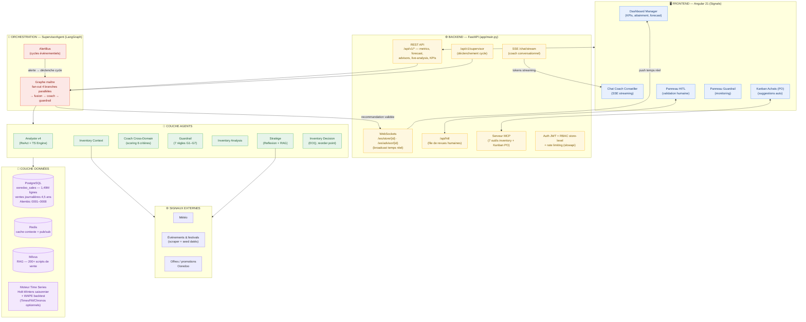
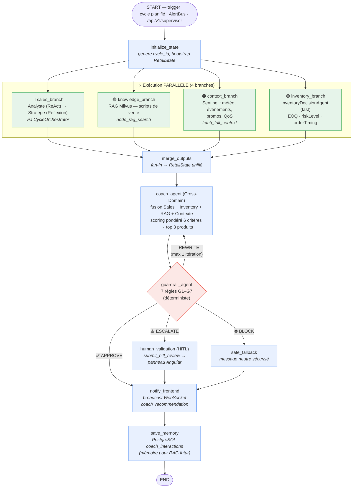
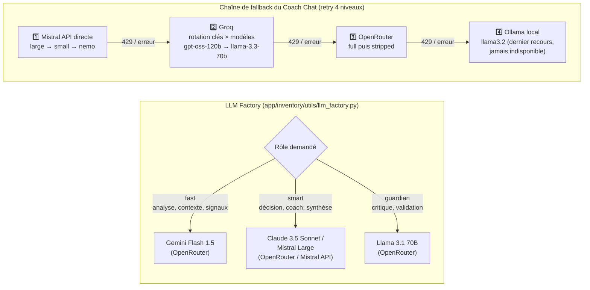
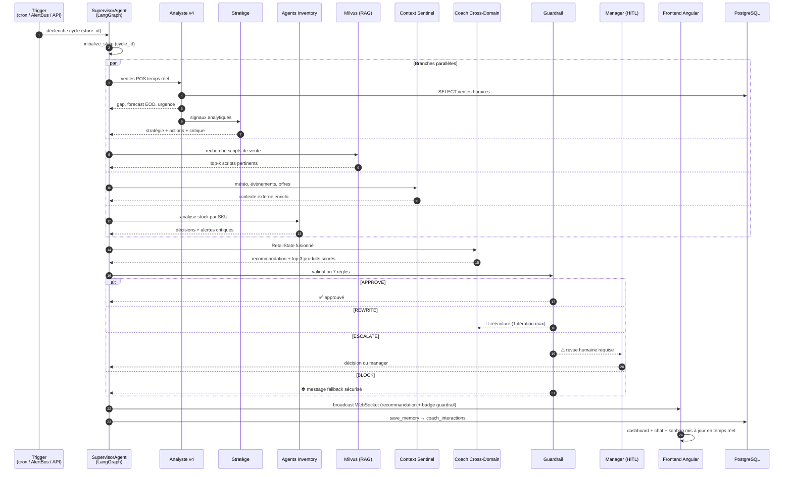
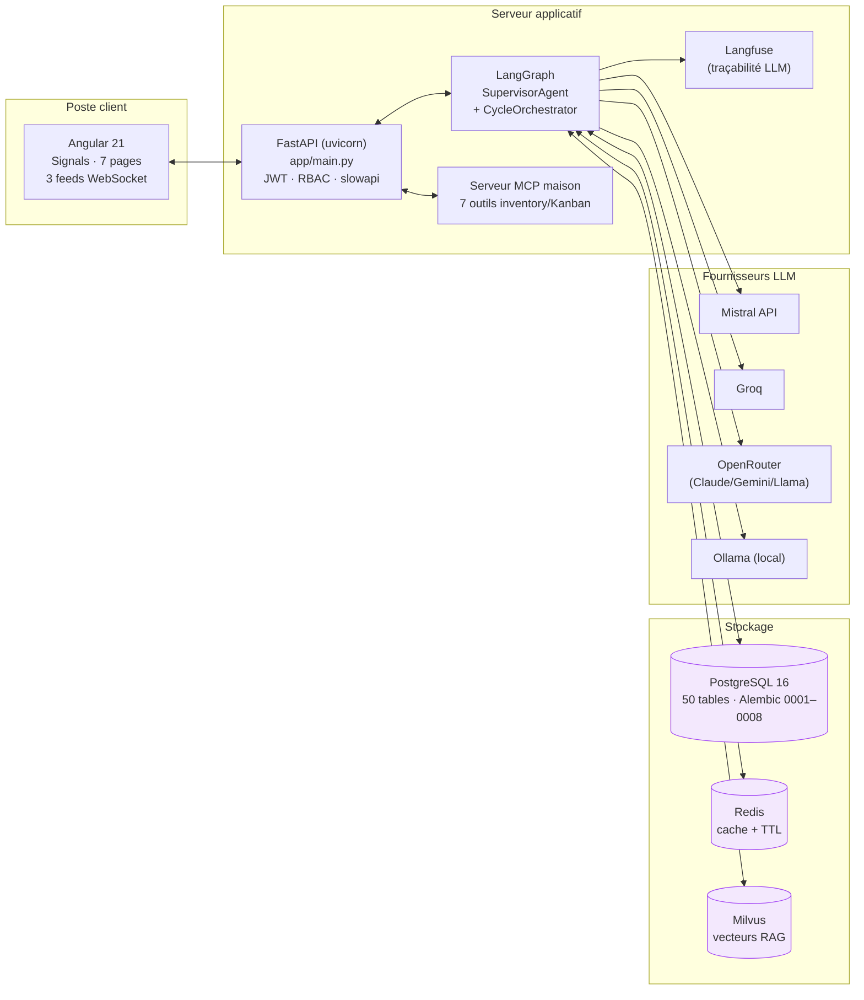

# Architecture Complète — Moteur Agentique Retail Ooredoo Tunisie

> **Système multi-agents temps réel** : coaching de vente + optimisation des stocks.
> Stack : FastAPI · LangGraph · PostgreSQL · Redis · Milvus · Angular 21.
> Document destiné au rapport — chaque diagramme est exportable en image (Mermaid).

---

## 1. Vue d'ensemble globale (macro-architecture)

---

## 2. Graphe de l'orchestrateur — SupervisorAgent (LangGraph)

Topologie exacte de `app/sales/orchestration/supervisor_agent.py` : fan-out parallèle sur 4 branches, fan-in, puis pipeline séquentiel avec routage conditionnel du Guardrail.

**Contrat d'état** : chaque nœud retourne uniquement son *delta* sur le `RetailState` (TypedDict LangGraph avec *reducers* — `operator.add` pour `agents_invoked`/`errors`, merge pour `metrics`), ce qui rend le fan-out parallèle sûr (pas d'`InvalidUpdateError`).

---

## 3. Fiche détaillée de chaque agent — entrées / sorties / LLM

| Agent | Pattern | LLM utilisé | Entrées (inputs) | Sorties (outputs) |
|---|---|---|---|---|
| **Analyste v4** | ReAct + moteur TS déterministe (LLM **hors chemin critique**) | Ollama local (fallback narration uniquement) | Ventes POS temps réel (PostgreSQL), objectif journalier, historique horaire | `gap_pct`, `forecast_eod` (Holt-Winters), `hourly_gaps`, `next_hours_forecast` (h+1..h+3), `urgency_level`, `urgency_score`, `trend_signal`, `analyst_summary`, anomalies |
| **Stratège** | Reflexion (génération → auto-critique → révision) + RAG | OpenRouter (rôle *smart*) → fallback Ollama local | Sortie Analyste, contexte externe (météo/événements/offres), stock critique (`vw_stock_enriched`), scripts RAG | `strategie`, `strategie_actions`, `focus_produits`, `cause_racine`, `message_manager`, `critique_score`, `critique_passed`, `feasibility` |
| **Knowledge (RAG)** | Retrieval sémantique | — (embeddings uniquement) | Requête construite depuis le gap/contexte | `rag_context` (docs + query), `retrieved_scripts` (top-k scripts Milvus, fallback corpus local) |
| **Context Sentinel** | Collecte de signaux | — (déterministe) | APIs météo, scraper événements/festivals, offres Ooredoo, QoS réseau | `external_context`, `context_report`, `context_heatmap`, `context_signals` (événements en cours / à venir) |
| **Inventory Analysis** | Analyse par SKU | Rôle *fast* (Gemini Flash via OpenRouter) hors mode `fast=True` | Stock par SKU, ventes, lead times fournisseurs (`supplier_products`) | Métriques stock : couverture, vélocité, rotation |
| **Inventory Decision** | Règles + formules (EOQ, point de commande) | Rôle *smart* pour la narration (désactivé en mode `fast`) | Métriques Inventory Analysis, objectif métier (`avoid_stockout`) | `inventory_decisions`, `critical_stock_alerts`, `riskLevel`, `orderTiming`, `formulaOrderQty`, suggestions de PO (Kanban, statut `SUGGERE`) |
| **Coach Cross-Domain** | Fusion multi-domaines, scoring pondéré 6 critères | — (scoring déterministe `rank_products`) | Contexte ventes, produits recommandables, historique conseiller, alertes stock | `coach_recommendation` (produit à pousser / à éviter, message conseiller, justification, confiance), `scored_products` (top 3) |
| **Coach Chat** (conversationnel) | Chat + Stratège serveur-side + RAG unifié | **Mistral primaire** (large→small→nemo) → Groq (rotation clés × modèles) → OpenRouter → Ollama (**retry 4 niveaux**) | Question du conseiller, RetailState du dernier cycle, scripts RAG | Réponse streamée en SSE token par token |
| **Guardrail** | 100 % déterministe — 7 règles G1–G7 (aucun appel LLM) | — | `coach_recommendation`, `strategie_actions`, alertes stock | `guardrail_status` (APPROVE / REWRITE / ESCALATE / BLOCK), `guardrail_issues`, `guardrail_confidence`, `requires_human_validation`, `guardrail_safe_fallback` |
| **Supervisor** | Orchestrateur LangGraph (StateGraph) | — | Trigger (cron, AlertBus, API), `store_id`, `advisor_id` | RetailState final, broadcast WS, persistance `coach_interactions` |

---

## 4. Stratégie LLM — sélection tiérée & chaîne de résilience

**Principe clé** : les calculs critiques (prévision, gap, EOQ, guardrail, scoring) sont **déterministes** — le LLM n'intervient que pour la génération de langage (stratégie, coaching, narration), avec un fallback local garantissant la disponibilité même sans aucune API externe.

---

## 5. Flux de données de bout en bout (séquence d'un cycle)

---

## 6. Entrées / Sorties du système (contrats d'interface)

### Entrées (Inputs)
| Source | Canal | Contenu |
|---|---|---|
| Point de vente (POS) | PostgreSQL `ooredoo_sales` | Ventes journalières/horaires — 1,49M lignes, 4,5 ans d'historique |
| Conseiller de vente | SSE `/chat/stream`, REST `/chat` | Questions en langage naturel |
| Manager | REST `/api/hitl`, Kanban | Validations HITL, approbation des PO suggérés |
| Signaux externes | Scrapers + seeds | Météo, festivals/concerts datés, offres Ooredoo |
| AlertBus | Interne (événementiel) | Alertes stock/ventes → déclenchement de cycles |
| Feedback humain | Table feedback (migration 0008) | Boucle d'apprentissage sur les recommandations |

### Sorties (Outputs)
| Destination | Canal | Contenu |
|---|---|---|
| Dashboard manager | WS `/ws/store/{id}` | KPIs, attainment, forecast EOD, hourly performance, alertes |
| Conseiller | WS `/ws/advisor/{id}` + SSE | Recommandation coach (produit à pousser/éviter), réponses chat |
| Kanban achats | Outils MCP (`suggest/move/list_purchase_order`) | PO auto-suggérés (SUGGERE → … → RECU, porte HITL préservée) |
| Panneau HITL | REST + WS | Revues escaladées par le Guardrail |
| Mémoire système | PostgreSQL `coach_interactions` | Historique des cycles pour le RAG futur |
| Observabilité | Langfuse + monitoring router | Traces LLM, métriques par nœud (`*_branch_ms`) |

---

## 7. Vue déploiement / composants techniques

---

## 8. Points d'architecture différenciants (à mettre en avant dans le rapport)

1. **Fan-out parallèle LangGraph** — les 4 branches (ventes, connaissance, contexte, inventaire) s'exécutent simultanément ; le `RetailState` avec *reducers* garantit une fusion sans conflit d'écriture.
2. **LLM hors chemin critique** — la prévision (Holt-Winters + backtest WAPE), le scoring produits et le Guardrail sont déterministes : le système reste fonctionnel et fiable même si tous les LLM sont indisponibles.
3. **Résilience LLM à 4 niveaux** — Mistral → Groq (rotation multi-clés) → OpenRouter → Ollama local : aucune dépendance à un fournisseur unique.
4. **Guardrail systématique** — chaque recommandation passe par 7 règles avec 4 issues possibles (approve / rewrite / escalate / block), dont une escalade humaine (HITL) native.
5. **Boucle fermée cross-domain** — les alertes stock influencent le coaching de vente (produit à éviter) et génèrent des suggestions de PO sur le Kanban, avec approbation humaine avant toute commande.
6. **Temps réel de bout en bout** — AlertBus événementiel → cycle agentique → broadcast WebSocket → UI Angular, sans polling.
