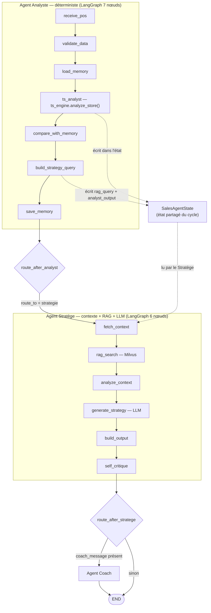
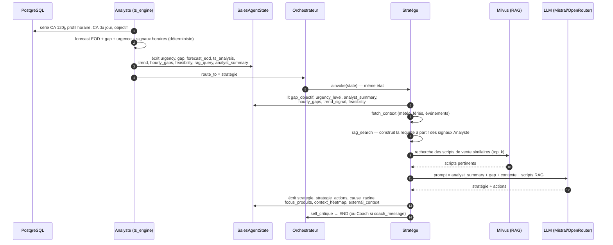
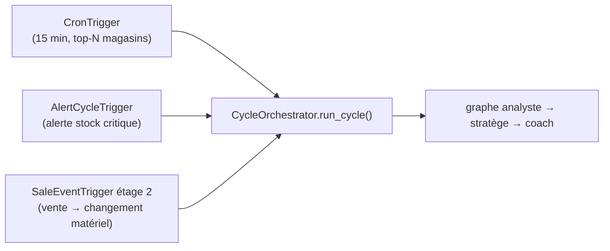

# Chaîne Analyste → Stratège

> Comment la sortie de l'agent **Analyste** (déterministe, temps réel) alimente
> l'agent **Stratège** (contexte + RAG + LLM). Document dérivé du code —
> `app/sales/coaching/agents/{analyst,stratege}` et `app/sales/orchestration/graph.py`.

---

## 1. Vue d'ensemble

Les deux agents partagent **un seul objet d'état** (`SalesAgentState`) qui traverse
tout le cycle. L'Analyste ne « parle » pas au Stratège : il **écrit ses résultats
dans l'état**, et l'orchestrateur enchaîne le Stratège qui **lit ces mêmes champs**.
Le couplage est donc un *contrat de données*, pas un appel direct.

- **Analyste** : 100 % déterministe (`ts_engine`), < 1 s, aucun LLM dans le chemin
  critique. Produit forecast EOD, gap, urgence, signaux horaires, et une
  `rag_query` d'intention.
- **Orchestrateur** (`CycleOrchestrator`) : graphe LangGraph `analyste → stratège → coach`.
- **Stratège** : lit les signaux de l'Analyste, ajoute le contexte externe
  (météo, fériés, événements), fait un RAG Milvus, puis génère la stratégie via LLM.

La dépendance est **réelle** (pas seulement séquentielle) : le Stratège construit sa
requête de récupération RAG à partir de l'urgence, du gap et des signaux temps réel
calculés par l'Analyste.

---

## 2. Flux global de la chaîne

---

## 3. Contrat de données — ce que l'Analyste transmet

Écrit par `node_ts_analysis` ([ts_node.py](../app/sales/coaching/agents/analyst/ts_node.py))
et `node_build_strategy_query` ([nodes.py](../app/sales/coaching/agents/analyst/nodes.py)),
lu par le Stratège ([stratege/nodes.py](../app/sales/coaching/agents/stratege/nodes.py)).

| Champ d'état | Type | Produit par | Usage côté Stratège |
|---|---|---|---|
| `urgency_level` | LOW/MEDIUM/HIGH/CRITICAL | ts_engine | pilote le ton de la requête RAG + priorité des actions |
| `urgency_score` | float 0-1 | ts_engine | scoring |
| `gap_objectif` (`gap_pct`) | float % | ts_engine | intention stratégique (combler le retard) |
| `gap_amount` | float TND | ts_engine | montant restant à réaliser |
| `forecast_eod` | float TND | ts_engine | prévision fin de journée |
| `forecast_mape` | float % | ts_engine | fiabilité de la prévision |
| `coverage`, `attainment` | float % | ts_engine | couverture / réalisé |
| `analyst_summary` | texte FR | ts_engine | injecté dans le prompt du LLM stratège |
| `ts_analysis` | dict complet | ts_engine | ledger horaire, CI, moteur |
| `trend_signal` | ACCELERATING/STABLE/DECELERATING | ts_engine | « relance immédiate » vs « capitaliser momentum » |
| `hourly_gaps` | liste heures | ts_engine | heures sous-performantes ciblées |
| `next_hours_forecast` | liste h+1..h+3 | ts_engine | attendu des prochaines heures |
| `feasibility` | ACHIEVED…VERY_HARD | ts_engine | « prioriser actions fort impact » si VERY_HARD |
| `rag_query` / `strategy_intent` | texte | build_strategy_query | graine de la requête RAG |
| `analyst_output` | dict | build_strategy_query | bloc complet (`next_agent = stratege`) |
| `route_to` | "strategie" | ts_node / build_strategy_query | routage |

---

## 4. Séquence détaillée du handoff

---

## 5. Ce que le Stratège produit en retour

Une fois la chaîne terminée, l'état porte les sorties du Stratège, consommées par le
dashboard et le Coach :

| Champ | Description |
|---|---|
| `strategie` | narratif stratégique (LLM) |
| `strategie_actions` | actions concrètes (produit cible, script, priorité) |
| `cause_racine` | diagnostic de la cause du gap |
| `focus_produits` | produits à pousser |
| `context_heatmap` / `context_signals` | grille de risque contextuelle |
| `external_context` | météo, fériés, événements (festivals), offres Ooredoo |
| `message_manager` | message de synthèse pour le manager |
| `rag_used` / `nb_rag_scripts` | traçabilité de la récupération RAG |

---

## 6. Déclenchement de la chaîne

Le cycle `analyste → stratège` est lancé par plusieurs voies (toutes via
`CycleOrchestrator.run_cycle`) :

> Note : l'**étage 1** de `SaleEventTrigger` (recalcul analytique poussé au
> dashboard) appelle `ts_engine.analyze_store` **seul**, sans passer par le
> Stratège — c'est le temps réel « bon marché ». Le cycle complet ci-dessus
> (étage 2) n'est déclenché que si l'urgence, la faisabilité ou le gap ont
> matériellement bougé.

---

## Fichiers de référence

| Rôle | Fichier |
|---|---|
| Graphe Analyste | `app/sales/coaching/agents/analyst/agent.py` |
| Moteur déterministe | `app/sales/coaching/agents/analyst/ts_engine.py` |
| Nœud TS + écriture état | `app/sales/coaching/agents/analyst/ts_node.py` |
| build_strategy_query | `app/sales/coaching/agents/analyst/nodes.py` |
| Graphe Stratège | `app/sales/coaching/agents/stratege/agent.py` |
| Nœuds Stratège (lecture état + RAG + LLM) | `app/sales/coaching/agents/stratege/nodes.py` |
| Orchestrateur du cycle | `app/sales/orchestration/graph.py` |
| État partagé | `app/sales/core/state.py` |
