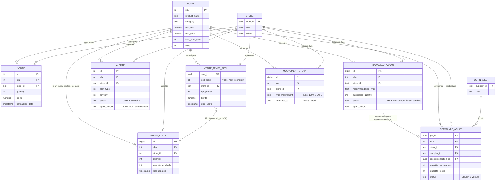

# Architecture conceptuelle des données — Ooredoo Retail Coach

Document de référence généré le 2026-07-05, vérifié entièrement contre le schéma **live** de `ooredoo_sales` (introspection directe `information_schema`/`pg_constraint`, pas les fichiers de migration — voir [Fiabilité des sources](#fiabilité-des-sources) ci-dessous).

## Diagramme entité-relation (entités centrales)

## Rôle de chaque schéma Postgres

| Schéma | Rôle | Tables clés | État |
|---|---|---|---|
| `sales` | Référentiel produits/stores + historique de ventes batch | `produits`, `boutiques`, `agents`, `transactions`, `transactions_rt`, `objectifs` | Actif, bien indexé |
| `inventory` | Stock, alertes, recommandations générées par les agents IA | `stock_levels`, `alerts`, `recommendations`, `products`, `sales_history`, `stock_history` | Actif — durci cette session (contraintes, dédoublonnage, FK) |
| `supply` | Cycle d'approvisionnement (achats, fournisseurs, mouvements) | `purchase_orders`, `suppliers`, `stock_movements`, `reorder_params` | Actif mais sous-exploité (`stock_movements.reference_type` presque toujours `'VENTE'`, jamais `'BC'`) |
| `market` | Signaux marché (concurrence, événements, saisonnalité) | `competitor_pricing`, `events`, `mnp_flows`, `seasonal_patterns` | Actif, alimente le Coach/Stratège |
| `customer` | Segmentation et satisfaction client | `segments`, `nps_csat`, `churn_signals` | Partiellement peuplé (`churn_signals` vide) |
| `coaching` | Événements et recommandations du module coaching | `coaching_events`, `coaching_recommendations`, `escalations`, `hitl_requests` | La plupart des tables vides (0 lignes) sauf `coaching_events` |
| `monitoring` | Observabilité (cycles agents, KPIs live) | `cycle_logs`, `realtime_store_pulse`, `coaching_interactions` | Actif |
| `agent` | — | 8 tables | **Confirmé mort** : 0 ligne dans toutes les tables, abandonné au profit de `public.agent_*` |
| `public` | Auth, logs agents, KPIs agrégés | `app_users`, `app_sessions`, `agent_logs`, `agent_kpi_daily` | Actif |

## Relations ajoutées cette session (migrations 011-014)

- `supply.purchase_orders.recommendation_id` → `inventory.recommendations.id` (`ON DELETE SET NULL`) — trace qu'une commande provient d'une recommandation approuvée.
- `inventory.alerts.sku/store_id` → `sales.produits`/`sales.boutiques`
- `inventory.recommendations.sku/store_id` → `sales.produits`/`sales.boutiques`
- `supply.purchase_orders.sku/store_id` → `sales.produits`/`sales.boutiques`
- `supply.stock_movements.sku/store_id` → `sales.produits`/`sales.boutiques`
- Index unique partiel `uq_reco_pending_sku_store` : une seule recommandation `pending` active par (sku, store_id).
- Contraintes CHECK sur `inventory.alerts.status` et `inventory.recommendations.status`.
- Trigger `trg_sync_stock_on_reco` **supprimé** — corrigeait un bug de corruption (une recommandation suggérée gonflait le stock physique avant toute approbation/réception).

## Limites connues, assumées (pas des angles morts)

- **`sales.transactions_rt.cod_prod`** joue le rôle de `sku` mais porte un nom différent, sans FK — cohérence de valeurs vérifiée (100% des `cod_prod` existent dans `sales.produits`), mais la convention de nommage reste incohérente. `des_produit` contient parfois le SKU brut au lieu du vrai nom produit (bug de données dans le pool du simulateur temps réel, pas corrigé).
- **`sales.transactions_history`** est une **vue** (`transactions` UNION ALL `transactions_rt`), pas une table — aucune contrainte n'y est applicable directement.
- **`supply.stock_movements`** a la bonne forme pour tracer chaque mouvement de stock (`reference_id`, `reference_type`, `stock_avant`, `stock_apres`) mais ces colonnes ne sont peuplées que pour les ventes (`type_mouvement='VENTE'`) — la réception de commande d'achat n'y écrit jamais rien aujourd'hui. Point d'ancrage identifié pour une future amélioration : `supply_repo.update_status()` sur la transition `RECU`/`RECU_PARTIEL`.
- **`agent_run_id`** sur `inventory.alerts` reste à 100% NULL — le chemin d'insertion qui le pourrait (`sync_alerts_to_db`) ne reçoit pas cet identifiant du pipeline batch sans modifier le contrat de retour de `orchestrator.analyze_batch()`. Non corrigé cette session (jugé plus invasif que sa valeur, qui est purement un champ d'audit).
- **Alembic n'est pas le mécanisme réel de migration** pour ce projet — les deux configurations (`inventory-module/alembic.ini`, `sales-module/alembic.ini`) pointent vers une base `asc_db` inexistante. Le mécanisme réel est `data/telco/*.sql` exécuté via `scripts/run_all_migrations.py` (voir la liste `MIGRATIONS` dans ce fichier pour l'ordre réel appliqué).

## Fiabilité des sources

Toutes les informations de ce document ont été vérifiées par introspection directe de la base `ooredoo_sales` (`information_schema.columns`, `pg_constraint`, `pg_indexes`, comptages de lignes réels) durant les sessions de durcissement de la fondation data (voir `data/telco/migration_011*.sql` à `migration_014*.sql`). Les fichiers `.py` sous `inventory-module/db/migrations/` et `sales-module/data/migrations/` (Alembic) décrivent un schéma différent de celui réellement en production — ne pas s'y fier pour comprendre l'état actuel.
