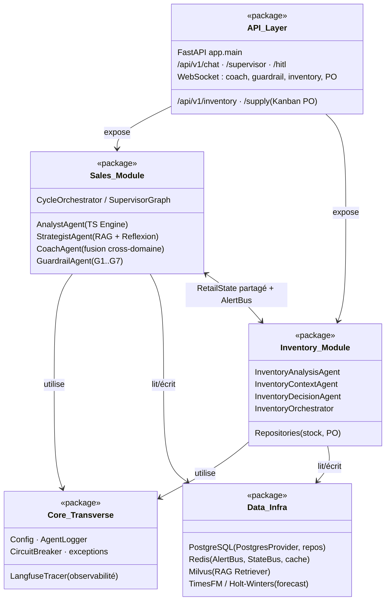
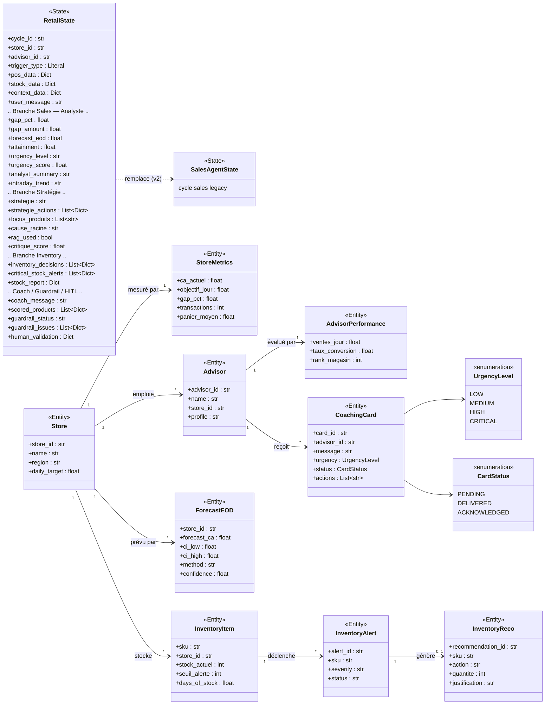
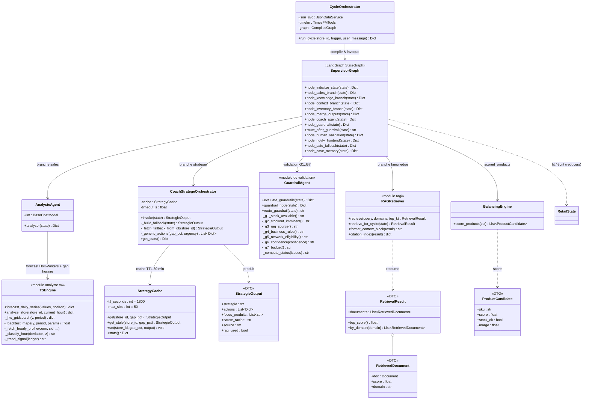
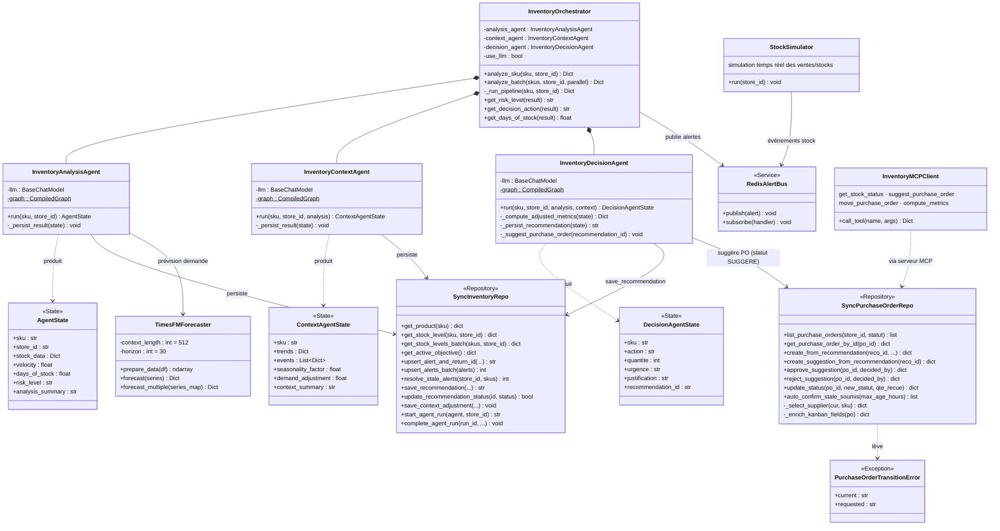
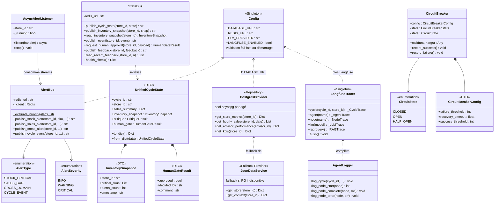

# Diagrammes de Classes — Moteur Agentique Retail (Sales + Inventory)

> Diagrammes UML de classes conçus à partir du code réel du package `app/`.
> Format **Mermaid** : rendu natif dans GitHub/GitLab/VS Code, exportable en
> PNG/SVG haute résolution via <https://mermaid.live> pour insertion dans le rapport.

Convention : les `TypedDict` LangGraph sont stéréotypés `<<State>>`, les modèles
Pydantic `<<Entity>>`, les dataclasses `<<DTO>>`, les énumérations `<<enumeration>>`.

---

## 1. Vue d'ensemble — Diagramme de packages

Positionne les grands sous-systèmes avant le détail des classes.

---

## 2. Modèle de domaine & états partagés

Le cœur du système : l'état unifié `RetailState` circule entre toutes les
branches du graphe LangGraph ; les entités Pydantic modélisent le domaine métier.

---

## 3. Module Sales — Agents de coaching & orchestration

Le `SupervisorGraph` (LangGraph) exécute 4 branches en parallèle puis fusionne
dans le CoachAgent, validé par le GuardrailAgent avant notification.

---

## 4. Module Inventory — Pipeline multi-agents & approvisionnement (Kanban PO)

Pipeline séquentiel Analysis → Context → Decision par SKU, avec persistance
des recommandations et suggestion automatique de bons de commande (HITL).

---

## 5. Communication inter-modules & infrastructure transverse

Bus Redis (alertes + état unifié), observabilité Langfuse, résilience
CircuitBreaker et accès données PostgreSQL.

---

## 6. Lecture recommandée pour le rapport

| # | Diagramme | Chapitre suggéré |
|---|-----------|------------------|
| 1 | Packages | Architecture générale (vue macroscopique) |
| 2 | Domaine & états | Conception — modèle de données / état partagé |
| 3 | Module Sales | Conception détaillée — coaching agentique |
| 4 | Module Inventory | Conception détaillée — optimisation stocks & Kanban PO |
| 5 | Infrastructure | Conception — communication, résilience, observabilité |

**Export haute qualité** : coller chaque bloc dans <https://mermaid.live> →
*Actions → PNG (scale 3)* ou SVG, puis insérer dans le rapport.
