# Diagrammes d'Architecture Globale — Moteur Agentique Retail Ooredoo

**Coaching de vente temps réel × Optimisation d'approvisionnement**
Branche `refactor/monolith-v2` — 2026-07-21

> **Portée** : jeu de diagrammes prêts à insérer dans un rapport. Chaque vue
> répond à une question différente et se lit indépendamment.
>
> | Vue | Question à laquelle elle répond |
> |---|---|
> | §1 Contexte | Qui utilise le système et de quoi dépend-il ? |
> | §2 Couches | Comment le système est-il structuré ? |
> | §3 Flux | Comment fonctionne-t-il, d'un déclencheur à une action ? |
> | §4 Orchestration | Comment les agents collaborent-ils concrètement ? |
> | §5 Déploiement | Qu'est-ce qui tourne où ? |
> | §6 Transverse | Qu'est-ce qui traverse toutes les couches ? |
>
> **Documents liés** : [ARCHITECTURE_GLOBALE_VISUELLE.md](ARCHITECTURE_GLOBALE_VISUELLE.md)
> (spécification textuelle détaillée) · [DIAGRAMME_CLASSES_METIER.md](DIAGRAMME_CLASSES_METIER.md)
> (modèle du domaine) · [DIAGRAMMES_CLASSES.md](DIAGRAMMES_CLASSES.md) (classes techniques).

---

## 0. Comment lire ces diagrammes

### Code couleur sémantique

| Couleur | Signification |
|---|---|
| 🔴 **Rouge Ooredoo** | Agents du domaine **Sales** |
| 🌸 **Rose** | Agents du domaine **Inventory** |
| 🟠 **Orange** | Orchestration LangGraph |
| 🟡 **Ambre, trait épais** | **Guardrail** — le seul point de sortie |
| 🟣 **Violet** | Intervention **humaine** (HITL) |
| 🔵 **Bleu** | Outils, RAG, MCP |
| 🩵 **Cyan** | Moteurs ML déterministes |
| 💜 **Pourpre** | Fournisseurs LLM |
| 🌊 **Bleu ciel** | Données & infrastructure |
| 🟢 **Sarcelle** | Frontend Angular |
| ⚪ **Ardoise** | Acteurs humains |

### Grammaire de tracé

| Tracé | Signification |
|---|---|
| `═══▶` trait épais | Flux synchrone principal |
| `───▶` trait fin | Flux synchrone secondaire |
| `- - ▶` pointillés | Rattachement, dépendance, ou **boucle de rétroaction** ①②③ |
| `◇` losange | Décision conditionnelle |
| `⬡` hexagone | Agent |
| `▭` cylindre | Base de données / store |
| `⬭` stade | Point d'entrée / sortie de graphe |

### Les 5 principes qui expliquent la forme du système

| # | Principe | Lecture sur les diagrammes |
|---|---|---|
| **P1** | **Deux domaines, un état** — Sales et Inventory fusionnés par `RetailState` | Deux colonnes symétriques convergeant vers un axe central |
| **P2** | **Le LLM n'est jamais sur le chemin critique du chiffre** | Les moteurs ML forment une couche *séparée* des agents |
| **P3** | **Rien ne sort sans passer le garde-fou** | Un losange unique en goulot avant toute notification |
| **P4** | **L'humain est un nœud du graphe, pas une exception** | Le HITL est *dans* le flux, pas en marge |
| **P5** | **Dégradation gracieuse partout** | Chaque service externe porte un chemin de repli en pointillés |

---

## 1. Vue de contexte — le système dans son environnement

Niveau le plus haut : une seule boîte pour le système, ses utilisateurs et ses
dépendances externes.

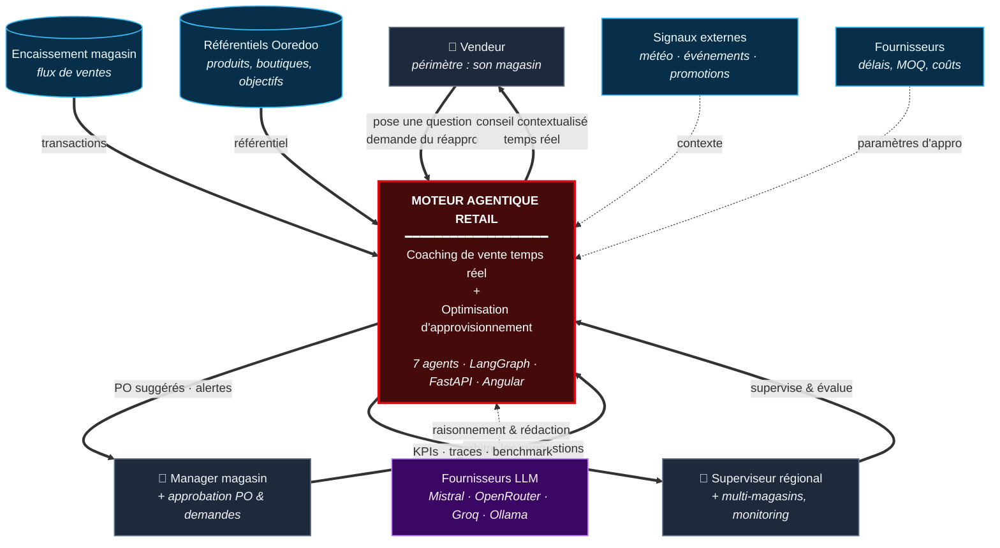

---

## 2. Vue macroscopique — les 8 couches

La structure du système, en bandes empilées. Chaque bande ne connaît que la
bande immédiatement en dessous.

```mermaid
flowchart TB

  subgraph L0["　C0 · ACTEURS　—　RBAC appliqué au niveau store_id, côté serveur　"]
    direction LR
    A1["Vendeur"]:::actor
    A2["Manager magasin"]:::actor
    A3["Superviseur régional"]:::actor
  end

  subgraph L1["　C1 · FRONTEND　—　Angular 21 · Signals　"]
    direction LR
    F1["Dashboard"]:::front
    F2["Coach Chat"]:::front
    F3["Inventaire"]:::front
    F4["Kanban Réappro"]:::front
    F5["Demandes"]:::front
    F6["Monitoring"]:::front
    F7["Évaluation"]:::front
  end

  subgraph L2["　C2 · API GATEWAY　—　FastAPI v4.0.0　"]
    direction LR
    G1["13 routers REST"]:::api
    G2["SSE<br/>/chat/stream"]:::api
    G3["WebSocket ×4<br/>store · advisor · inventory · supply"]:::api
    G4["JWT · RBAC<br/>slowapi · CORS"]:::api
  end

  subgraph L3["　C3 · ORCHESTRATION　—　LangGraph · 3 graphes maîtres　"]
    direction LR
    O1["SupervisorAgent<br/><i>RetailState</i>"]:::orch
    O2["CycleOrchestrator<br/><i>SalesAgentState</i>"]:::orch
    O3["InventoryOrchestrator<br/><i>par SKU, N workers</i>"]:::orch
  end

  subgraph L4["　C4 · AGENTS　—　7 agents · 6 sous-graphes compilés　"]
    direction LR
    subgraph L4S["SALES"]
      direction LR
      AG1["Analyste"]:::agent
      AG2["Stratège"]:::agent
      AG3["Coach"]:::agent
      AG7["Guardrail"]:::guard
    end
    subgraph L4I["INVENTORY"]
      direction LR
      AG4["Analysis"]:::agent2
      AG5["Context"]:::agent2
      AG6["Decision"]:::agent2
    end
  end

  subgraph L5["　C5 · OUTILS & CONNAISSANCE　"]
    direction LR
    T3["ReAct tools<br/>12 outils analyste"]:::tool
    T4["Cross-domain<br/>11 fonctions"]:::tool
    T1["Serveur MCP<br/>7 outils"]:::tool
    T2["RAG hybride<br/>dense + BM25"]:::tool
  end

  subgraph L6["　C6 · MOTEURS ML　—　déterministes, hors chemin LLM　（P2）"]
    direction LR
    M1["Global XGBoost<br/>WAPE 33,4 % · repli Holt-Winters"]:::ml
    M2["Demand Sensing<br/>MSTL → XGBoost · WAPE 9,8 %"]:::ml
    M3["TimesFM<br/><i>foundation model, préchargé</i>"]:::ml
  end

  subgraph L7["　C7 · LLM FACTORY　—　get_llm par rôle, fallback en cascade　（P5）"]
    direction LR
    P1["Mistral<br/><i>primaire</i>"]:::llm
    P2["OpenRouter<br/><i>fast / smart</i>"]:::llm
    P3["Groq<br/><i>+ rotation de clés</i>"]:::llm
    P4["Ollama<br/><i>local, offline</i>"]:::llm
  end

  subgraph L8["　C8 · DONNÉES & INFRASTRUCTURE　"]
    direction LR
    D1[("PostgreSQL<br/>5 schémas métier<br/>Alembic 0001→0012")]:::data
    D2[("Milvus 2.5.14<br/>vector store RAG")]:::data
    D3[("Redis 7<br/>Alert Bus · cache")]:::data
    D4[("Langfuse v2<br/>traces & coûts")]:::obs
  end

  L0 ==> L1
  L1 ==> L2
  L2 ==> L3
  L3 ==> L4
  L4 ==> L5
  L5 ==> L6
  L4 ==> L7
  L5 ==> L8
  L6 ==> L8
  L7 -.->|"traces"| L8

  style L0 fill:#0F172A,stroke:#64748B,stroke-width:2px,color:#F1F5F9
  style L1 fill:#042F2E,stroke:#14B8A6,stroke-width:2px,color:#ECFDF5
  style L2 fill:#0F172A,stroke:#94A3B8,stroke-width:2px,color:#F8FAFC
  style L3 fill:#2C1004,stroke:#FB923C,stroke-width:2px,color:#FFF7ED
  style L4 fill:#2C0707,stroke:#E30613,stroke-width:2px,color:#FFFFFF
  style L4S fill:#450A0A,stroke:#E30613,stroke-width:1px,color:#FFFFFF
  style L4I fill:#4C0519,stroke:#FB7185,stroke-width:1px,color:#FFF1F2
  style L5 fill:#0C1B3A,stroke:#60A5FA,stroke-width:2px,color:#EFF6FF
  style L6 fill:#062430,stroke:#22D3EE,stroke-width:2px,color:#ECFEFF
  style L7 fill:#240445,stroke:#C084FC,stroke-width:2px,color:#FAF5FF
  style L8 fill:#052135,stroke:#38BDF8,stroke-width:2px,color:#F0F9FF

  classDef actor  fill:#1E293B,stroke:#64748B,stroke-width:1.5px,color:#F1F5F9
  classDef front  fill:#064E3B,stroke:#14B8A6,stroke-width:1.5px,color:#ECFDF5
  classDef api    fill:#1E293B,stroke:#94A3B8,stroke-width:1.5px,color:#F8FAFC
  classDef orch   fill:#431407,stroke:#FB923C,stroke-width:1.5px,color:#FFF7ED
  classDef agent  fill:#7F1D1D,stroke:#E30613,stroke-width:2px,color:#FFFFFF
  classDef agent2 fill:#881337,stroke:#FB7185,stroke-width:2px,color:#FFF1F2
  classDef guard  fill:#713F12,stroke:#FACC15,stroke-width:2.5px,color:#FEFCE8
  classDef tool   fill:#172554,stroke:#60A5FA,stroke-width:1.5px,color:#EFF6FF
  classDef ml     fill:#083344,stroke:#22D3EE,stroke-width:1.5px,color:#ECFEFF
  classDef llm    fill:#3B0764,stroke:#C084FC,stroke-width:1.5px,color:#FAF5FF
  classDef data   fill:#082F49,stroke:#38BDF8,stroke-width:1.5px,color:#F0F9FF
  classDef obs    fill:#1F2937,stroke:#9CA3AF,stroke-width:1.5px,color:#F9FAFB
```

**Lecture des couches**

| Couche | Contenu | Chiffre clé |
|---|---|---|
| **C0** Acteurs | 3 rôles, cloisonnement `store_id` côté serveur | résolution d'alias `STORE_MAP` |
| **C1** Frontend | Angular 21 Signals, 7 pages | 4 WebSockets + 1 SSE |
| **C2** API | FastAPI v4.0.0 | 13 routers |
| **C3** Orchestration | LangGraph | 3 graphes maîtres + 6 sous-graphes |
| **C4** Agents | 4 Sales + 3 Inventory | 7 agents |
| **C5** Outils | ReAct · cross-domain · MCP · RAG | 12 + 11 + 7 outils |
| **C6** Moteurs ML | Global XGBoost · Holt-Winters · MSTL→XGBoost | WAPE 33,4 % (ventes) et 9,8 % (demand sensing) |
| **C7** LLM Factory | 6 providers, rôles `fast`/`smart` | fallback en cascade |
| **C8** Données | PostgreSQL · Milvus · Redis · Langfuse | 5 schémas, 12 migrations |

---

## 3. Vue de flux — d'un déclencheur à une action validée

La vue la plus importante : elle montre le **fonctionnement**, pas la structure.
Quatre déclencheurs entrent à gauche, une action tracée sort à droite, trois
boucles de rétroaction reviennent.

```mermaid
flowchart LR

  subgraph TRIG["① DÉCLENCHEURS"]
    direction TB
    TR1["Vente temps réel<br/><i>transactions_rt</i>"]:::trig
    TR2["Seuil de stock franchi<br/><i>stock_levels</i>"]:::trig
    TR3["Cycle programmé<br/><i>planning horaire</i>"]:::trig
    TR4["Message du vendeur<br/><i>coach chat</i>"]:::trig
  end

  BUS{{"Alert Bus — Redis Pub/Sub<br/>canaux : stock · sales · cross · cycle"}}:::infra
  INIT(["initialize_state<br/><i>RetailState</i>"]):::orch

  subgraph PERCEP["② PERCEPTION — fan-out parallèle, même superstep"]
    direction TB
    B1["sales_branch<br/><b>Analyste</b><br/><i>gap, forecast EOD, urgence</i>"]:::agent
    B2["knowledge_branch<br/><b>Stratège + RAG</b><br/><i>stratégie, cause racine</i>"]:::agent
    B3["context_branch<br/><i>météo, événements, promos</i>"]:::agent
    B4["inventory_branch<br/><b>Analysis ∥ Context → Decision</b>"]:::agent2
  end

  MERGE[["merge_outputs<br/><i>reducers : operator.add · _merge_dict</i>"]]:::orch

  subgraph DECIDE["③ DÉCISION"]
    direction TB
    COACH["<b>Coach</b><br/><i>fusion cross-domaine</i><br/>scored_products"]:::agent
    RECO["<b>Recommandation d'achat</b><br/><i>quantité, urgence, arbitrages</i>"]:::agent2
  end

  GUARD{"<b>GUARDRAIL</b><br/>G1…G7<br/>━━━━━━━<br/>goulot unique（P3）"}:::guard

  subgraph OUT["④ SORTIE"]
    direction TB
    FALL["safe_fallback<br/><i>l'original n'est jamais envoyé</i>"]:::guard
    HITL["<b>human_validation</b><br/><i>nœud du graphe</i>（P4）"]:::hitl
    NOTIF["notify_frontend<br/><i>WebSocket · SSE</i>"]:::orch
  end

  subgraph ACT["⑤ ACTION"]
    direction TB
    AC1["Conseil affiché<br/>au vendeur"]:::front
    AC2["PO suggéré<br/><i>statut SUGGERE</i>"]:::front
    AC3["Alerte / demande<br/>de réappro"]:::front
  end

  KANBAN["<b>Kanban Réappro</b><br/>SUGGERE → SOUMIS → CONFIRME<br/>→ EXPEDIE → RECU"]:::hitl
  STOCK[("stock_levels<br/><i>stock réel</i>")]:::data
  FEED[("agent_feedback<br/><i>followed · ignored<br/>approved · rejected</i>")]:::data
  MEM(["save_memory"]):::orch

  TR1 & TR2 ==> BUS
  TR3 ==> INIT
  TR4 ==> INIT
  BUS ==> INIT

  INIT ==> B1 & B2 & B3 & B4
  B1 & B2 & B3 & B4 ==> MERGE
  MERGE ==> COACH
  MERGE ==> RECO
  COACH ==> GUARD
  RECO ==> GUARD

  GUARD -->|"BLOCK · G1/G4"| FALL
  GUARD -->|"ESCALATE"| HITL
  GUARD ==>|"APPROVE"| NOTIF
  GUARD -.->|"REWRITE · G6<br/>une passe supplémentaire"| COACH

  FALL --> NOTIF
  HITL --> NOTIF
  NOTIF ==> AC1 & AC2 & AC3
  NOTIF ==> MEM

  AC2 ==> KANBAN
  AC3 ==> KANBAN
  KANBAN ==>|"statut RECU<br/>réception physique"| STOCK
  STOCK -.->|"<b>① boucle événementielle</b><br/>rupture détectée → nouveau cycle"| BUS

  KANBAN -.->|"<b>② boucle HITL</b><br/>décision du manager"| FEED
  AC1 -.->|"<b>③ boucle d'apprentissage</b><br/>conseil suivi ou ignoré"| FEED
  FEED -.->|"règles apprises réinjectées<br/>dans les prompts"| DECIDE

  style TRIG   fill:#0F172A,stroke:#64748B,stroke-width:2px,color:#F1F5F9
  style PERCEP fill:#2C0707,stroke:#E30613,stroke-width:2px,color:#FFFFFF
  style DECIDE fill:#2C1004,stroke:#FB923C,stroke-width:2px,color:#FFF7ED
  style OUT    fill:#1A0F33,stroke:#A78BFA,stroke-width:2px,color:#F5F3FF
  style ACT    fill:#042F2E,stroke:#14B8A6,stroke-width:2px,color:#ECFDF5

  classDef trig   fill:#1E293B,stroke:#64748B,stroke-width:1.5px,color:#F1F5F9
  classDef infra  fill:#082F49,stroke:#38BDF8,stroke-width:2px,color:#F0F9FF
  classDef orch   fill:#431407,stroke:#FB923C,stroke-width:1.5px,color:#FFF7ED
  classDef agent  fill:#7F1D1D,stroke:#E30613,stroke-width:2px,color:#FFFFFF
  classDef agent2 fill:#881337,stroke:#FB7185,stroke-width:2px,color:#FFF1F2
  classDef guard  fill:#713F12,stroke:#FACC15,stroke-width:3px,color:#FEFCE8
  classDef hitl   fill:#2E1065,stroke:#A78BFA,stroke-width:2px,color:#F5F3FF
  classDef front  fill:#064E3B,stroke:#14B8A6,stroke-width:1.5px,color:#ECFDF5
  classDef data   fill:#082F49,stroke:#38BDF8,stroke-width:1.5px,color:#F0F9FF
```

### Les 7 règles du Guardrail

Le composant le plus important du flux : **le seul point de sortie du système**.

| Règle | Contrôle | Verdict |
|---|---|---|
| **G1** | `stock_available` — produit recommandé à stock zéro | 🔴 **BLOCK** |
| **G2** | `stockout_imminent` — rupture imminente sur le produit poussé | 🟠 ESCALATE |
| **G3** | `rag_source` — recommandation non sourcée par le RAG | 🟠 ESCALATE |
| **G4** | `business_rules` — offre non autorisée | 🔴 **BLOCK** |
| **G5** | `network_eligibility` — éligibilité réseau du client | 🟠 ESCALATE |
| **G6** | `confidence` — score sous le seuil minimum | 🟡 REWRITE |
| **G7** | `budget` — dépassement d'enveloppe | 🟠 ESCALATE |

Le statut retenu est le **maximum** des sévérités déclenchées
(`_SEVERITY_RANK` : `BLOCK` 3 > `ESCALATE` 2 > `REWRITE` 1 > `APPROVE` 0),
et `requires_human_validation = status in ("ESCALATE", "BLOCK")`.

### Les 3 boucles fermées

| Boucle | Chemin | Effet |
|---|---|---|
| **①** Événementielle | rupture détectée → `AlertBus` canal `stock` → nouveau cycle | Réactivité sans intervention humaine |
| **②** HITL | PO `SUGGERE` → Kanban → manager → `RECU` → stock réel | Aucune commande sans validation humaine |
| **③** Apprentissage | conseil suivi/ignoré → `agent_feedback` → prompts | Les agents s'améliorent avec l'usage |

---

## 4. Zoom orchestration multi-agents

### 4.1 Graphe maître — `SupervisorAgent` sur `RetailState`

[supervisor_agent.py](../app/sales/orchestration/supervisor_agent.py)

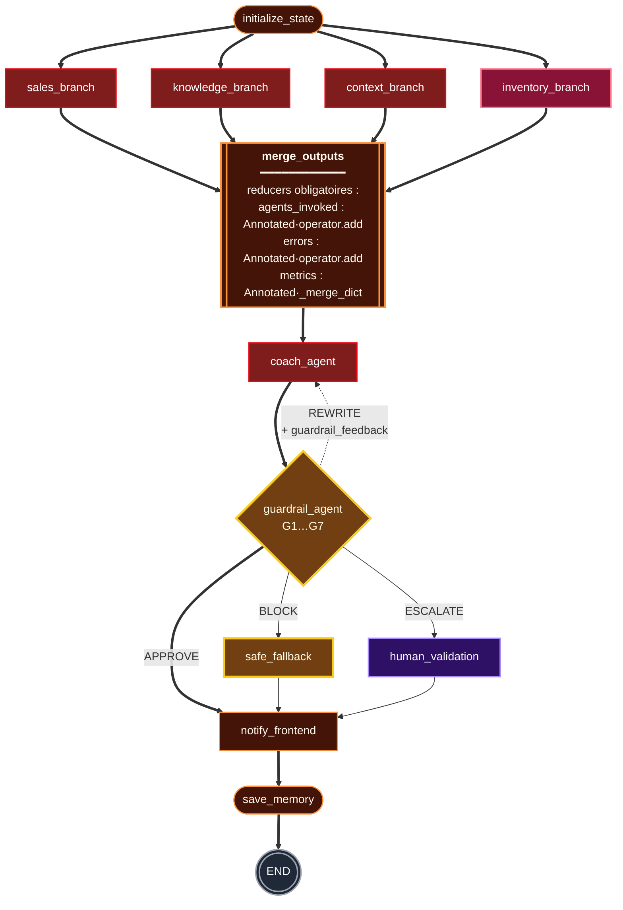

> ⚠️ **Contrainte technique à ne pas masquer** : les 4 branches écrivent dans le
> *même superstep* LangGraph. Sans reducer, le graphe lève `InvalidUpdateError`.
> **Les nodes retournent des deltas, jamais l'état complet.**

### 4.2 Les 6 sous-graphes d'agents

Chaque agent est lui-même un `StateGraph` compilé.

```mermaid
flowchart LR

  subgraph SA["🔴 SALES"]
    direction TB

    subgraph A1["Analyste — 7 nodes"]
      direction LR
      a1["receive_pos"]:::n
      a2["validate_data"]:::n
      a3["load_memory"]:::n
      a4["ts_analyst"]:::nml
      a5["compare_with_memory"]:::n
      a6["build_strategy_query"]:::n
      a7["save_memory"]:::n
      a1 --> a2
      a2 --> a3
      a3 --> a4
      a4 --> a5
      a5 --> a6
      a6 --> a7
    end

    subgraph A2["Stratège — 6 nodes"]
      direction LR
      b1["fetch_context"]:::n
      b2["rag_search"]:::nrag
      b3["analyze_context"]:::n
      b4["generate_strategy"]:::n
      b5["build_output"]:::n
      b6["self_critique"]:::n
      b1 --> b2
      b2 --> b3
      b3 --> b4
      b4 --> b5
      b5 --> b6
    end

    subgraph A3["Coach — 6 nodes"]
      direction LR
      c1["load_context"]:::n
      c2["rag_search"]:::nrag
      c3["load_advisor_history"]:::n
      c4["invoke_stratege_for_coach"]:::n
      c5["generate_conseil"]:::n
      c6["save_conseil"]:::n
      c1 --> c2
      c2 --> c3
      c3 --> c4
      c4 --> c5
      c5 --> c6
    end

    subgraph A4["Guardrail — fonction pure, pas un graphe"]
      direction LR
      d1["evaluate_guardrails"]:::ng
      d2["guardrail_node"]:::ng
      d3["route_guardrail"]:::ng
      d1 --> d2
      d2 --> d3
    end
  end

  subgraph IA["🌸 INVENTORY"]
    direction TB

    subgraph A5["Analysis — 3 nodes"]
      direction LR
      e1["fetch"]:::n2
      e2["compute"]:::nml
      e3["reason<br/><i>LLM optionnel : use_llm</i>"]:::n2
      e1 --> e2
      e2 --> e3
    end

    subgraph A6["Context — 2 nodes"]
      direction LR
      f1["fetch_signals"]:::n2
      f2["interpret"]:::n2
      f1 --> f2
    end

    subgraph A7["Decision — arête conditionnelle"]
      direction LR
      g1["constraints_check"]:::n2
      g2{"contraintes<br/>dures ?"}:::ncond
      g3["decide<br/><i>LLM</i>"]:::n2
      g4["décision directe"]:::n2
      g1 --> g2
      g2 -->|"non"| g3
      g2 -->|"oui — court-circuit du LLM"| g4
    end
  end

  style SA fill:#2C0707,stroke:#E30613,stroke-width:2px,color:#FFFFFF
  style IA fill:#2C0710,stroke:#FB7185,stroke-width:2px,color:#FFF1F2
  style A4 fill:#3F2506,stroke:#FACC15,stroke-width:2px,color:#FEFCE8

  classDef n     fill:#7F1D1D,stroke:#E30613,stroke-width:1.5px,color:#FFFFFF
  classDef n2    fill:#881337,stroke:#FB7185,stroke-width:1.5px,color:#FFF1F2
  classDef nml   fill:#083344,stroke:#22D3EE,stroke-width:2px,color:#ECFEFF
  classDef nrag  fill:#172554,stroke:#60A5FA,stroke-width:2px,color:#EFF6FF
  classDef ng    fill:#713F12,stroke:#FACC15,stroke-width:2px,color:#FEFCE8
  classDef ncond fill:#431407,stroke:#FB923C,stroke-width:2px,color:#FFF7ED
```

> 🩵 Les nodes en **cyan** (`ts_analyst`, `compute`) appellent les moteurs ML
> déterministes — **application de P2** : le LLM ne fait que rédiger par-dessus
> un chiffre qu'il n'a pas calculé.
> 🔵 Les nodes en **bleu** (`rag_search`) interrogent le RAG hybride.

### 4.3 Graphe Sales — routage conditionnel

[graph.py](../app/sales/orchestration/graph.py) — ce n'est **pas** un pipeline
linéaire : le champ `route_to` porte la décision.

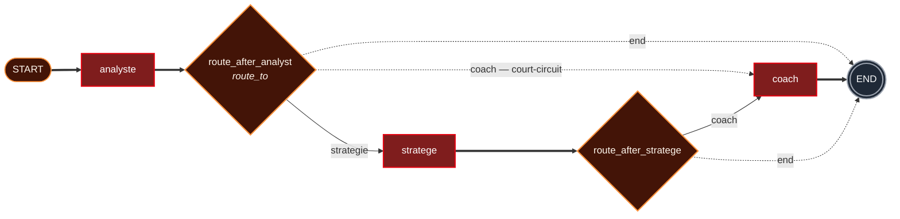

### 4.4 Orchestrateur Inventory — parallélisme par SKU

[orchestrator.py](../app/inventory/services/orchestrator.py)

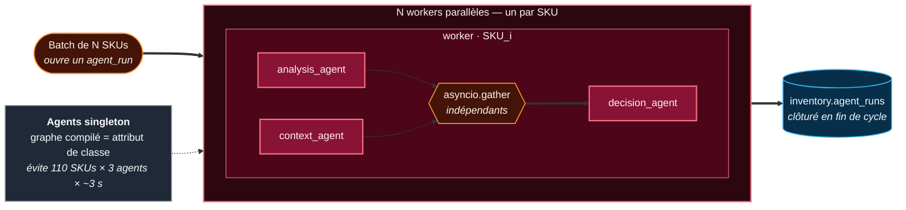

**Deux optimisations qui ont dicté la forme** :
1. **Agents singleton** — le graphe compilé est un attribut *de classe*.
   Instancier par worker coûtait `110 SKUs × 3 agents × ~3 s de compilation`.
2. **Analysis ∥ Context** — aucun ne consomme la sortie de l'autre ; les
   paralléliser divise par deux le temps mur par SKU.

---

## 5. Vue de déploiement — qu'est-ce qui tourne où

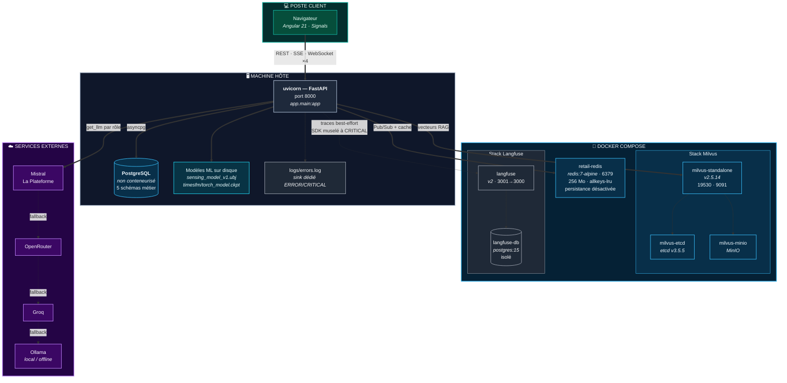

| Service | Image | Port | Rôle |
|---|---|---|---|
| Backend | uvicorn / FastAPI | `8000` | API + orchestration + agents |
| `milvus-standalone` | `milvusdb/milvus:v2.5.14` | `19530`, `9091` | Vector store RAG — BM25 natif, `hybrid_search`, RRF |
| `milvus-etcd` | `quay.io/coreos/etcd:v3.5.5` | — | Métadonnées Milvus |
| `milvus-minio` | `minio/minio:RELEASE.2023-03-20` | — | Object store Milvus |
| `retail-redis` | `redis:7-alpine` | `6379` | Alert Bus Pub/Sub + cache |
| `langfuse` | `langfuse/langfuse:2` | `3001` → `3000` | Observabilité LLM — traces, coûts |
| `langfuse-db` | `postgres:15` | — | Backing store Langfuse, isolé |
| **PostgreSQL métier** | — | — | **Non conteneurisé** — schéma géré par Alembic uniquement |

> ⚠️ La base PostgreSQL métier n'est **pas** dans `docker-compose.yml` : elle est
> externe. Son schéma a une source de vérité unique — les migrations Alembic
> `0001` → `0012`. **Zéro DDL au runtime, zéro CSV, zéro hardcode.**

---

## 6. Mécanismes transverses

Ce qui traverse toutes les couches et n'apparaît sur aucune bande.

### 6.1 Alert Bus — 4 canaux Redis Pub/Sub

[alert_bus.py](../app/sales/core/alert_bus.py) — c'est la **boucle ①**.

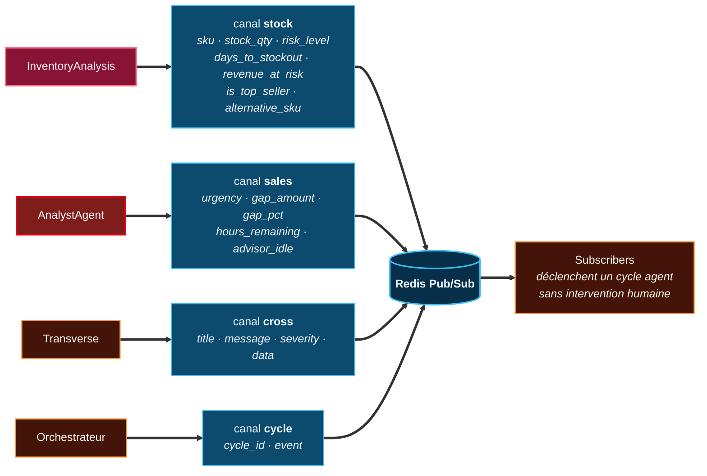

### 6.2 Circuit Breaker — un par agent

[circuit_breaker.py](../app/sales/core/circuit_breaker.py)

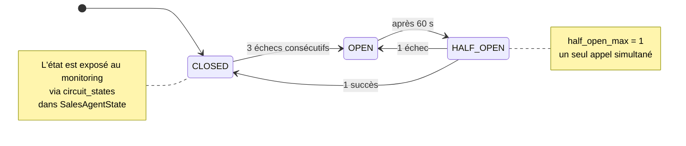

### 6.3 Chaînes de dégradation gracieuse (P5)

Chaque dépendance externe a un chemin de repli. **Aucune ne peut faire tomber
le système.**

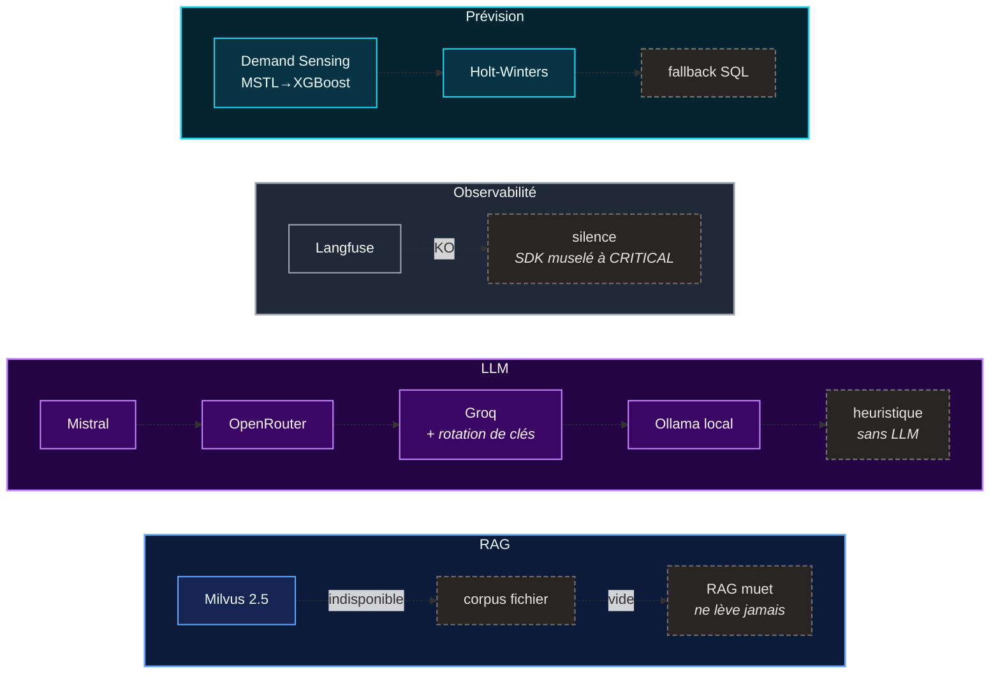

### 6.4 Feature flags — activation par morceaux

[config.py](../app/sales/core/config.py)

| Flag | Effet |
|---|---|
| `enable_state_bus` | Bus d'état partagé Redis |
| `enable_circuit_breaker` | Disjoncteurs par agent |
| `enable_inventory_sync` | Synchronisation du domaine Inventory |
| `enable_critique_agent` | Auto-critique du Stratège (`critique_min_score = 0.80`, `critique_max_cycles = 2`) |
| `enable_supervisor` | Graphe maître `SupervisorAgent` |

### 6.5 Observabilité & évaluation

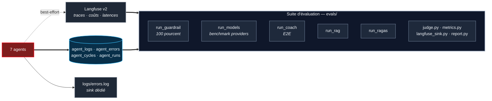

---

## 7. Table des composants

| Composant | Rôle | Fichier source |
|---|---|---|
| **SupervisorAgent** | Graphe maître sur `RetailState` | [supervisor_agent.py](../app/sales/orchestration/supervisor_agent.py) |
| **CycleOrchestrator** | Graphe Sales sur `SalesAgentState` | [graph.py](../app/sales/orchestration/graph.py) |
| **InventoryOrchestrator** | Workers parallèles par SKU | [orchestrator.py](../app/inventory/services/orchestrator.py) |
| **RetailState** | État unifié Sales × Inventory | [retail_state.py](../app/sales/core/retail_state.py) |
| **SalesAgentState** | État du cycle Sales | [state.py](../app/sales/core/state.py) |
| **Guardrail G1–G7** | Point de sortie unique | [guardrail_agent.py](../app/sales/coaching/agents/guardrail/guardrail_agent.py) |
| **Alert Bus** | 4 canaux Redis Pub/Sub | [alert_bus.py](../app/sales/core/alert_bus.py) |
| **Circuit Breaker** | Disjoncteur par agent | [circuit_breaker.py](../app/sales/core/circuit_breaker.py) |
| **Outils ReAct** | 12 outils de l'Analyste | [react_tools.py](../app/sales/coaching/agents/analyst/react_tools.py) |
| **Outils cross-domaine** | 11 fonctions, pont Sales ↔ Inventory | [cross_domain_tools.py](../app/sales/coaching/agents/coach/cross_domain_tools.py) |
| **Serveur MCP** | 7 outils, porte HITL préservée | [mcp_server.py](../app/inventory/services/mcp_server.py) |
| **RAG hybride** | dense + BM25 → RRF → rerank → MMR | [retriever.py](../app/sales/data/rag/retriever.py) · [schema.py](../app/sales/data/rag/schema.py) |
| **LLM Factory** | `get_llm(provider, role, temperature)` | [llm_factory.py](../app/inventory/utils/llm_factory.py) |
| **Feature flags** | Activation par morceaux | [config.py](../app/sales/core/config.py) |
| **API & WebSockets** | 13 routers, 4 WS, 1 SSE | [main.py](../app/main.py) |
| **Infrastructure** | 6 conteneurs | [docker-compose.yml](../docker-compose.yml) |
| **Migrations** | Source de vérité du schéma | [db/migrations/versions/](../db/migrations/versions/) |

---

## 8. Export pour le rapport

Chaque bloc ```mermaid se colle tel quel dans <https://mermaid.live> :
**Actions → PNG / SVG**. Pour une figure pleine page, exporter en SVG puis
redimensionner sans perte.

**Ordre d'insertion recommandé dans un rapport** :

1. §1 Contexte — pose le décor en une figure
2. §2 Couches — la figure de référence de l'architecture
3. §3 Flux — la figure qui explique la valeur du système
4. §4.1 Graphe superviseur — la preuve technique
5. §5 Déploiement — en annexe
6. §6 Transverse — en annexe

> **Rappel de charte** : fond sombre, palette froide, un seul accent chaud (le
> rouge Ooredoo) réservé aux agents Sales. Pas de 3D, pas d'isométrie, pas de
> dégradés, pas d'ombres portées, pas d'icônes de robot. Le rendu vise la
> **documentation d'ingénierie**, pas l'illustration marketing.
