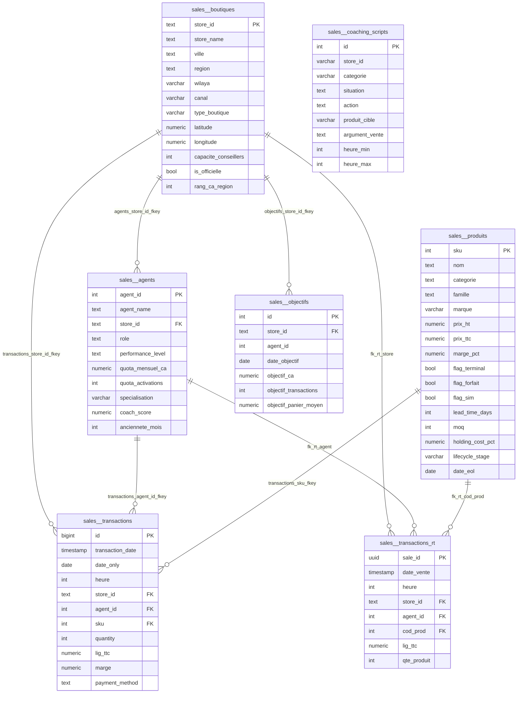
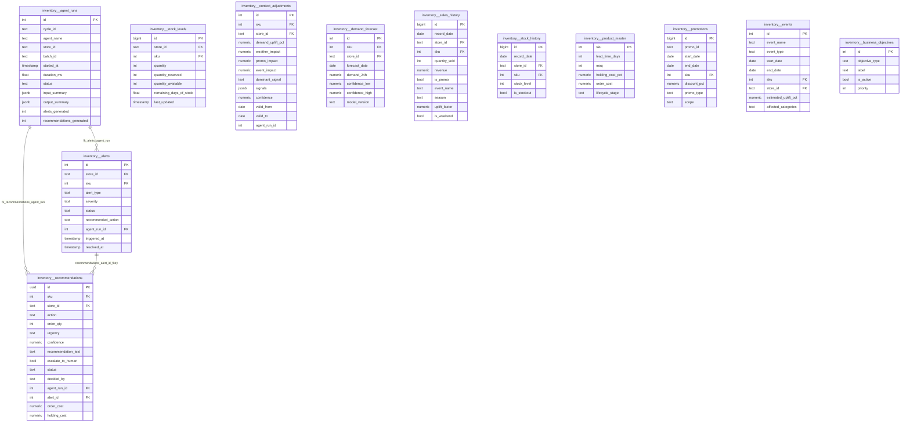
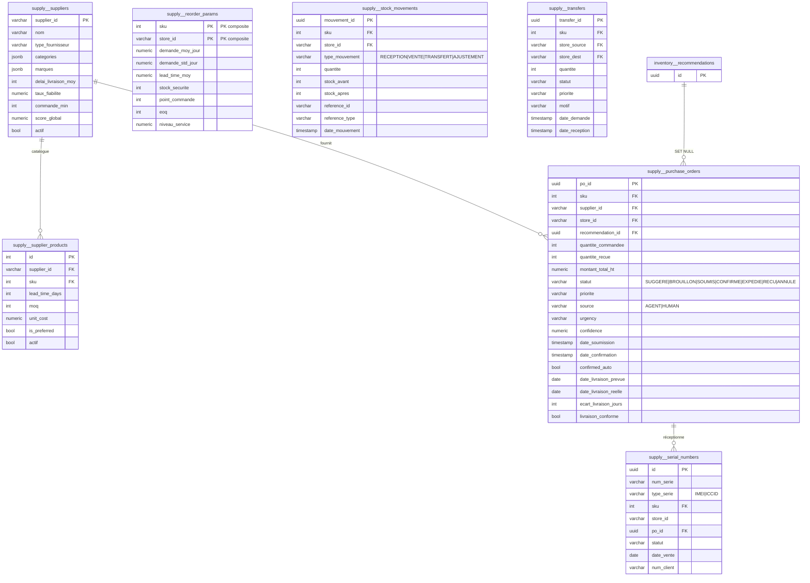
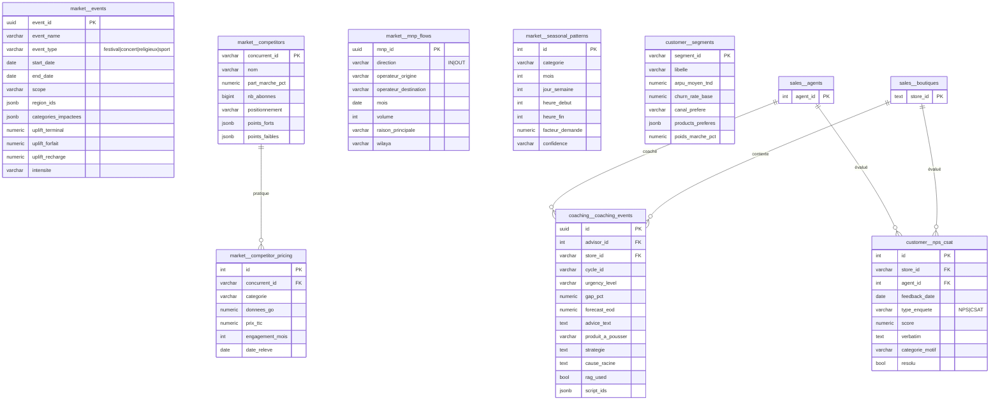

# Diagramme de la Base de Données — `ooredoo_sales`

> Rétro-ingénierie effectuée directement sur PostgreSQL via `pg_constraint`
> (source de vérité des FK — jamais `information_schema`).
> **51 tables** réparties en **7 schémas**, **49 clés étrangères** déclarées.
> Diagrammes au format **Mermaid** (rendu GitHub/VS Code, export PNG/SVG via <https://mermaid.live>).

Note de lecture : Mermaid n'accepte pas le `.` dans les noms d'entités — le
préfixe de schéma est rendu par `schema__table` (ex. `sales__boutiques` = `sales.boutiques`).

---

## 1. Vue macroscopique — les 7 schémas

| Schéma | Rôle | Tables | Volumétrie notable |
|--------|------|-------:|--------------------|
| `sales` | Référentiel & transactionnel ventes | 7 | `transactions` ≈ 1,93 M lignes |
| `inventory` | Stocks, alertes, recommandations agents | 11 | `stock_history` ≈ 1,12 M lignes |
| `supply` | Approvisionnement (PO Kanban, fournisseurs) | 7 | `stock_movements` ≈ 157 k |
| `market` | Contexte marché (événements, concurrents, MNP) | 5 | `events` : 38 festivals/concerts |
| `coaching` | Historique des cycles de coaching | 1 | 84 événements |
| `customer` | Voix du client (NPS/CSAT, segments) | 2 | — |
| `public` | Auth, HITL, observabilité agents, KPI agrégés | 18 | `agent_kpi_daily` ≈ 114 k |

**Tables pivots** : `sales.boutiques` (référencée par **14 FK**) et
`sales.produits` (référencée par **16 FK**) sont les hubs du modèle — tout le
système converge vers le couple (`store_id`, `sku`).

---

## 2. Vue globale des relations (49 FK)

```mermaid
erDiagram
    %% ================= HUBS =================
    sales__boutiques ||--o{ sales__agents : "emploie"
    sales__boutiques ||--o{ sales__objectifs : "a pour cible"
    sales__boutiques ||--o{ sales__transactions : "réalise"
    sales__boutiques ||--o{ sales__transactions_rt : "réalise (temps réel)"
    sales__produits  ||--o{ sales__transactions : "vendu dans"
    sales__produits  ||--o{ sales__transactions_rt : "vendu dans"
    sales__agents    ||--o{ sales__transactions : "effectue"
    sales__agents    ||--o{ sales__transactions_rt : "effectue"

    %% ================= INVENTORY =================
    sales__boutiques ||--o{ inventory__stock_levels : "stocke"
    sales__produits  ||--o{ inventory__stock_levels : "niveau de"
    sales__produits  ||--|| inventory__product_master : "paramètres supply"
    sales__boutiques ||--o{ inventory__alerts : "alerte sur"
    sales__produits  ||--o{ inventory__alerts : "concerne"
    inventory__agent_runs ||--o{ inventory__alerts : "génère"
    sales__boutiques ||--o{ inventory__recommendations : "pour"
    sales__produits  ||--o{ inventory__recommendations : "concerne"
    inventory__agent_runs ||--o{ inventory__recommendations : "produit"
    inventory__alerts ||--o{ inventory__recommendations : "déclenche"
    sales__boutiques ||--o{ inventory__context_adjustments : "ajusté pour"
    sales__produits  ||--o{ inventory__context_adjustments : "ajusté pour"
    sales__boutiques ||--o{ inventory__demand_forecast : "prévu pour"
    sales__produits  ||--o{ inventory__demand_forecast : "prévu pour"
    sales__boutiques ||--o{ inventory__sales_history : "historique"
    sales__produits  ||--o{ inventory__sales_history : "historique"
    sales__boutiques ||--o{ inventory__stock_history : "historique"
    sales__produits  ||--o{ inventory__stock_history : "historique"
    sales__produits  ||--o{ inventory__promotions : "promu"
    sales__produits  ||--o{ inventory__events : "impacté par"
    sales__boutiques ||--o{ inventory__events : "impacté par"

    %% ================= SUPPLY =================
    sales__produits  ||--o{ supply__purchase_orders : "commandé"
    sales__boutiques ||--o{ supply__purchase_orders : "livré à"
    supply__suppliers ||--o{ supply__purchase_orders : "fournit"
    inventory__recommendations ||--o{ supply__purchase_orders : "à l'origine de"
    supply__suppliers ||--o{ supply__supplier_products : "catalogue"
    sales__produits  ||--o{ supply__supplier_products : "sourcé"
    sales__produits  ||--o{ supply__reorder_params : "paramétré"
    sales__boutiques ||--o{ supply__reorder_params : "paramétré"
    sales__produits  ||--o{ supply__stock_movements : "mouvementé"
    sales__boutiques ||--o{ supply__stock_movements : "mouvementé"
    supply__purchase_orders ||--o{ supply__serial_numbers : "réceptionne"
    sales__produits  ||--o{ supply__transfers : "transféré"
    sales__boutiques ||--o{ supply__transfers : "source"
    sales__boutiques ||--o{ supply__transfers : "destination"

    %% ================= COACHING / CUSTOMER / MARKET =================
    sales__agents    ||--o{ coaching__coaching_events : "coaché"
    sales__boutiques ||--o{ coaching__coaching_events : "contexte"
    sales__agents    ||--o{ customer__nps_csat : "évalué"
    sales__boutiques ||--o{ customer__nps_csat : "évalué"
    market__competitors ||--o{ market__competitor_pricing : "pratique"
```

---

## 3. Schéma `sales` — Référentiel & transactionnel (détaillé)

`sales.coaching_scripts` (corpus RAG, 2 040 scripts) n'a volontairement pas de
FK : le `store_id` peut être générique (`ALL`) pour les scripts applicables à
tout le réseau.

---

## 4. Schéma `inventory` — Chaîne causale des agents stock

La chaîne causale est traçable de bout en bout :
**`agent_runs` → `alerts` → `recommendations` → `supply.purchase_orders`**.

Toutes les tables `inventory.*` portant (`store_id`, `sku`) référencent
`sales.boutiques` et `sales.produits` (cf. vue globale §2) — FK omises ici pour
la lisibilité. `business_objectives` est une table de configuration sans FK
(objectif actif : minimiser ruptures / coûts / équilibré).

---

## 5. Schéma `supply` — Approvisionnement & Kanban PO

Cœur de la boucle fermée : la recommandation du DecisionAgent devient un bon de
commande `SUGGERE` sur le Kanban, approuvé par l'humain (HITL), suivi jusqu'à `RECU`.

---

## 6. Schémas `market`, `coaching`, `customer` — Contexte & feedback

---

## 7. Schéma `public` — Auth, HITL, observabilité & KPI (relations logiques)

Ces 18 tables n'ont **aucune FK déclarée** (choix de conception : tables
d'observabilité à fort débit d'écriture + agrégats recalculables — pas de
contrainte pour ne pas bloquer les pipelines). Les relations sont **logiques**,
portées par les clés naturelles `store_id`, `agent_id`, `cycle_id`, `user_id` :

```mermaid
erDiagram
    app_users {
        int id PK
        varchar user_id UK
        varchar username
        varchar password_hash
        varchar role "manager|advisor|admin"
        varchar store_id "logique vers sales.boutiques"
        varchar advisor_id
    }
    app_sessions {
        int id PK
        varchar token UK
        varchar user_id "logique vers app_users"
        timestamp expires_at
        varchar ip_address
    }
    agent_cycles {
        int id PK
        varchar cycle_id UK
        varchar store_id "logique"
        varchar triggered_by
        varchar urgency_level
        float gap_pct
        float forecast_eod
        text analyst_summary
        text strategie
        bool rag_used
    }
    agent_logs {
        int id PK
        varchar cycle_id "logique vers agent_cycles"
        varchar agent_name
        varchar node_name
        varchar status
        jsonb input_state
        jsonb output_state
        float duration_ms
    }
    agent_errors {
        int id PK
        varchar cycle_id "logique"
        varchar agent_name
        varchar error_type
        text traceback_txt
        bool resolved
    }
    hitl_reviews {
        uuid id PK
        text cycle_id "logique"
        text store_id "logique"
        float critique_score
        jsonb actions
        text status "pending|approved|rejected"
        text approver_name
        timestamptz reviewed_at
    }
    coach_interactions {
        int id PK
        varchar store_id "logique"
        varchar advisor_name
        text message
        text response
        float confidence
        bool rag_used
    }
    agent_feedback {
        int id PK
        varchar store_id "logique"
        varchar source
        varchar ref_id "reco/alerte/PO"
        int sku "logique vers sales.produits"
        varchar decision "accepted|rejected"
        jsonb payload
    }
    rag_feedback {
        int id PK
        varchar cycle_id "logique"
        text query
        float top_score
        bool was_useful
    }
    store_kpi_daily {
        bigint id PK
        varchar store_id "logique"
        date kpi_date
        numeric ca_realise
        numeric ca_cible
        numeric gap_ca_pct
        numeric taux_conversion
    }
    agent_kpi_daily {
        bigint id PK
        int agent_id "logique vers sales.agents"
        varchar store_id "logique"
        date kpi_date
        numeric ca_realise
        numeric gap_ca_pct
        int nb_postpaye
    }
    telco_targets_monthly {
        bigint id PK
        varchar store_id "logique"
        int agent_id "logique"
        int mois
        int annee
        numeric ca_cible_mensuel
        int activations_postpaye
    }

    app_users ||--o{ app_sessions : "user_id (logique)"
    agent_cycles ||--o{ agent_logs : "cycle_id (logique)"
    agent_cycles ||--o{ agent_errors : "cycle_id (logique)"
    agent_cycles ||--o{ hitl_reviews : "cycle_id (logique)"
    agent_cycles ||--o{ rag_feedback : "cycle_id (logique)"
    store_kpi_daily ||--o{ agent_kpi_daily : "store_id+date (logique)"
```

Tables non représentées (même logique, faible enjeu pour le rapport) :
`agent_memory`, `agent_sessions`, `rag_queries`, `rag_feedback_metrics`,
`weekly_kpi_summary`, `alembic_version` (versionnement migrations).

---

## 8. Inventaire exhaustif des 49 clés étrangères

Règle de suppression : `NO ACTION` (défaut) sauf mention `SET NULL`
(utilisée sur les liens de traçabilité agents, pour ne jamais perdre l'historique).

| Table source | Colonne(s) | → Table cible | Règle DELETE |
|---|---|---|---|
| coaching.coaching_events | advisor_id | sales.agents | NO ACTION |
| coaching.coaching_events | store_id | sales.boutiques | NO ACTION |
| customer.nps_csat | agent_id | sales.agents | NO ACTION |
| customer.nps_csat | store_id | sales.boutiques | NO ACTION |
| inventory.alerts | agent_run_id | inventory.agent_runs | **SET NULL** |
| inventory.alerts | sku | sales.produits | NO ACTION |
| inventory.alerts | store_id | sales.boutiques | NO ACTION |
| inventory.context_adjustments | sku | sales.produits | NO ACTION |
| inventory.context_adjustments | store_id | sales.boutiques | NO ACTION |
| inventory.demand_forecast | sku | sales.produits | NO ACTION |
| inventory.demand_forecast | store_id | sales.boutiques | NO ACTION |
| inventory.events | sku | sales.produits | NO ACTION |
| inventory.events | store_id | sales.boutiques | NO ACTION |
| inventory.product_master | sku | sales.produits | NO ACTION |
| inventory.promotions | sku | sales.produits | NO ACTION |
| inventory.recommendations | sku | sales.produits | NO ACTION |
| inventory.recommendations | store_id | sales.boutiques | NO ACTION |
| inventory.recommendations | agent_run_id | inventory.agent_runs | **SET NULL** |
| inventory.recommendations | alert_id | inventory.alerts | **SET NULL** |
| inventory.sales_history | sku | sales.produits | NO ACTION |
| inventory.sales_history | store_id | sales.boutiques | NO ACTION |
| inventory.stock_history | sku | sales.produits | NO ACTION |
| inventory.stock_history | store_id | sales.boutiques | NO ACTION |
| inventory.stock_levels | sku | sales.produits | NO ACTION |
| inventory.stock_levels | store_id | sales.boutiques | NO ACTION |
| market.competitor_pricing | concurrent_id | market.competitors | NO ACTION |
| sales.agents | store_id | sales.boutiques | NO ACTION |
| sales.objectifs | store_id | sales.boutiques | NO ACTION |
| sales.transactions | agent_id | sales.agents | NO ACTION |
| sales.transactions | sku | sales.produits | NO ACTION |
| sales.transactions | store_id | sales.boutiques | NO ACTION |
| sales.transactions_rt | agent_id | sales.agents | NO ACTION |
| sales.transactions_rt | cod_prod | sales.produits | NO ACTION |
| sales.transactions_rt | store_id | sales.boutiques | NO ACTION |
| supply.purchase_orders | sku | sales.produits | NO ACTION |
| supply.purchase_orders | store_id | sales.boutiques | NO ACTION |
| supply.purchase_orders | recommendation_id | inventory.recommendations | **SET NULL** |
| supply.purchase_orders | supplier_id | supply.suppliers | NO ACTION |
| supply.reorder_params | sku | sales.produits | NO ACTION |
| supply.reorder_params | store_id | sales.boutiques | NO ACTION |
| supply.serial_numbers | po_id | supply.purchase_orders | NO ACTION |
| supply.stock_movements | sku | sales.produits | NO ACTION |
| supply.stock_movements | store_id | sales.boutiques | NO ACTION |
| supply.supplier_products | sku | sales.produits | NO ACTION |
| supply.supplier_products | supplier_id | supply.suppliers | NO ACTION |
| supply.transfers | sku | sales.produits | NO ACTION |
| supply.transfers | store_dest | sales.boutiques | NO ACTION |
| supply.transfers | store_source | sales.boutiques | NO ACTION |

---

## 9. Points de conception à valoriser dans le rapport

1. **Modèle en étoile double hub** : `sales.boutiques` et `sales.produits`
   centralisent l'intégrité référentielle de tout le système (30 des 49 FK).
2. **Chaîne causale agentique traçable** :
   `agent_runs → alerts → recommendations → purchase_orders` — chaque décision
   IA est reliée à son exécution d'agent, avec `SET NULL` pour préserver
   l'historique métier même après purge des runs techniques.
3. **Boucle fermée d'approvisionnement** : `purchase_orders.source`
   (AGENT/HUMAN) + `statut` Kanban (SUGGERE → … → RECU) + `confirmed_auto`
   matérialisent le HITL en base.
4. **Séparation FK déclarées / relations logiques** : les schémas métier
   (`sales`, `inventory`, `supply`…) sont contraints ; le schéma `public`
   (observabilité, KPI à fort débit) reste sans FK par choix de performance —
   à présenter comme un compromis assumé.
5. **Double PK composite** : `supply.reorder_params (sku, store_id)` — les
   paramètres de réapprovisionnement sont propres au couple produit × boutique.
