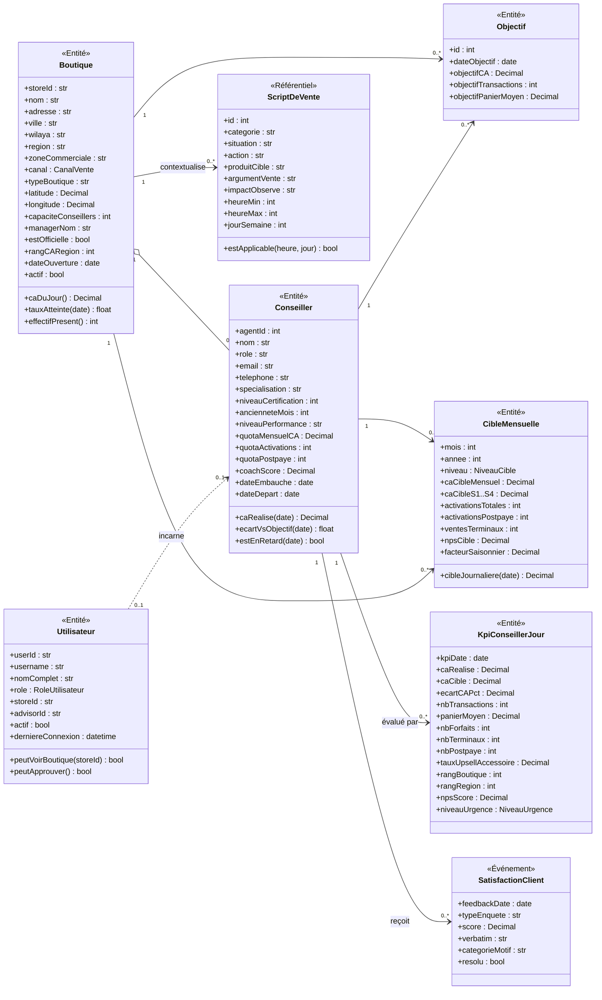
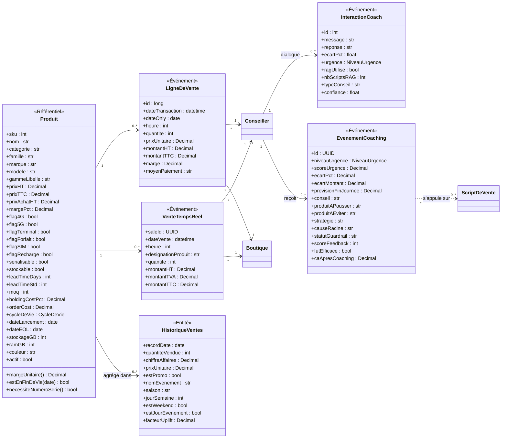
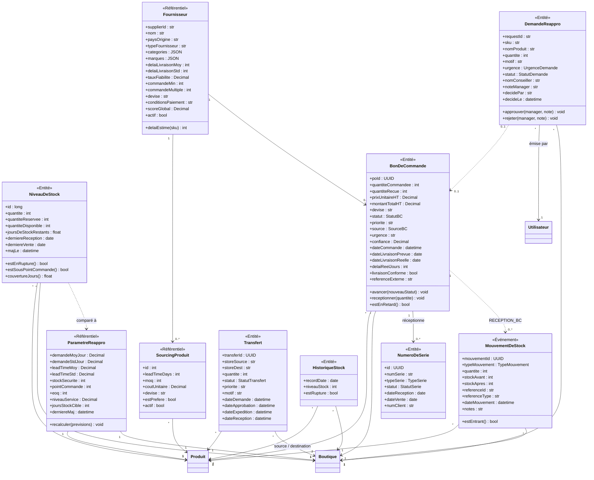
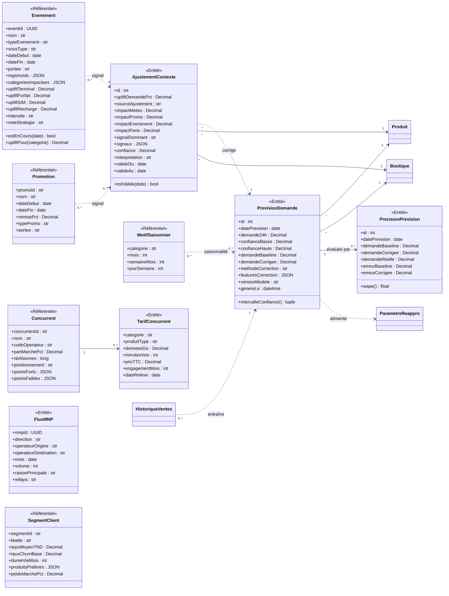
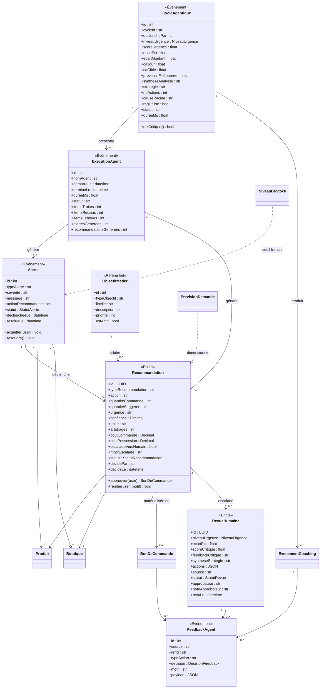

# Diagramme de Classes Métier — Moteur Agentique Retail Ooredoo

> **Portée** : modèle du **domaine métier** (Réseau, Ventes, Stock, Approvisionnement,
> Prévision, Pilotage agentique). Les classes techniques (agents LangGraph, états
> `RetailState`, repositories, orchestrateurs) sont documentées séparément dans
> [DIAGRAMMES_CLASSES.md](DIAGRAMMES_CLASSES.md).
>
> **Source** : dérivé du schéma PostgreSQL réel (`docs/DATABASE_SCHEMA.md`) et des
> migrations Alembic `0001` → `0012`, seule source de vérité du modèle.
>
> **Format** : Mermaid — rendu natif GitHub/GitLab/VS Code, export PNG/SVG via
> <https://mermaid.live> pour insertion dans le rapport.

**Conventions**

| Stéréotype | Signification |
|---|---|
| `<<Entité>>` | Entité métier persistante avec identité propre |
| `<<Référentiel>>` | Donnée de référence peu volatile (catalogue, paramétrage) |
| `<<Événement>>` | Fait daté produit par le système ou un acteur |
| `<<enumeration>>` | Valeurs contraintes (CHECK SQL) |

---

## 1. Vue globale du domaine métier

Vue d'ensemble : les entités pivots et leurs relations. Attributs réduits aux
identifiants et aux propriétés discriminantes pour rester lisible.

```mermaid
classDiagram
    direction TB

    %% ---------- Réseau & acteurs ----------
    class Boutique {
        <<Entité>>
        +storeId : str
        +nom : str
        +ville : str
        +region : str
        +canal : CanalVente
        +actif : bool
    }

    class Conseiller {
        <<Entité>>
        +agentId : int
        +nom : str
        +specialisation : str
        +quotaMensuelCA : Decimal
        +coachScore : Decimal
    }

    class Utilisateur {
        <<Entité>>
        +userId : str
        +role : RoleUtilisateur
        +storeId : str
        +advisorId : str
    }

    %% ---------- Catalogue & ventes ----------
    class Produit {
        <<Référentiel>>
        +sku : int
        +nom : str
        +categorie : str
        +prixTTC : Decimal
        +cycleDeVie : CycleDeVie
        +stockable : bool
    }

    class LigneDeVente {
        <<Événement>>
        +id : long
        +dateVente : datetime
        +quantite : int
        +montantTTC : Decimal
        +marge : Decimal
    }

    class Objectif {
        <<Entité>>
        +dateObjectif : date
        +objectifCA : Decimal
        +objectifTransactions : int
    }

    %% ---------- Stock & approvisionnement ----------
    class NiveauDeStock {
        <<Entité>>
        +quantite : int
        +quantiteReservee : int
        +quantiteDisponible : int
        +joursDeStockRestants : float
    }

    class MouvementDeStock {
        <<Événement>>
        +mouvementId : UUID
        +typeMouvement : TypeMouvement
        +quantite : int
    }

    class ParametreReappro {
        <<Référentiel>>
        +pointCommande : int
        +stockSecurite : int
        +eoq : int
    }

    class BonDeCommande {
        <<Entité>>
        +poId : UUID
        +quantiteCommandee : int
        +statut : StatutBC
        +source : SourceBC
    }

    class Fournisseur {
        <<Référentiel>>
        +supplierId : str
        +nom : str
        +delaiLivraisonMoy : int
        +tauxFiabilite : Decimal
    }

    class DemandeReappro {
        <<Entité>>
        +requestId : str
        +quantite : int
        +urgence : UrgenceDemande
        +statut : StatutDemande
    }

    %% ---------- Prévision & contexte ----------
    class PrevisionDemande {
        <<Entité>>
        +datePrevision : date
        +demande24h : Decimal
        +demandeCorrigee : Decimal
    }

    class AjustementContexte {
        <<Entité>>
        +upliftDemandePct : Decimal
        +signalDominant : str
        +confiance : Decimal
    }

    class Evenement {
        <<Référentiel>>
        +eventId : UUID
        +nom : str
        +dateDebut : date
        +intensite : str
    }

    class Promotion {
        <<Référentiel>>
        +promoId : str
        +remisePct : Decimal
    }

    %% ---------- Pilotage agentique ----------
    class CycleAgentique {
        <<Événement>>
        +cycleId : str
        +declencheur : str
        +niveauUrgence : NiveauUrgence
        +ecartPct : float
    }

    class Alerte {
        <<Événement>>
        +id : int
        +typeAlerte : str
        +severite : str
        +statut : StatutAlerte
    }

    class Recommandation {
        <<Entité>>
        +id : UUID
        +action : str
        +quantiteCommande : int
        +confiance : Decimal
        +statut : StatutRecommandation
    }

    class RevueHumaine {
        <<Entité>>
        +id : UUID
        +statut : StatutRevue
        +approbateur : str
    }

    class FeedbackAgent {
        <<Événement>>
        +source : str
        +decision : DecisionFeedback
    }

    %% ---------- Relations ----------
    Boutique "1" o-- "0..*" Conseiller : emploie
    Boutique "1" --> "0..*" Objectif : fixe
    Utilisateur "0..1" ..> "0..1" Conseiller : incarne
    Utilisateur "*" --> "1" Boutique : rattaché à

    LigneDeVente "*" --> "1" Produit : porte sur
    LigneDeVente "*" --> "1" Conseiller : réalisée par
    LigneDeVente "*" --> "1" Boutique : enregistrée en

    NiveauDeStock "*" --> "1" Produit : mesure
    NiveauDeStock "*" --> "1" Boutique : localisé en
    MouvementDeStock "*" --> "1" Produit : impacte
    MouvementDeStock "*" --> "1" Boutique : dans
    ParametreReappro "1" --> "1" Produit : paramètre
    ParametreReappro "1" --> "1" Boutique : pour

    Fournisseur "1" --> "0..*" BonDeCommande : honore
    BonDeCommande "*" --> "1" Produit : commande
    BonDeCommande "*" --> "1" Boutique : livrée à
    BonDeCommande "0..1" ..> "1" Recommandation : matérialise
    DemandeReappro "0..1" ..> "0..1" BonDeCommande : donne lieu à
    DemandeReappro "*" --> "1" Utilisateur : émise par

    PrevisionDemande "*" --> "1" Produit : prévoit
    PrevisionDemande "*" --> "1" Boutique : sur
    AjustementContexte "*" ..> "1" PrevisionDemande : corrige
    Evenement "0..*" ..> "0..*" AjustementContexte : alimente
    Promotion "0..*" ..> "0..*" AjustementContexte : alimente

    CycleAgentique "1" --> "0..*" Alerte : produit
    Alerte "1" --> "0..*" Recommandation : déclenche
    Recommandation "*" --> "1" Produit : porte sur
    Recommandation "*" --> "1" Boutique : cible
    Recommandation "0..1" --> "0..1" RevueHumaine : escalade vers
    RevueHumaine "1" --> "0..*" FeedbackAgent : génère
    LigneDeVente ..> MouvementDeStock : génère (VENTE)
    BonDeCommande ..> MouvementDeStock : génère (RECEPTION_BC)
```



---

## 2. Sous-domaine « Réseau & Force de vente »



**Règles de gestion**

- `Utilisateur.role` pilote le RBAC : un `vendeur` ne voit que sa boutique et son
  propre périmètre ; un `manager` arbitre les `DemandeReappro` et les `RevueHumaine`.
- `KpiConseillerJour` est unique par `(agentId, kpiDate)` — recalculé quotidiennement.
- `CibleMensuelle.niveau` permet de fixer un objectif AGENT, BOUTIQUE ou REGION.

---

## 3. Sous-domaine « Catalogue & Ventes »



**Règles de gestion**

- `LigneDeVente` = historique consolidé (~1,93 M lignes) ; `VenteTempsReel` = flux
  chaud alimenté par la simulation temps réel, réconcilié en fin de journée.
- `HistoriqueVentes` est l'agrégat journalier `(date, boutique, sku)` servant de
  série temporelle d'entrée aux prévisions.
- `EvenementCoaching.futEfficace` / `caApresCoaching` ferment la boucle
  d'apprentissage : mesure a posteriori de l'impact du conseil délivré.

---

## 4. Sous-domaine « Stock & Approvisionnement »



**Règles de gestion**

- `NiveauDeStock.quantiteDisponible` est une colonne **générée** :
  `quantite - quantiteReservee` — jamais écrite directement.
- Unicité `(sku, storeId)` sur `NiveauDeStock` et `ParametreReappro`.
- Un seul `SourcingProduit.estPrefere = true` par SKU (index unique partiel).
- Cycle de vie du `BonDeCommande` :
  `SUGGERE → BROUILLON → SOUMIS → CONFIRME → EXPEDIE → RECU_PARTIEL → RECU`
  (branches `ANNULE` / `LITIGE`). Le passage à `RECU` génère un `MouvementDeStock`
  de type `RECEPTION_BC` qui incrémente le `NiveauDeStock` — bouclage physique.
- `BonDeCommande.source = AGENT` ⇒ le BC provient d'une `Recommandation` et entre
  au statut `SUGGERE` : **aucune commande n'est émise sans validation humaine**.
- Un `Produit.serialisable = true` impose un `NumeroDeSerie` (IMEI/ICCID/eSIM) par
  unité réceptionnée puis vendue.

---

## 5. Sous-domaine « Prévision & Contexte marché »



**Règles de gestion**

- Chaîne de prévision : `HistoriqueVentes` → **baseline MSTL** (`demandeBaseline`)
  → **correction XGBoost** (`demandeCorrigee`, `methodeCorrection`) →
  `PrecisionPrevision` mesure l'écart au réel (WAPE) a posteriori.
- Unicité `(sku, storeId, datePrevision)` sur `PrevisionDemande`.
- Unicité `(sku, storeId, valideDu)` sur `AjustementContexte` : un seul jeu de
  signaux contextuels par produit/boutique/jour.

---

## 6. Sous-domaine « Pilotage agentique & Décision »

Le cœur de la valeur métier : comment un écart commercial ou un risque de rupture
devient une action tracée, validée et mesurée.



**Chaîne causale complète** (tracée en base depuis la migration `0005`) :

```
LigneDeVente → MouvementDeStock(VENTE) → NiveauDeStock
      ↓
ExecutionAgent → Alerte(stockout_risk) → Recommandation(order_qty)
      ↓                                        ↓
RevueHumaine (si escaladeVersHumain)     BonDeCommande(SUGGERE)
      ↓                                        ↓
FeedbackAgent ←──────────────── MouvementDeStock(RECEPTION_BC) → NiveauDeStock
```

**Règles de gestion**

- Une `Recommandation` ne devient jamais un `BonDeCommande` exécuté sans passage
  par une décision humaine (`approuver()` ou `RevueHumaine`) — **porte HITL**.
- `Recommandation` : unicité d'une seule recommandation `pending` par
  `(sku, storeId)` (index unique partiel `uq_reco_pending_sku_store`).
- `ObjectifMetier.estActif` sélectionne l'arbitrage courant (ex. `balanced`,
  `minimize_stockout`, `minimize_cost`) qui pondère les recommandations.
- `FeedbackAgent` agrège les décisions humaines (suivi / ignoré / approuvé /
  rejeté) et est réinjecté dans les prompts des agents Décision et Stratège.

---

## 7. Énumérations métier

```mermaid
classDiagram
    class RoleUtilisateur {
        <<enumeration>>
        VENDEUR
        MANAGER
        ADMIN
    }
    class CanalVente {
        <<enumeration>>
        PHYSIQUE
        DIGITAL
        INDIRECT
    }
    class CycleDeVie {
        <<enumeration>>
        launch
        growth
        mature
        decline
        eol
    }
    class NiveauUrgence {
        <<enumeration>>
        CRITIQUE
        ELEVE
        MODERE
        OK
    }
    class NiveauCible {
        <<enumeration>>
        AGENT
        BOUTIQUE
        REGION
    }
    class StatutBC {
        <<enumeration>>
        SUGGERE
        BROUILLON
        SOUMIS
        CONFIRME
        EXPEDIE
        RECU_PARTIEL
        RECU
        ANNULE
        LITIGE
    }
    class SourceBC {
        <<enumeration>>
        AGENT
        MANUEL
    }
    class TypeMouvement {
        <<enumeration>>
        RECEPTION_BC
        VENTE
        RETOUR_CLIENT
        RETOUR_FOURNISSEUR
        TRANSFERT_ENTRANT
        TRANSFERT_SORTANT
        AJUSTEMENT_INVENTAIRE
        CASSE_PERTE
        INVENTAIRE_GAIN
        INVENTAIRE_PERTE
        RESERVATION
        LIBERATION_RESERVATION
    }
    class TypeSerie {
        <<enumeration>>
        IMEI
        ICCID
        ESIM
        EAN
    }
    class StatutSerie {
        <<enumeration>>
        EN_STOCK
        VENDU
        RESERVE
        DEFECTUEUX
        RETOURNE
        VOLE
        EN_TRANSIT
    }
    class StatutTransfert {
        <<enumeration>>
        DEMANDE
        APPROUVE
        EXPEDIE
        RECU
        REJETE
        ANNULE
        EN_LITIGE
    }
    class UrgenceDemande {
        <<enumeration>>
        RUPTURE
        CRITIQUE
        NORMALE
    }
    class StatutDemande {
        <<enumeration>>
        EN_ATTENTE
        APPROUVEE
        REJETEE
    }
    class StatutAlerte {
        <<enumeration>>
        pending
        acknowledged
        validated
        rejected
        dismissed
        resolved
    }
    class StatutRecommandation {
        <<enumeration>>
        pending
        approved
        rejected
        executed
        cancelled
    }
    class StatutRevue {
        <<enumeration>>
        pending
        approved
        rejected
    }
    class DecisionFeedback {
        <<enumeration>>
        followed
        ignored
        approved
        rejected
    }
```



---

## 8. Correspondance classe métier ↔ table PostgreSQL

| Classe métier | Table | Volume (2026-07) |
|---|---|---|
| `Boutique` | `sales.boutiques` | 201 |
| `Conseiller` | `sales.agents` | 699 |
| `Utilisateur` | `public.app_users` | 7 |
| `Objectif` | `sales.objectifs` | 23 517 |
| `CibleMensuelle` | `public.telco_targets_monthly` | 6 917 |
| `KpiConseillerJour` | `public.agent_kpi_daily` | 114 211 |
| `ScriptDeVente` | `sales.coaching_scripts` | 1 141 |
| `SatisfactionClient` | `customer.nps_csat` | — |
| `Produit` | `sales.produits` (+ `inventory.product_master`) | 4 593 |
| `LigneDeVente` | `sales.transactions` | 1 929 823 |
| `VenteTempsReel` | `sales.transactions_rt` | 8 238 |
| `HistoriqueVentes` | `inventory.sales_history` | 693 954 |
| `InteractionCoach` | `public.coach_interactions` | 255 |
| `EvenementCoaching` | `coaching.coaching_events` | — |
| `NiveauDeStock` | `inventory.stock_levels` | 46 244 |
| `HistoriqueStock` | `inventory.stock_history` | 844 987 |
| `MouvementDeStock` | `supply.stock_movements` | 156 669 |
| `ParametreReappro` | `supply.reorder_params` | 945 |
| `Fournisseur` | `supply.suppliers` | 10 |
| `SourcingProduit` | `supply.supplier_products` | — |
| `BonDeCommande` | `supply.purchase_orders` | — |
| `NumeroDeSerie` | `supply.serial_numbers` | 177 |
| `Transfert` | `supply.transfers` | 34 |
| `DemandeReappro` | `public.product_requests` | — |
| `PrevisionDemande` | `inventory.demand_forecast` | 840 |
| `PrecisionPrevision` | `inventory.forecast_accuracy` | — |
| `AjustementContexte` | `inventory.context_adjustments` | 1 907 |
| `Evenement` | `market.events` (+ `inventory.events`) | — |
| `Promotion` | `inventory.promotions` | 27 |
| `MotifSaisonnier` | `market.seasonal_patterns` | — |
| `Concurrent` / `TarifConcurrent` | `market.competitors` / `market.competitor_pricing` | — |
| `FluxMNP` | `market.mnp_flows` | — |
| `SegmentClient` | `customer.segments` | — |
| `CycleAgentique` | `public.agent_cycles` | 1 147 |
| `ExecutionAgent` | `inventory.agent_runs` | 63 309 |
| `Alerte` | `inventory.alerts` | 144 |
| `Recommandation` | `inventory.recommendations` | 511 |
| `RevueHumaine` | `public.hitl_reviews` | 9 |
| `FeedbackAgent` | `public.agent_feedback` | — |
| `ObjectifMetier` | `inventory.business_objectives` | 6 |

> Les tables purement techniques (`agent_logs`, `agent_errors`, `agent_memory`,
> `app_sessions`, `rag_queries`, `rag_feedback`, `alembic_version`) sont exclues :
> elles relèvent de l'observabilité et de l'infrastructure, pas du domaine métier.

---

## 9. Pivots du modèle

Deux entités structurent tout le domaine et servent de clé de jointure quasi
universelle :

- **`Boutique` (`store_id`)** — référencée par 11 tables. Unité de pilotage :
  objectifs, stock, alertes, recommandations, BC, RBAC.
- **`Produit` (`sku`)** — référencée par 9 tables. Unité de décision :
  vente, stock, prévision, réappro, sourcing.

Le couple **`(sku, store_id)`** est la granularité de décision du système :
c'est à ce niveau que sont calculés le point de commande, la prévision de
demande, l'ajustement contextuel et la recommandation d'achat.
