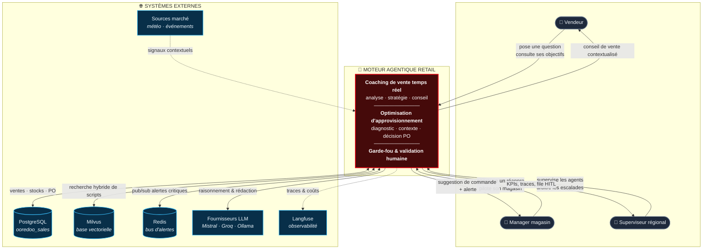
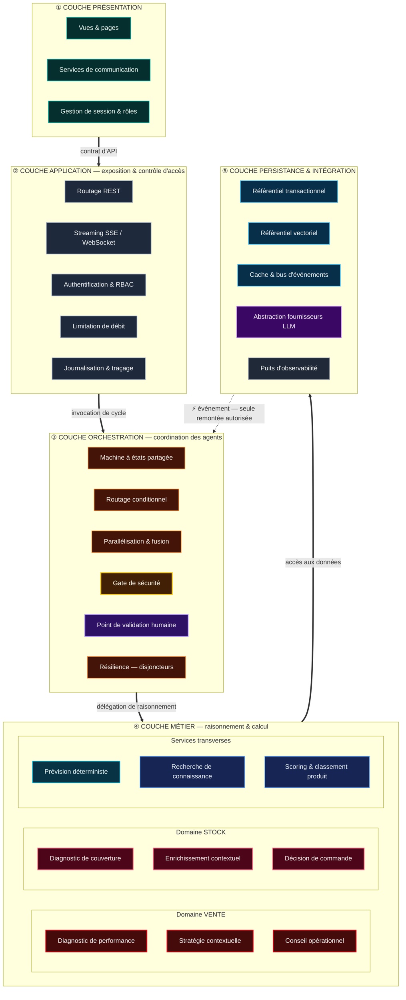
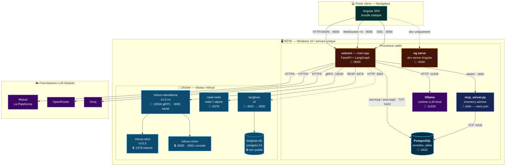
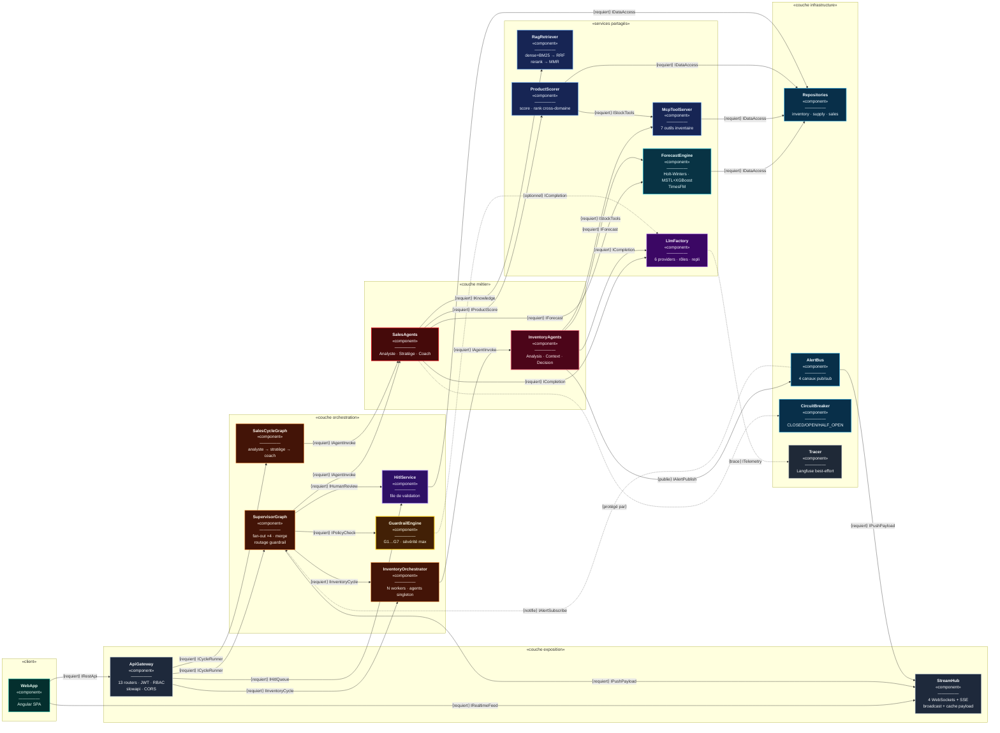

# Vues d'Architecture — Moteur Agentique Retail Ooredoo Tunisie

Quatre vues complémentaires du même système, chacune répondant à une question
différente. Toutes sont dérivées du code source ; voir
[ARCHITECTURE_GLOBALE_VISUELLE.md](ARCHITECTURE_GLOBALE_VISUELLE.md) pour la
spécification détaillée et la charte graphique.

| Vue | Question à laquelle elle répond | Public |
|---|---|---|
| **1 · Globale** | *Que fait le système, avec qui dialogue-t-il ?* | Jury, encadrant, métier |
| **2 · Logique** | *Comment les responsabilités sont-elles découpées ?* | Architecte, développeur |
| **3 · Physique** | *Où tourne quoi, sur quel port, dans quel processus ?* | DevOps, déploiement |
| **4 · Composants** | *Quelles interfaces chaque brique fournit et requiert ?* | Développeur, intégrateur |

> **Règle de lecture** : la vue logique ignore délibérément le déploiement ; la
> vue physique ignore délibérément le métier. Ne cherchez pas à les faire
> coïncider une à une — un composant logique peut se répartir sur plusieurs
> processus, et un processus peut porter plusieurs composants logiques.

---

# 1 · Architecture Globale

*Vue de contexte — le système et son environnement.*

## 1.1 Périmètre

Le système est un **monolithe FastAPI + LangGraph** qui expose une API unifiée à
un frontend Angular, et consomme cinq dépendances externes : PostgreSQL, Milvus,
Redis, Langfuse et un ou plusieurs fournisseurs LLM.

## 1.2 Diagramme de contexte



## 1.3 Capacités offertes

| Capacité | Déclencheur | Sortie |
|---|---|---|
| Coaching conversationnel | message du vendeur | conseil streamé (SSE) + produits scorés |
| Cycle d'analyse automatique | cron ou alerte Redis | payload dashboard poussé en WebSocket |
| Suggestion de réapprovisionnement | cycle inventory par SKU | PO au statut `SUGGERE` sur le Kanban |
| Alerte critique | rupture détectée | notification temps réel + cycle agent |
| Validation humaine | statut guardrail `ESCALATE`/`BLOCK` | entrée dans la file HITL |

---

# 2 · Architecture Logique

*Vue de découpage — les responsabilités, sans aucune notion de déploiement.*

## 2.1 Principe de stratification

Cinq couches logiques, dépendance **strictement descendante** : une couche ne
connaît que celle du dessous. Aucune remontée d'appel, sauf par événement
(Redis) — qui est justement le mécanisme prévu pour inverser le sens.



## 2.2 Responsabilités par couche

| Couche | Responsabilité | Ne fait **jamais** |
|---|---|---|
| ① Présentation | rendu, saisie, abonnement aux flux | aucune règle métier, aucun calcul de KPI |
| ② Application | exposition, sécurité, sérialisation | aucun raisonnement, aucune orchestration d'agent |
| ③ Orchestration | séquencement, parallélisation, fusion d'état, arbitrage | aucun accès direct à la base |
| ④ Métier | diagnostic, stratégie, prévision, décision | aucune connaissance du transport (HTTP/WS) |
| ⑤ Persistance | lecture/écriture, cache, appels LLM | aucune décision métier |

## 2.3 Règle de dépendance et son unique exception

Le sens des flèches est descendant sans exception **sauf** la remontée
événementielle : le bus d'alertes (couche ⑤) publie un événement que
l'orchestration (couche ③) consomme. C'est un découplage volontaire — le
producteur d'alerte ignore totalement qui la traitera.

## 2.4 Modèle d'état partagé

Le contrat entre l'orchestration et le métier est un **état typé unique**,
`RetailState`, organisé en 8 groupes :

```
identité        cycle_id · store_id · advisor_id · trigger_type
entrées         pos_data · stock_data · context_data · user_message
analyse         gap_pct · forecast_eod · urgency_level · ts_analysis · feasibility
stratégie       strategie_actions · focus_produits · cause_racine · critique_score
inventaire      inventory_decisions · critical_stock_alerts · inventory_snapshot
connaissance    rag_context · retrieved_scripts · recommended_offers
sortie          coach_recommendation · scored_products · advisor_message_final
contrôle        guardrail_status · requires_human_validation · hitl_* · métriques
```

**Contrainte structurante** : les branches parallèles écrivent dans le même
superstep. Trois champs portent donc un *reducer* explicite
(`agents_invoked`, `errors` → concaténation ; `metrics` → fusion de
dictionnaires). Chaque nœud retourne un **delta**, jamais l'état complet.

---

# 3 · Architecture Physique

*Vue de déploiement — processus, conteneurs, ports, protocoles.*

## 3.1 Topologie

Déploiement mono-hôte (poste de développement / serveur unique). Six conteneurs
Docker sur le réseau `milvus`, plus deux à trois processus natifs.



## 3.2 Table de déploiement

| Unité | Type | Port hôte | Protocole | Persistance |
|---|---|---|---|---|
| `uvicorn main:app` | processus Python | **8000** | HTTP · WS · SSE | — (sans état) |
| Angular SPA | bundle statique | 4200 (dev) | HTTP | `localStorage` |
| `mcp_server.py` | processus enfant | *aucun* | **stdio** | — |
| PostgreSQL `ooredoo_sales` | service natif | **5432** | TCP | volume disque |
| Ollama | service natif | **11434** | HTTP | modèles locaux |
| `milvus-standalone` | conteneur | **19530**, 9091 | gRPC, HTTP | `volumes/milvus` |
| `milvus-etcd` | conteneur | interne 2379 | gRPC | `volumes/etcd` |
| `milvus-minio` | conteneur | interne 9000/9001 | HTTP S3 | `volumes/minio` |
| `retail-redis` | conteneur | **6379** | RESP | **aucune** (`--save ""`) |
| `langfuse` | conteneur | **3001** → 3000 | HTTP | via `langfuse-db` |
| `langfuse-db` | conteneur | non publié | TCP | volume `langfuse-pg` |

## 3.3 Contraintes physiques observées

Trois points de déploiement non évidents, découverts en exploitation :

**① Résolution IPv6 sous Windows** — `localhost` résout en `::1` avant
`127.0.0.1`. Ollama et Milvus n'écoutent qu'en IPv4 : chaque requête payait le
timeout de la tentative IPv6. **2227 ms via `localhost` contre 87 ms via
`127.0.0.1`**. La configuration réécrit systématiquement les URL
(`_prefer_ipv4()`).

**② Garde-fou de schéma au démarrage** — au boot, `schema_check.py` vérifie que
la base est à la révision Alembic attendue et **refuse de démarrer sinon**.
L'application ne crée jamais de table : le schéma appartient aux migrations.

**③ Redis sans persistance** — `--save ""`, `--appendonly no`,
`maxmemory 256mb` en `allkeys-lru`. C'est un **bus et un cache**, jamais une
source de vérité. Un redémarrage Redis est sans conséquence fonctionnelle.

## 3.4 Séquence de démarrage

```
1. docker compose up -d          # milvus + etcd + minio + redis + langfuse
2. alembic upgrade head          # schéma à la révision attendue
3. python db/seeds/*.py          # seeds idempotents
4. uvicorn main:app --port 8000  # schema_check → lifespan → prêt
5. python scripts/smoke_test.py  # contrat API + 3 WebSockets
```

## 3.5 Modes dégradés

Conformément au principe de dégradation gracieuse, aucune de ces pannes n'arrête
le système :

| Panne | Comportement |
|---|---|
| Milvus indisponible | RAG bascule sur le corpus fichier ; le retriever ne lève jamais |
| Redis indisponible | perte du bus événementiel ; les cycles cron continuent |
| Langfuse indisponible | SDK muselé à `CRITICAL` ; aucun impact agent |
| Groq en quota | rotation de clés, puis repli sur Ollama local |
| LLM entièrement KO | nœuds `use_llm=False` → heuristiques déterministes |
| **PostgreSQL indisponible** | **arrêt** — seule dépendance sans repli |

---

# 4 · Diagramme de Composants

*Vue d'assemblage — interfaces fournies (○—) et requises (—C).*

## 4.1 Composants et leurs contrats



## 4.2 Catalogue des interfaces

| Interface | Fournie par | Requise par | Contrat |
|---|---|---|---|
| `IRestApi` | ApiGateway | WebApp | 13 routers REST, JWT porteur, RBAC `store_id` |
| `IRealtimeFeed` | StreamHub | WebApp | 4 WebSockets + 1 SSE, broadcast multi-connexion |
| `ICycleRunner` | SupervisorGraph, SalesCycleGraph | ApiGateway | `invoke(RetailState) → RetailState` |
| `IInventoryCycle` | InventoryOrchestrator | ApiGateway, SupervisorGraph | cycle par SKU, `agent_run` tracé |
| `IAgentInvoke` | SalesAgents, InventoryAgents | orchestrateurs | sous-graphe compilé, retourne un **delta** |
| `IPolicyCheck` | GuardrailEngine | SupervisorGraph | `evaluate(...) → {status, issues, safe_fallback}` |
| `IHumanReview` | HitlService | SupervisorGraph | inscription en file, attente d'arbitrage |
| `IHitlQueue` | HitlService | ApiGateway | lecture/résolution de la file |
| `IForecast` | ForecastEngine | agents | prévision **déterministe**, sans LLM |
| `IKnowledge` | RagRetriever | SalesAgents | recherche hybride, **ne lève jamais** |
| `IStockTools` | McpToolServer | InventoryAgents, ProductScorer | 7 outils, protocole MCP stdio |
| `IProductScore` | ProductScorer | SalesAgents | scoring cross-domaine → `scored_products` |
| `ICompletion` | LlmFactory | tous les agents | `get_llm(provider, role, temperature)` |
| `IDataAccess` | Repositories | services | accès PostgreSQL, jamais de DDL |
| `IAlertPublish` | AlertBus | InventoryAgents | publication sur 4 canaux |
| `IAlertSubscribe` | AlertBus | SupervisorGraph | **abonnement — inversion de dépendance** |
| `IPushPayload` | StreamHub | SupervisorGraph, AlertBus | diffusion vers les clients connectés |
| `ITelemetry` | Tracer | LlmFactory | best-effort, jamais bloquant |

## 4.3 Points d'assemblage remarquables

**`IAlertSubscribe` est la seule interface inversée.** Toutes les autres vont du
haut vers le bas. Celle-ci remonte de l'infrastructure vers l'orchestration :
c'est ce qui rend le système *événementiel* et non seulement *requête-réponse*.

**`IPolicyCheck` est un goulot obligatoire.** Aucun composant ne peut atteindre
`IPushPayload` sans être passé par `GuardrailEngine`. C'est une propriété
d'architecture, pas une convention de code.

**`IStockTools` est le pont inter-domaines.** `ProductScorer`, qui appartient au
domaine vente, requiert une interface fournie par le domaine stock. C'est le
seul couplage horizontal entre les deux domaines, et il est explicite.

**`ICompletion` isole totalement les fournisseurs LLM.** Changer de modèle ou de
fournisseur n'impacte aucun agent — d'où la possibilité du repli en cascade
Groq → Ollama sans modification métier.

---

# 5 · Correspondance entre les vues

Une même brique n'occupe pas la même case selon la vue. Ce tableau évite les
contresens en soutenance.

| Composant (vue 4) | Couche logique (vue 2) | Unité physique (vue 3) |
|---|---|---|
| WebApp | ① Présentation | bundle navigateur / `ng serve :4200` |
| ApiGateway · StreamHub | ② Application | processus `uvicorn :8000` |
| SupervisorGraph · SalesCycleGraph · InventoryOrchestrator | ③ Orchestration | processus `uvicorn :8000` |
| GuardrailEngine · HitlService | ③ Orchestration | processus `uvicorn :8000` |
| SalesAgents · InventoryAgents | ④ Métier | processus `uvicorn :8000` |
| ForecastEngine · ProductScorer | ④ Métier | processus `uvicorn :8000` |
| RagRetriever | ④ Métier | `uvicorn` **+** conteneur Milvus `:19530` |
| McpToolServer | ④ Métier | **processus enfant séparé** (stdio) |
| LlmFactory | ⑤ Persistance/Intégration | `uvicorn` + Ollama `:11434` + API distantes |
| Repositories | ⑤ Persistance | `uvicorn` + PostgreSQL `:5432` |
| AlertBus | ⑤ Persistance | `uvicorn` + conteneur Redis `:6379` |
| Tracer | ⑤ Persistance | `uvicorn` + conteneur Langfuse `:3001` |

**Lecture clé** : l'essentiel du système est **un seul processus**. C'est un
monolithe assumé. Seuls le serveur MCP (processus enfant) et les dépendances
d'infrastructure (conteneurs) sont physiquement séparés. La modularité est
**logique**, pas physique — ce qui est un choix cohérent pour un déploiement
mono-magasin, et le point à faire évoluer en premier si le passage à l'échelle
multi-région devient nécessaire.

---

## Annexe — Générer ces vues en image

Les prompts de génération (SVG exact ou image stylée) sont dans
[PROMPT_IMAGE_ARCHITECTURE.md](PROMPT_IMAGE_ARCHITECTURE.md). La charte
graphique — palette sémantique, grammaire de formes et de traits — est en §14 de
[ARCHITECTURE_GLOBALE_VISUELLE.md](ARCHITECTURE_GLOBALE_VISUELLE.md) et
s'applique aux quatre vues, garantissant qu'elles se lisent comme un ensemble
cohérent.
