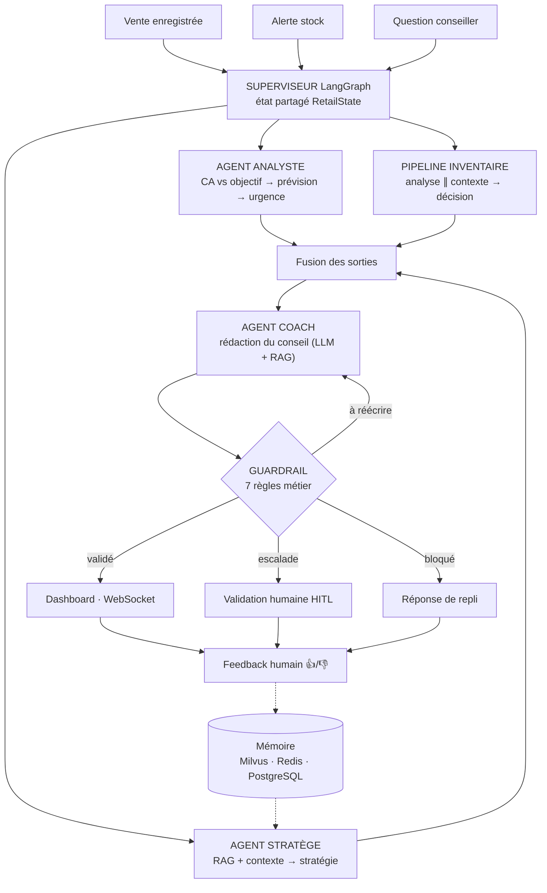

# Architecture agentique

Un **superviseur LangGraph** reçoit un déclencheur, lance les agents en parallèle,
fusionne leurs sorties, fait rédiger le conseil puis le soumet à un contrôle métier
avant diffusion.

## Les agents

| Agent | Question à laquelle il répond | Sortie |
|---|---|---|
| **Analyste** | Où en est la boutique face à son objectif ? | écart %, prévision fin de journée, urgence HAUT/MOYEN/BAS |
| **Stratège** | Que faire, et pourquoi ça a marché ailleurs ? | cause racine, produits à pousser, actions (avec auto-critique) |
| **Inventaire** (3 sous-agents) | Quel SKU risque la rupture, et combien commander ? | niveau de risque, quantité et date de commande |
| **Coach** | Comment le dire au conseiller, maintenant ? | message court et actionnable |
| **Guardrail** | Est-ce diffusable ? | validé / à réécrire / escalade / bloqué |

## Le pipeline inventaire

`Analyse` (stock, couverture, risque) et `Contexte` (signaux de demande) tournent
**en parallèle** — ils sont indépendants ; `Décision` consomme les deux, vérifie les
contraintes (budget, fournisseur, délai) puis propose la commande.

## Les 7 garde-fous

1. produit en stock — 2. pas de rupture imminente — 3. argument issu d'une source RAG
vérifiée — 4. pas de remise non autorisée — 5. éligibilité réseau confirmée —
6. confiance suffisante — 7. commande importante → approbation manager.

## Principes de conception

- **État partagé, écritures en delta** : chaque nœud ne renvoie que ce qu'il modifie.
- **Dégradation gracieuse** : un agent indisponible n'interrompt pas le cycle.
- **LLM hors du chemin critique** : les chiffres viennent du calcul, le LLM formule.
- **Une seule boucle de réécriture** : pas de va-et-vient infini Coach ↔ Guardrail.
- **Tout est tracé** (Langfuse) : un cycle = une trace, un agent = un span.

→ Diagramme éditable : [architecture_agentique.drawio](architecture_agentique.drawio)
→ Vue d'ensemble : [architecture_globale.md](architecture_globale.md)
