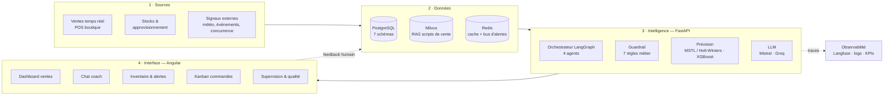

# Architecture globale

Plateforme agentique retail : elle observe les ventes et les stocks en temps réel,
et produit deux sorties — un **conseil de vente** au conseiller, une **suggestion de
commande** au manager.

## Les 4 couches

| Couche | Rôle | Technique |
|---|---|---|
| **Sources** | Ventes, stocks, signaux marché, historique 4,5 ans | transactions POS, mouvements de stock, scrapers |
| **Données** | Vérité métier, mémoire sémantique, temps réel | PostgreSQL (schéma versionné Alembic), Milvus, Redis |
| **Intelligence** | Décide et rédige | LangGraph, garde-fous, modèles de prévision, LLM |
| **Interface** | Rend actionnable | Angular, REST + WebSocket + streaming |

## Points structurants

- **Une seule API** (FastAPI) expose ventes, inventaire et agents ; le front ne parle qu'à elle.
- **Temps réel par WebSocket** : le dashboard et les alertes stock sont poussés, pas interrogés.
- **Schéma de base versionné** : toute évolution passe par une migration, aucune création de table à l'exécution.
- **Aucune décision automatique irréversible** : commandes et cas sensibles passent par une validation humaine.
- **Boucle fermée** : la note humaine sur un conseil (👍/👎) redevient une donnée d'évaluation des agents.

→ Diagramme éditable : [architecture_globale.drawio](architecture_globale.drawio)
→ Détail des agents : [architecture_agentique.md](architecture_agentique.md)
