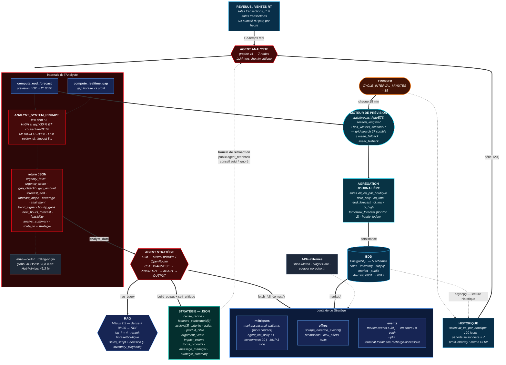

# 06 — Flux temps réel Analyste → Stratège

Compagnon de [FLUX_ANALYSTE_STRATEGE.drawio](../diagrams/FLUX_ANALYSTE_STRATEGE.drawio).
Toutes les valeurs ci-dessous sont **extraites du code source**, pas approximées.

| Objectif | Bloc à utiliser |
|---|---|
| Image exacte pour le rapport | **§1 — Prompt SVG** (LLM générateur de code) ⭐ |
| Rendu immédiat sans LLM | **§2 — Mermaid** (coller sur mermaid.live) |
| Illustration de slide | **§3 — Prompt diffusion** (Midjourney / DALL·E / Flux) |
| Vérifier les chiffres | **§4 — Table des valeurs sourcées** |

> Rappel : les modèles de diffusion **ne savent pas écrire du texte dense**.
> Un schéma d'architecture est à 70 % du texte. Pour un livrable technique,
> utiliser §1 ou §2 — jamais §3.

---

## 1. ⭐ Prompt SVG — schéma exact

À coller dans Claude / GPT / tout LLM générateur de code.

````
Generate ONE self-contained SVG file (viewBox 0 0 1600 1250, no external assets,
no JavaScript, no external fonts). Embed all styling in a <style> block using a
system geometric sans-serif stack. Output only the SVG code, nothing else.

═══ DESIGN SYSTEM (mandatory) ═══
Background: #0B1220. Primary text #F1F5F9, secondary text #94A3B8.
Semantic stroke / fill pairs:
  Agents (LLM)       #E30613 / #450A0A
  Tools & RAG        #60A5FA / #172554
  ML / forecasting   #22D3EE / #083344
  Data & PostgreSQL  #38BDF8 / #082F49
  Trigger            #FB923C / #431407
  Output to advisor  #14B8A6 / #042F2E
  Evaluation         #9CA3AF / #1F2937
  Feedback loop      #FACC15 (dashed, 60% opacity)
Shape grammar: agents = HEXAGON. Database = CYLINDER. Entry/exit = STADIUM
(fully rounded ends). Everything else = rounded rect, 12px radius.
Line grammar: main flow = solid 2.5px arrow. Secondary = solid 1.5px.
External dependency = dotted 1.5px. Feedback loop = dashed, amber.
No 3D, no isometric, no gradients on shapes, no drop shadows, no robot or brain
icons. Target aesthetic: engineering documentation (Stripe, Vercel, Temporal).

═══ TITLE ═══
"Flux temps réel — Agent Analyste → Agent Stratège", 23px bold, top-left.
Subtitle 12px #94A3B8: "Moteur agentique Retail — Ooredoo Tunisie".

═══ LAYOUT — three vertical zones ═══
LEFT column = the two agents. CENTER = their internals. RIGHT = forecasting
engine and database. The flow reads top-left → right → down → bottom-left.

─── ROW 1 (top) ───
[A] Rounded rect, data color, top-left:
    "REVENUS / VENTES RT"
    small: "sales.transactions_rt ∪ sales.transactions"
    small: "CA cumulé du jour, par heure"

[B] Rectangle (sharp corners), data color, center-top:
    "HISTORIQUE"
    small: "sales.vw_ca_par_boutique — 120 jours"
    small: "série journalière, période saisonnière = 7"
    small: "profil intraday : même jour de semaine (DOW)"

[C] Stadium, trigger color, top-right:
    "TRIGGER"
    small: "CYCLE_INTERVAL_MINUTES = 15"
    small: "orchestration/trigger.py"

─── ROW 2 ───
[D] HEXAGON, agent color, left:
    "AGENT ANALYSTE"
    small: "graphe v4 — 7 nodes · LLM hors chemin critique"
    Below it, 10px #94A3B8 caption:
    "receive_pos → validate_data → load_memory → ts_analyst
     → compare_with_memory → build_strategy_query → save_memory"

[E] A large dashed-border container (agent color, 1.5px dashed) to the right of
    [D], holding four stacked groups. Draw a curly brace "{" before each group.

    Group "tools" (label 14px, tools color):
      - rounded rect: "compute_eod_forecast"
        small: "prévision fin de journée + IC 80 %"
      - rounded rect: "compute_realtime_gap"
        small: "gap horaire vs profil attendu"
      - caption 10px in ML color:
        "ts_engine.analyze_store() — 100 % déterministe, < 1 s"

    Group "prompt" (label 14px, agent color):
      - rounded rect: "ANALYST_SYSTEM_PROMPT — few-shot ×3"
        small: "règles d'urgence : HIGH gap>30 % & couverture<80 % · MEDIUM 15–30 %"
        small: "+ ANALYST_USER_PROMPT : pos_data · historique · forecast · objectif"
        small: "optionnel — ANALYST_LLM_SUMMARY=1, timeout 8 s"

    Group "return" (label 14px, agent color):
      - rounded rect titled "JSON", listing in small monospace:
        "urgency_level · urgency_score · gap_objectif · gap_amount"
        "forecast_eod · forecast_mape · coverage · attainment"
        "trend_signal · hourly_gaps · next_hours_forecast · feasibility"
        "analyst_summary  |  route_to = \"strategie\""

    Group "eval" (evaluation color, dotted arrow from the JSON box):
      - rounded rect: "eval — WAPE backtest rolling-origin, 28 j"
        small: "plafonné à 60 % · global XGBoost 33,4 % vs Holt-Winters 46,3 %"

─── RIGHT COLUMN ───
[F] Stadium, ML color:
    "MOTEUR DE PRÉVISION"
    small: "statsforecast AutoETS season_length=7"
    small: "↓ fallback holt_winters_seasonal7"
    small: "grid-search 27 combis (α, β, γ)"
    small: "↓ mean_fallback ↓ linear_fallback"

[G] Rectangle, ML color, below [F]:
    "AGRÉGATION JOURNALIÈRE"
    small: "sales.vw_ca_par_boutique — date_only · ca_total"
    small: "eod_forecast · eod_ci_low / ci_high"
    small: "tomorrow_forecast (horizon 2)"
    small: "hourly_ledger · hourly_gaps"

[H] CYLINDER, data color, lower right:
    "BDD"
    small: "PostgreSQL — 5 schémas"
    small: "sales · inventory · supply · market · public"
    small: "Alembic 0001 → 0012 — source de vérité unique"

[I] Small rounded rect, slate (#64748B / #1E293B), bottom right:
    "APIs externes"
    small: "Open-Meteo (météo) · Nager.Date (fériés TN) · scraper ooredoo.tn"

─── BOTTOM ZONE ───
[J] HEXAGON, agent color, lower left:
    "AGENT STRATÈGE"
    small: "LLM — Mistral primaire / OpenRouter"
    small: "CoT : DIAGNOSE → PRIORITIZE → ADAPT → OUTPUT"
    Caption below, 10px #94A3B8:
    "fetch_context → rag_search → analyze_context → generate_strategy
     → build_output → self_critique"

[K] HEXAGON, tools color, right of [J]:
    "RAG"
    small: "Milvus 2.5 — dense + BM25 → RRF"
    small: "top_k = 4 · rerank horaire/boutique"
    small: "domaines : sales_script + decision"
    small: "(+ inventory_playbook si stock_alerts)"

[L] Dashed container with a curly brace "{", tools color, below [K],
    holding three rounded rects:
      - "métriques"
        small: "market.seasonal_patterns (mois courant)"
        small: "agent_kpi_daily 7 j · concurrents 90 j · MNP 3 mois"
      - "offres"
        small: "scrape_ooredoo_events() — promotions · new_offers · tarifs"
      - "events"
        small: "market.events ≤ 30 j — en cours / à venir"
        small: "uplift terminal·forfait·sim·recharge·accessoire"

[M] Rounded rect, output color, bottom left:
    "STRATÉGIE — JSON"
    small: "cause_racine · facteurs_contextuels[3]"
    small: "actions[3] : priorite · action · produit_cible"
    small: "            argument_vente · impact_estime"
    small: "focus_produits · message_manager · strategie_summary"

═══ EDGES (draw exactly these, orthogonal with rounded corners) ═══
A → D          solid 2.5px, label "CA temps réel"
B → D          solid 2px,   label "série 120 j"
C → B          dotted 2px   (trigger fires the history read)
C → F          solid 2px,   label "chaque 15 min"
D → tools brace, D → prompt box, D → JSON box   solid, agent color
prompt → JSON  solid 1.5px
JSON → eval    dotted 1.5px
compute_eod_forecast → F   solid 2px, ML color
F → G          solid 2.5px
G → H          solid 2.5px, label "persistance"
H → B          dotted 1.5px, long path around the right edge,
               label "asyncpg — lecture historique"
JSON → J       SOLID 3px, agent color, routed around the LEFT edge of the canvas,
               label "analyst_data"   ← this is the main hand-off, make it prominent
J → K          solid 2px, label "rag_query"
J → L          solid 2px, label "fetch_full_context()"
H → L          solid 2px, label "market.*"
I → L          dotted 1.5px
J → M          solid 3px, output color, label "build_output + self_critique"
M → D          DASHED amber, routed around the far LEFT edge back to the top,
               label "boucle de rétroaction / public.agent_feedback
                      / conseil suivi ou ignoré"

═══ LEGEND (bottom strip, #0F172A fill, #475569 stroke) ═══
"⬡ Agent (LangGraph)" · "▭ Outil / RAG" · "▭ Moteur ML déterministe"
"⌷ PostgreSQL" · "◠ Sortie vendeur" · "▭ Déclencheur"
Second line: "━━ flux principal    ┄┄ dépendance externe    ┄┄ boucle de rétroaction"
````

---

## 2. Mermaid — rendu immédiat

Coller tel quel sur <https://mermaid.live> → *Actions → SVG / PNG*.



---

## 3. Prompt diffusion — illustration de slide uniquement

⚠️ Le texte sera illisible ou inventé. À réserver à une slide d'ouverture.

```
Technical architecture diagram of a real-time multi-agent retail AI pipeline,
flat vector engineering-documentation style on a deep navy background (#0B1220).
Two red hexagonal agent nodes connected by a thick red flow line curving around
the left edge. A cyan forecasting engine block and a blue database cylinder on
the right column. A blue hexagon labelled RAG at the bottom, feeding a teal
rounded output card. Thin amber dashed feedback loop arcing from the bottom-left
back to the top. Cool restrained palette, one warm red accent only.
Clean orthogonal connectors, sparse labels, generous negative space.
No 3D, no isometric, no gradients, no drop shadows, no robot or brain icons,
no neon cyberpunk glow. Aesthetic reference: Stripe / Vercel / Temporal docs.
```

---

## 4. Table des valeurs sourcées

Tout élément chiffré des prompts ci-dessus est traçable au code.

| Valeur | Fichier |
|---|---|
| `sales.transactions_rt ∪ sales.transactions` | `app/sales/coaching/agents/analyst/ts_engine.py:268-272` |
| 120 jours d'historique · `vw_ca_par_boutique` | `ts_engine.py:193-199` |
| Profil intraday filtré `EXTRACT(DOW)` | `ts_engine.py:221-224` |
| `CYCLE_INTERVAL_MINUTES = 15` | `app/core/config.py:99` · `app/sales/orchestration/trigger.py` |
| Graphe analyste 7 nodes | `analyst/agent.py:36-56` |
| `analyze_store()` déterministe < 1 s | `analyst/ts_node.py:5-8, 79` |
| Règles d'urgence HIGH / MEDIUM / LOW | `analyst/prompts.py:29-32` |
| Few-shot ×3 | `analyst/prompts.py:42-118` |
| `ANALYST_LLM_SUMMARY=1`, timeout 8 s | `analyst/ts_node.py:27-28` |
| 14 champs du JSON de retour | `analyst/ts_node.py:136-167` |
| WAPE rolling-origin 28 j, plafond 60 % | `ts_engine.py:113-135` |
| `AutoETS(season_length=7)` | `ts_engine.py:160` |
| `holt_winters_seasonal7` · grid-search 27 combis | `ts_engine.py:96-110, 184` |
| `mean_fallback` (< 21 j) · `linear_fallback` | `ts_engine.py:145-149` · `ts_node.py:170-201` |
| Graphe stratège 6 nodes | `stratege/agent.py:38-52` |
| RAG `top_k=4`, domaines, bonus météo +0.08 | `stratege/nodes.py:234-252` |
| `market.seasonal_patterns` mois courant | `stratege/tools.py:243-249` |
| `market.events ≤ 30 j`, split en cours / à venir | `stratege/tools.py:195-241` |
| `scrape_ooredoo_events()` | `stratege/tools.py:390-395` |
| Open-Meteo · Nager.Date | `stratege/tools.py:67, 140` |
| Schéma JSON de sortie du stratège | `stratege/prompts.py:278-299` |

> **Écart connu** — `ANALYST_SYSTEM_PROMPT` mentionne encore *« Interpret TimesFM
> end-of-day forecasts »* et le champ `timesfm_end_of_day_forecast`, alors que
> `ts_node.py:93` documente `timesfm_prediction` comme une simple clé de
> compatibilité remplie par `ts_engine`. Sans effet tant que
> `ANALYST_LLM_SUMMARY=0`, mais à corriger avant toute réactivation du résumé LLM.
