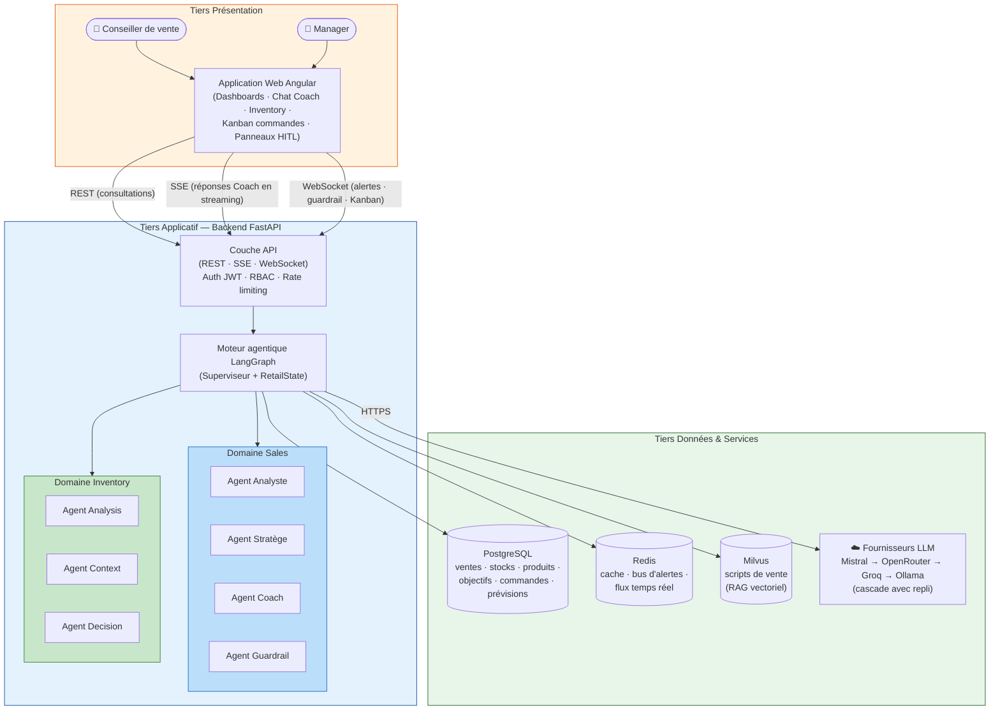

# Architecture globale du système

> Rendu cible : `img/architecture_globale.png` — vue 3 tiers (présentation / applicatif / données & services).
> À rendre via https://mermaid.live (Export PNG) ou `mmdc -i architecture_globale.md -o architecture_globale.png`.

## Légende

- **Tiers présentation** : application Angular unique, deux profils d'utilisateurs (conseiller / manager), trois canaux de communication (REST, SSE, WebSocket).
- **Tiers applicatif** : FastAPI expose les API et héberge le moteur multi-agents orchestré par LangGraph.
- **Tiers données & services** : PostgreSQL (données métier), Redis (cache + temps réel), Milvus (RAG), cascade de fournisseurs LLM avec repli automatique.
