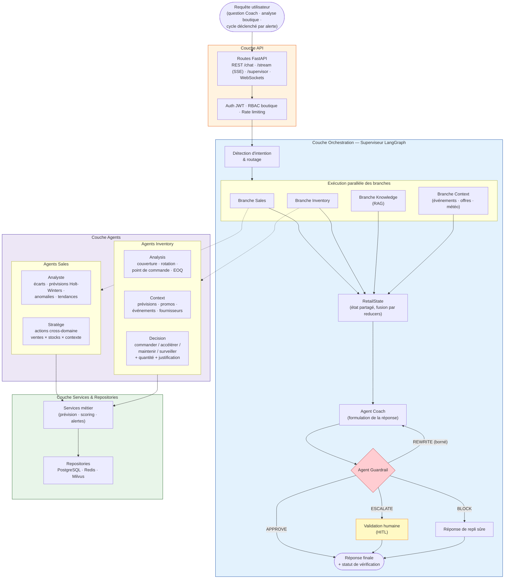

# Architecture logique du moteur multi-agents

> Rendu cible : `img/architecture_logique.png` — organisation en couches + flux d'un cycle multi-agents.
> À rendre via https://mermaid.live (Export PNG) ou `mmdc`.

## Légende

- **Couche API** : points d'entrée REST/SSE/WebSocket, sécurisés (JWT, RBAC, rate limiting).
- **Couche orchestration** : le superviseur route selon l'intention, exécute les 4 branches en parallèle, fusionne les sorties dans le `RetailState` via des reducers, puis la réponse passe par le Coach et le Guardrail.
- **Verdicts Guardrail** : APPROVE (diffusée), REWRITE (re-passe bornée), ESCALATE (validation humaine), BLOCK (réponse de repli sûre).
- **Couche agents** : 4 agents Sales + 3 agents Inventory, chacun encapsulant une expertise.
- **Couche services & repositories** : logique métier réutilisable et accès aux données, isolés des routes et des agents.
