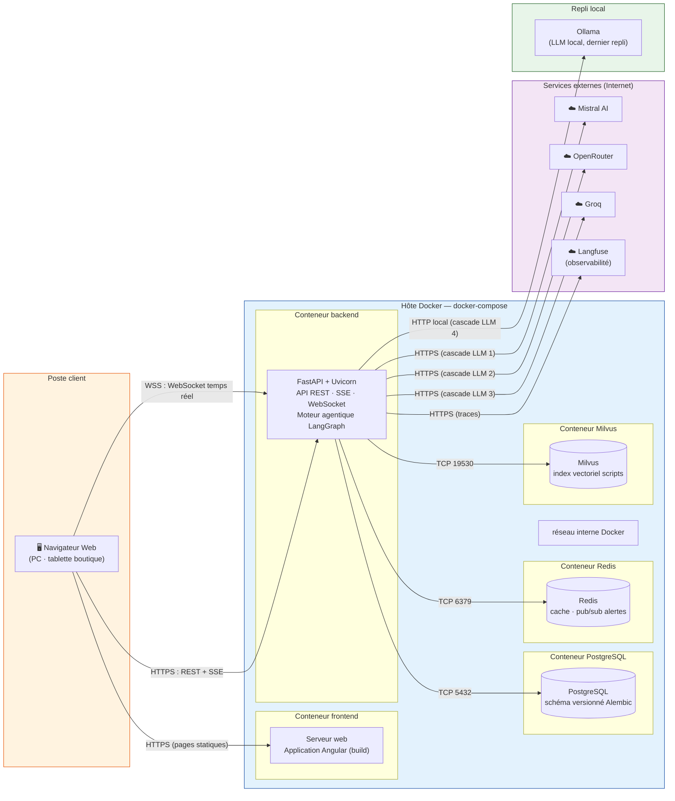

# Architecture physique et déploiement

> Rendu cible : `img/architecture_physique.png` — vue déploiement (conteneurs Docker + services externes).
> À rendre via https://mermaid.live (Export PNG) ou `mmdc`.

## Légende

- **Poste client** : navigateur web (PC ou tablette en boutique), aucun logiciel spécifique requis.
- **Hôte Docker** : 5 conteneurs orchestrés par docker-compose (frontend, backend, PostgreSQL, Redis, Milvus) communiquant sur le réseau interne Docker.
- **Services externes** : fournisseurs LLM appelés en cascade (Mistral → OpenRouter → Groq → Ollama local) et Langfuse pour l'observabilité.
- **Protocoles** : HTTPS pour REST/SSE, WSS pour le temps réel, TCP interne pour les bases de données.
