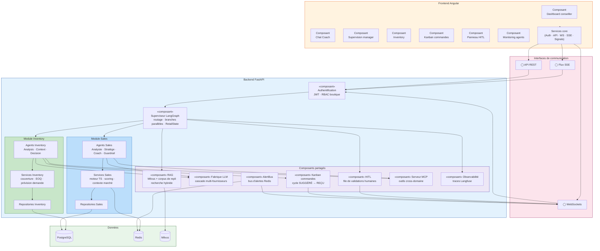

# Diagramme de composants

> Rendu cible : `img/diagramme_composants.png` — modules logiciels et dépendances.
> À rendre via https://mermaid.live (Export PNG) ou `mmdc`.

## Légende

- **Frontend Angular** : 7 composants d'interface + services core (auth, API, WebSocket, SSE, Signals).
- **Interfaces** : trois canaux exposés par le backend — REST (consultations), SSE (streaming Coach), WebSockets (alertes, guardrail, Kanban).
- **Modules Sales et Inventory** : chacun regroupe ses agents, services et repositories — la séparation des domaines est structurelle.
- **Composants partagés** : RAG, fabrique LLM (cascade), AlertBus, HITL, Kanban, serveur MCP (outils cross-domaine) et observabilité.
- **Données** : PostgreSQL (métier), Redis (cache/pub-sub), Milvus (vecteurs).
