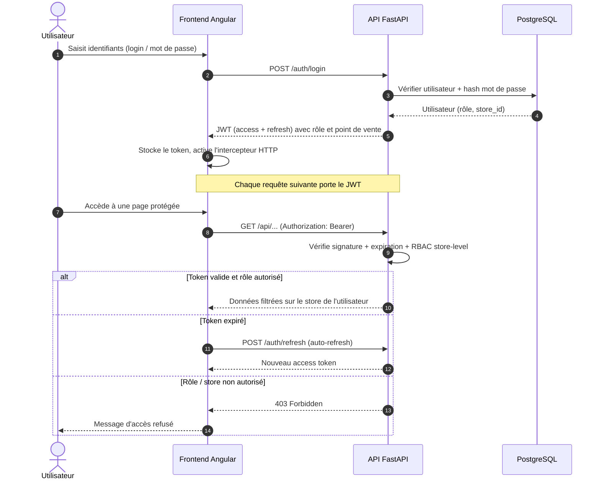

# SEQ-01 — Authentification et contrôle d'accès

**User stories couvertes :** US-8.1 · **Besoins :** BF-8.2, BNF-3.1

```mermaid
sequenceDiagram
    autonumber
    actor U as Utilisateur
    participant FE as Frontend Angular
    participant API as API FastAPI
    participant DB as PostgreSQL

    U->>FE: Saisit identifiants (login / mot de passe)
    FE->>API: POST /auth/login
    API->>DB: Vérifier utilisateur + hash mot de passe
    DB-->>API: Utilisateur (rôle, store_id)
    API-->>FE: JWT (access + refresh) avec rôle et point de vente
    FE->>FE: Stocke le token, active l'intercepteur HTTP

    Note over FE,API: Chaque requête suivante porte le JWT

    U->>FE: Accède à une page protégée
    FE->>API: GET /api/... (Authorization: Bearer)
    API->>API: Vérifie signature + expiration + RBAC store-level
    alt Token valide et rôle autorisé
        API-->>FE: Données filtrées sur le store de l'utilisateur
    else Token expiré
        FE->>API: POST /auth/refresh (auto-refresh)
        API-->>FE: Nouveau access token
    else Rôle / store non autorisé
        API-->>FE: 403 Forbidden
        FE-->>U: Message d'accès refusé
    end
```
