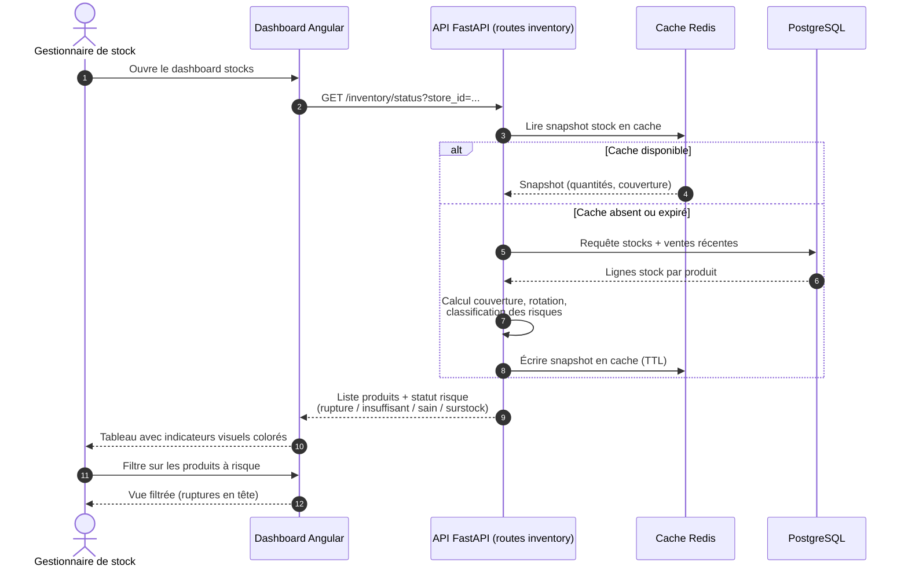

# SEQ-02 — Consultation de l'état des stocks et des risques

**User stories couvertes :** US-2.1, US-2.2 · **Besoins :** BF-1.1, BF-1.2, BNF-4.1, BNF-4.3

```mermaid
sequenceDiagram
    autonumber
    actor G as Gestionnaire de stock
    participant FE as Dashboard Angular
    participant API as API FastAPI (routes inventory)
    participant RD as Cache Redis
    participant DB as PostgreSQL

    G->>FE: Ouvre le dashboard stocks
    FE->>API: GET /inventory/status?store_id=...
    API->>RD: Lire snapshot stock en cache
    alt Cache disponible
        RD-->>API: Snapshot (quantités, couverture)
    else Cache absent ou expiré
        API->>DB: Requête stocks + ventes récentes
        DB-->>API: Lignes stock par produit
        API->>API: Calcul couverture, rotation,<br/>classification des risques
        API->>RD: Écrire snapshot en cache (TTL)
    end
    API-->>FE: Liste produits + statut risque<br/>(rupture / insuffisant / sain / surstock)
    FE-->>G: Tableau avec indicateurs visuels colorés
    G->>FE: Filtre sur les produits à risque
    FE-->>G: Vue filtrée (ruptures en tête)
```
