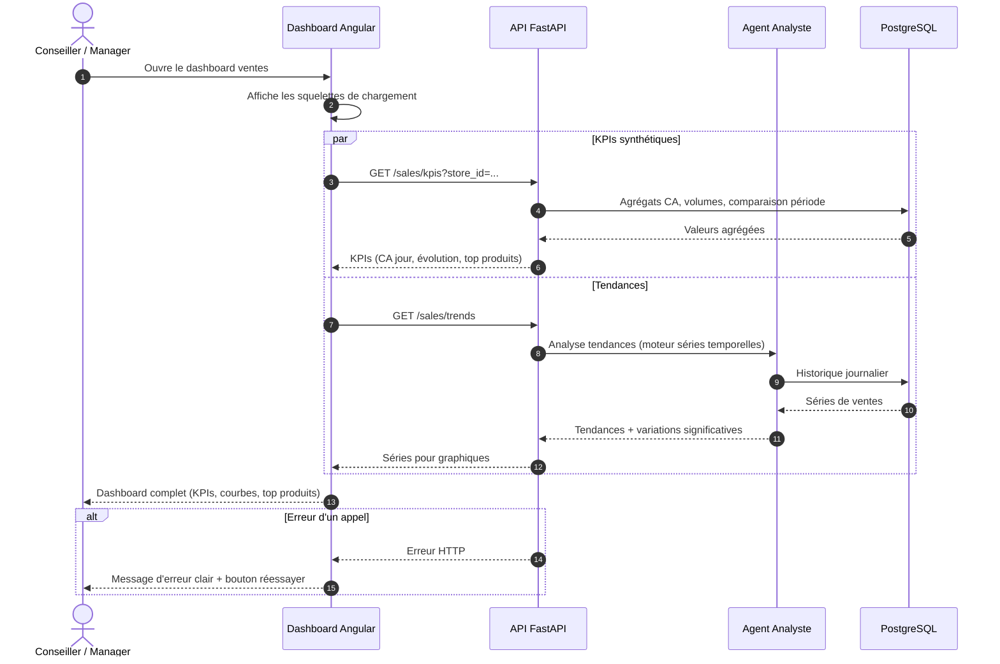

# SEQ-03 — Consultation du dashboard ventes et KPIs

**User stories couvertes :** US-2.3, US-2.4, US-2.6 · **Besoins :** BF-5.1, BNF-4.1, BNF-4.2

```mermaid
sequenceDiagram
    autonumber
    actor C as Conseiller / Manager
    participant FE as Dashboard Angular
    participant API as API FastAPI
    participant AN as Agent Analyste
    participant DB as PostgreSQL

    C->>FE: Ouvre le dashboard ventes
    FE->>FE: Affiche les squelettes de chargement
    par KPIs synthétiques
        FE->>API: GET /sales/kpis?store_id=...
        API->>DB: Agrégats CA, volumes, comparaison période
        DB-->>API: Valeurs agrégées
        API-->>FE: KPIs (CA jour, évolution, top produits)
    and Tendances
        FE->>API: GET /sales/trends
        API->>AN: Analyse tendances (moteur séries temporelles)
        AN->>DB: Historique journalier
        DB-->>AN: Séries de ventes
        AN-->>API: Tendances + variations significatives
        API-->>FE: Séries pour graphiques
    end
    FE-->>C: Dashboard complet (KPIs, courbes, top produits)
    alt Erreur d'un appel
        API-->>FE: Erreur HTTP
        FE-->>C: Message d'erreur clair + bouton réessayer
    end
```
