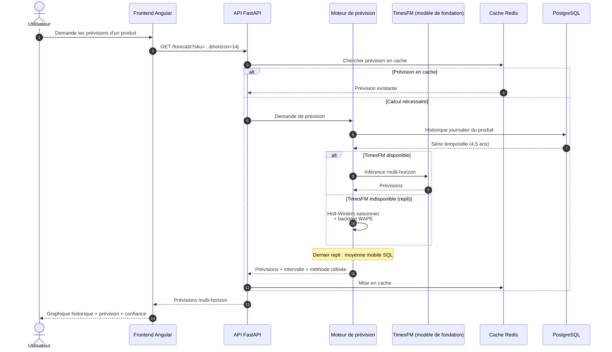

# SEQ-04 — Consultation des prévisions de demande / ventes

**User stories couvertes :** US-3.1, US-3.2, US-3.3 · **Besoins :** BF-1.4, BF-5.2, BNF-2.4

```mermaid
sequenceDiagram
    autonumber
    actor U as Utilisateur
    participant FE as Frontend Angular
    participant API as API FastAPI
    participant FC as Moteur de prévision
    participant TF as TimesFM (modèle de fondation)
    participant RD as Cache Redis
    participant DB as PostgreSQL

    U->>FE: Demande les prévisions d'un produit
    FE->>API: GET /forecast?sku=...&horizon=14j
    API->>RD: Chercher prévision en cache
    alt Prévision en cache
        RD-->>API: Prévision existante
    else Calcul nécessaire
        API->>FC: Demande de prévision
        FC->>DB: Historique journalier du produit
        DB-->>FC: Série temporelle (4,5 ans)
        alt TimesFM disponible
            FC->>TF: Inférence multi-horizon
            TF-->>FC: Prévisions
        else TimesFM indisponible (repli)
            FC->>FC: Holt-Winters saisonnier<br/>+ backtest WAPE
        end
        Note over FC: Dernier repli : moyenne mobile SQL
        FC-->>API: Prévisions + intervalle + méthode utilisée
        API->>RD: Mise en cache
    end
    API-->>FE: Prévisions multi-horizon
    FE-->>U: Graphique historique + prévision + confiance
```
