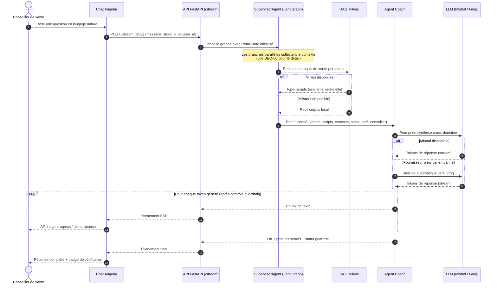

# SEQ-05 — Dialogue avec l'assistant coach (streaming SSE)

**User stories couvertes :** US-4.1, US-4.2, US-4.3, US-4.5 · **Besoins :** BF-4.1, BF-4.3, BF-4.4, BF-5.4, BNF-1.3

```mermaid
sequenceDiagram
    autonumber
    actor C as Conseiller de vente
    participant FE as Chat Angular
    participant API as API FastAPI (/stream)
    participant SUP as SupervisorAgent (LangGraph)
    participant RAG as RAG Milvus
    participant CO as Agent Coach
    participant LLM as LLM (Mistral / Groq)

    C->>FE: Pose une question en langage naturel
    FE->>API: POST /stream (SSE) {message, store_id, advisor_id}
    API->>SUP: Lance le graphe avec RetailState initialisé

    Note over SUP: Les branches parallèles collectent le contexte<br/>(voir SEQ-06 pour le détail)

    SUP->>RAG: Recherche scripts de vente pertinents
    alt Milvus disponible
        RAG-->>SUP: Top-k scripts (similarité vectorielle)
    else Milvus indisponible
        RAG-->>SUP: Repli corpus local
    end

    SUP->>CO: État fusionné (ventes, scripts, contexte, stock, profil conseiller)
    CO->>LLM: Prompt de synthèse cross-domaine
    alt Mistral disponible
        LLM-->>CO: Tokens de réponse (stream)
    else Fournisseur principal en panne
        CO->>LLM: Bascule automatique vers Groq
        LLM-->>CO: Tokens de réponse (stream)
    end

    loop Pour chaque token généré (après contrôle guardrail)
        CO-->>API: Chunk de texte
        API-->>FE: Événement SSE
        FE-->>C: Affichage progressif de la réponse
    end
    CO-->>API: Fin + produits scorés + statut guardrail
    API-->>FE: Événement final
    FE-->>C: Réponse complète + badge de vérification
```
