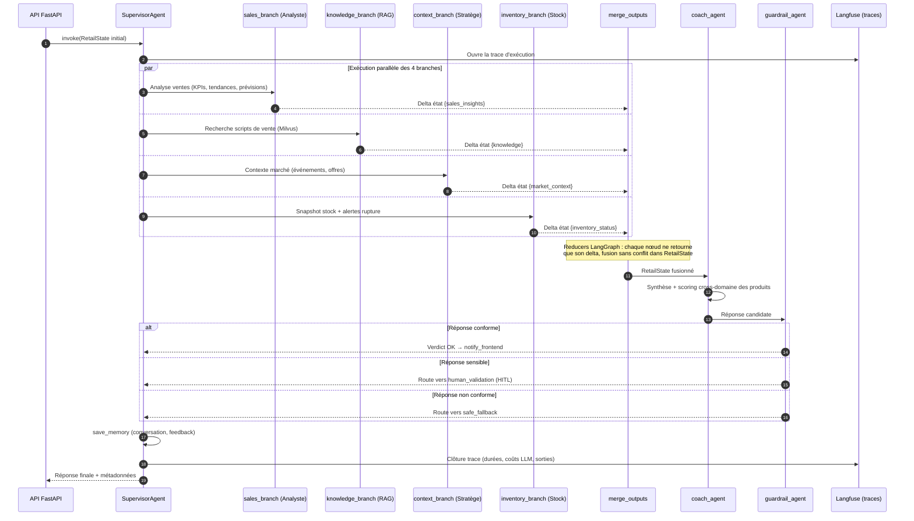

# SEQ-06 — Orchestration multi-agents (SupervisorAgent)

**User stories couvertes :** US-7.1, US-7.2, US-7.3, US-7.4 · **Besoins :** BF-8.1, BF-8.4, BNF-5.4

```mermaid
sequenceDiagram
    autonumber
    participant API as API FastAPI
    participant SUP as SupervisorAgent
    participant SB as sales_branch (Analyste)
    participant KB as knowledge_branch (RAG)
    participant CB as context_branch (Stratège)
    participant IB as inventory_branch (Stock)
    participant M as merge_outputs
    participant CO as coach_agent
    participant G as guardrail_agent
    participant LF as Langfuse (traces)

    API->>SUP: invoke(RetailState initial)
    SUP->>LF: Ouvre la trace d'exécution

    par Exécution parallèle des 4 branches
        SUP->>SB: Analyse ventes (KPIs, tendances, prévisions)
        SB-->>M: Delta état {sales_insights}
    and
        SUP->>KB: Recherche scripts de vente (Milvus)
        KB-->>M: Delta état {knowledge}
    and
        SUP->>CB: Contexte marché (événements, offres)
        CB-->>M: Delta état {market_context}
    and
        SUP->>IB: Snapshot stock + alertes rupture
        IB-->>M: Delta état {inventory_status}
    end

    Note over M: Reducers LangGraph : chaque nœud ne retourne<br/>que son delta, fusion sans conflit dans RetailState

    M->>CO: RetailState fusionné
    CO->>CO: Synthèse + scoring cross-domaine des produits
    CO->>G: Réponse candidate
    alt Réponse conforme
        G-->>SUP: Verdict OK → notify_frontend
    else Réponse sensible
        G-->>SUP: Route vers human_validation (HITL)
    else Réponse non conforme
        G-->>SUP: Route vers safe_fallback
    end
    SUP->>SUP: save_memory (conversation, feedback)
    SUP->>LF: Clôture trace (durées, coûts LLM, sorties)
    SUP-->>API: Réponse finale + métadonnées
```
