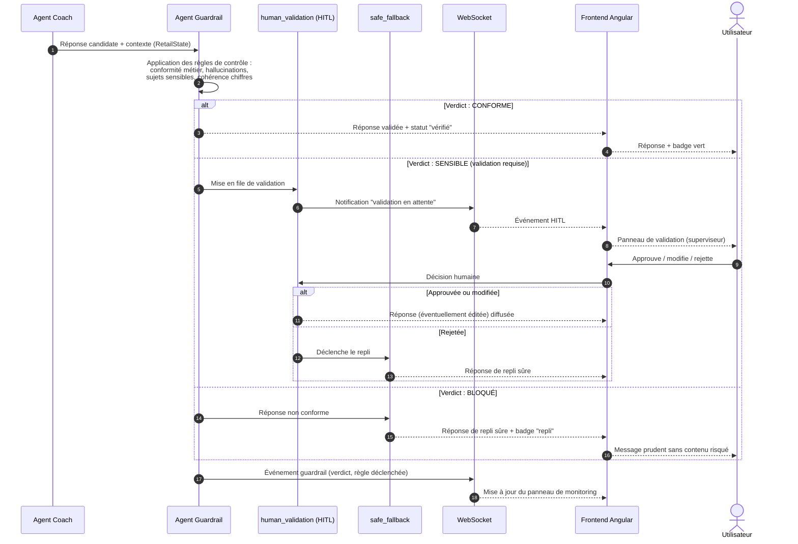

# SEQ-07 — Contrôle des réponses par le Guardrail

**User stories couvertes :** US-8.3, US-8.4, US-8.5 · **Besoins :** BF-7.1, BF-7.2, BF-7.3

```mermaid
sequenceDiagram
    autonumber
    participant CO as Agent Coach
    participant G as Agent Guardrail
    participant H as human_validation (HITL)
    participant F as safe_fallback
    participant WS as WebSocket
    participant FE as Frontend Angular
    actor U as Utilisateur

    CO->>G: Réponse candidate + contexte (RetailState)
    G->>G: Application des règles de contrôle :<br/>conformité métier, hallucinations,<br/>sujets sensibles, cohérence chiffres

    alt Verdict : CONFORME
        G-->>FE: Réponse validée + statut "vérifié"
        FE-->>U: Réponse + badge vert
    else Verdict : SENSIBLE (validation requise)
        G->>H: Mise en file de validation
        H->>WS: Notification "validation en attente"
        WS-->>FE: Événement HITL
        FE-->>U: Panneau de validation (superviseur)
        U->>FE: Approuve / modifie / rejette
        FE->>H: Décision humaine
        alt Approuvée ou modifiée
            H-->>FE: Réponse (éventuellement éditée) diffusée
        else Rejetée
            H->>F: Déclenche le repli
            F-->>FE: Réponse de repli sûre
        end
    else Verdict : BLOQUÉ
        G->>F: Réponse non conforme
        F-->>FE: Réponse de repli sûre + badge "repli"
        FE-->>U: Message prudent sans contenu risqué
    end

    G->>WS: Événement guardrail (verdict, règle déclenchée)
    WS-->>FE: Mise à jour du panneau de monitoring
```
