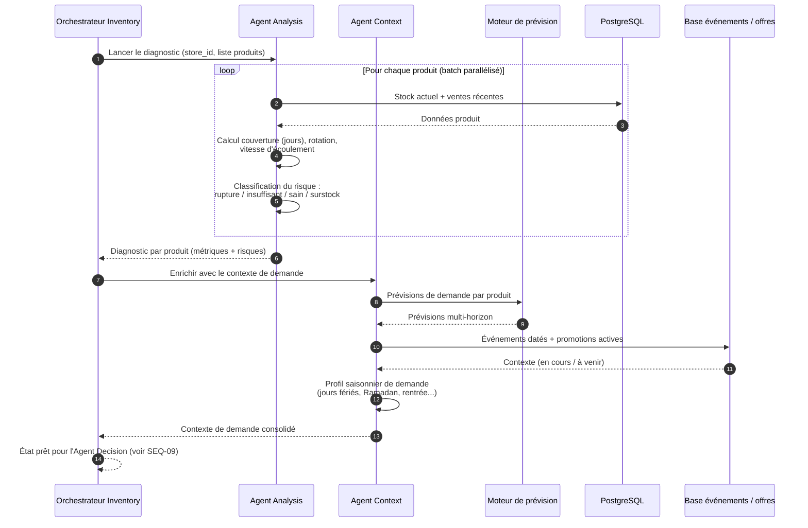

# SEQ-08 — Cycle d'analyse des stocks (Agents Analysis + Context)

**User stories couvertes :** US-5.1, US-5.2 · **Besoins :** BF-1.1, BF-1.2, BF-1.3, BNF-1.1

```mermaid
sequenceDiagram
    autonumber
    participant OR as Orchestrateur Inventory
    participant A as Agent Analysis
    participant CX as Agent Context
    participant FC as Moteur de prévision
    participant DB as PostgreSQL
    participant EV as Base événements / offres

    OR->>A: Lancer le diagnostic (store_id, liste produits)
    loop Pour chaque produit (batch parallélisé)
        A->>DB: Stock actuel + ventes récentes
        DB-->>A: Données produit
        A->>A: Calcul couverture (jours), rotation,<br/>vitesse d'écoulement
        A->>A: Classification du risque :<br/>rupture / insuffisant / sain / surstock
    end
    A-->>OR: Diagnostic par produit (métriques + risques)

    OR->>CX: Enrichir avec le contexte de demande
    CX->>FC: Prévisions de demande par produit
    FC-->>CX: Prévisions multi-horizon
    CX->>EV: Événements datés + promotions actives
    EV-->>CX: Contexte (en cours / à venir)
    CX->>CX: Profil saisonnier de demande<br/>(jours fériés, Ramadan, rentrée...)
    CX-->>OR: Contexte de demande consolidé

    OR-->>OR: État prêt pour l'Agent Decision (voir SEQ-09)
```
