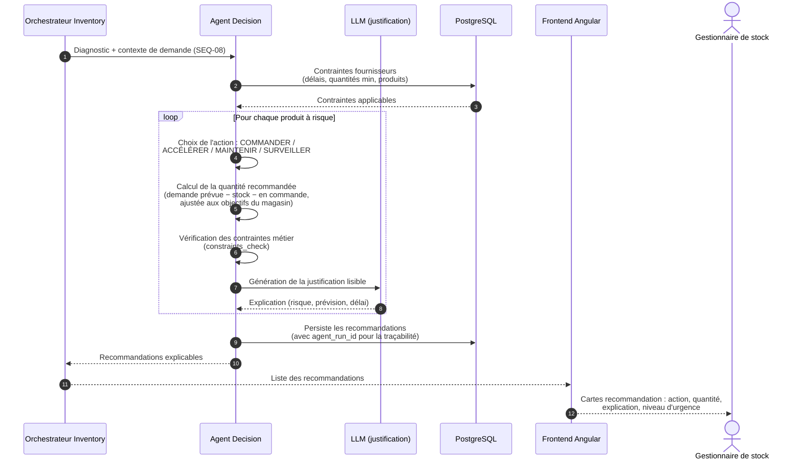

# SEQ-09 — Génération des recommandations de réapprovisionnement

**User stories couvertes :** US-5.3, US-5.4, US-5.5, US-5.6 · **Besoins :** BF-2.1, BF-2.2, BF-2.3, BF-3.1, BNF-5.2

```mermaid
sequenceDiagram
    autonumber
    participant OR as Orchestrateur Inventory
    participant D as Agent Decision
    participant LLM as LLM (justification)
    participant DB as PostgreSQL
    participant FE as Frontend Angular
    actor G as Gestionnaire de stock

    OR->>D: Diagnostic + contexte de demande (SEQ-08)
    D->>DB: Contraintes fournisseurs<br/>(délais, quantités min, produits)
    DB-->>D: Contraintes applicables

    loop Pour chaque produit à risque
        D->>D: Choix de l'action : COMMANDER /<br/>ACCÉLÉRER / MAINTENIR / SURVEILLER
        D->>D: Calcul de la quantité recommandée<br/>(demande prévue − stock − en commande,<br/>ajustée aux objectifs du magasin)
        D->>D: Vérification des contraintes métier<br/>(constraints_check)
        D->>LLM: Génération de la justification lisible
        LLM-->>D: Explication (risque, prévision, délai)
    end

    D->>DB: Persiste les recommandations<br/>(avec agent_run_id pour la traçabilité)
    D-->>OR: Recommandations explicables
    OR-->>FE: Liste des recommandations
    FE-->>G: Cartes recommandation : action, quantité,<br/>explication, niveau d'urgence
```
