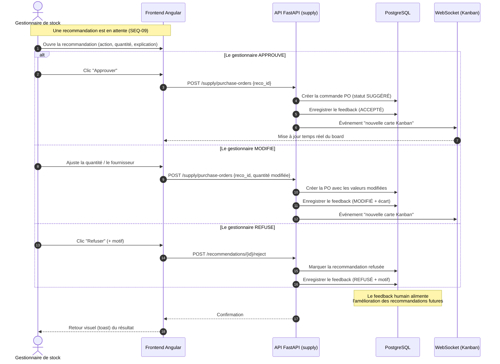

# SEQ-10 — Validation humaine et création de commande (HITL)

**User stories couvertes :** US-8.2, US-9.2, US-10.4 · **Besoins :** BF-3.2, BF-8.3

```mermaid
sequenceDiagram
    autonumber
    actor G as Gestionnaire de stock
    participant FE as Frontend Angular
    participant API as API FastAPI (supply)
    participant DB as PostgreSQL
    participant WS as WebSocket (Kanban)

    Note over G,FE: Une recommandation est en attente (SEQ-09)

    G->>FE: Ouvre la recommandation (action, quantité, explication)
    alt Le gestionnaire APPROUVE
        G->>FE: Clic "Approuver"
        FE->>API: POST /supply/purchase-orders {reco_id}
        API->>DB: Créer la commande PO (statut SUGGÉRÉ)
        API->>DB: Enregistrer le feedback (ACCEPTÉ)
        API->>WS: Événement "nouvelle carte Kanban"
        WS-->>FE: Mise à jour temps réel du board
    else Le gestionnaire MODIFIE
        G->>FE: Ajuste la quantité / le fournisseur
        FE->>API: POST /supply/purchase-orders {reco_id, quantité modifiée}
        API->>DB: Créer la PO avec les valeurs modifiées
        API->>DB: Enregistrer le feedback (MODIFIÉ + écart)
        API->>WS: Événement "nouvelle carte Kanban"
    else Le gestionnaire REFUSE
        G->>FE: Clic "Refuser" (+ motif)
        FE->>API: POST /recommendations/{id}/reject
        API->>DB: Marquer la recommandation refusée
        API->>DB: Enregistrer le feedback (REFUSÉ + motif)
    end

    Note over DB: Le feedback humain alimente<br/>l'amélioration des recommandations futures
    API-->>FE: Confirmation
    FE-->>G: Retour visuel (toast) du résultat
```
