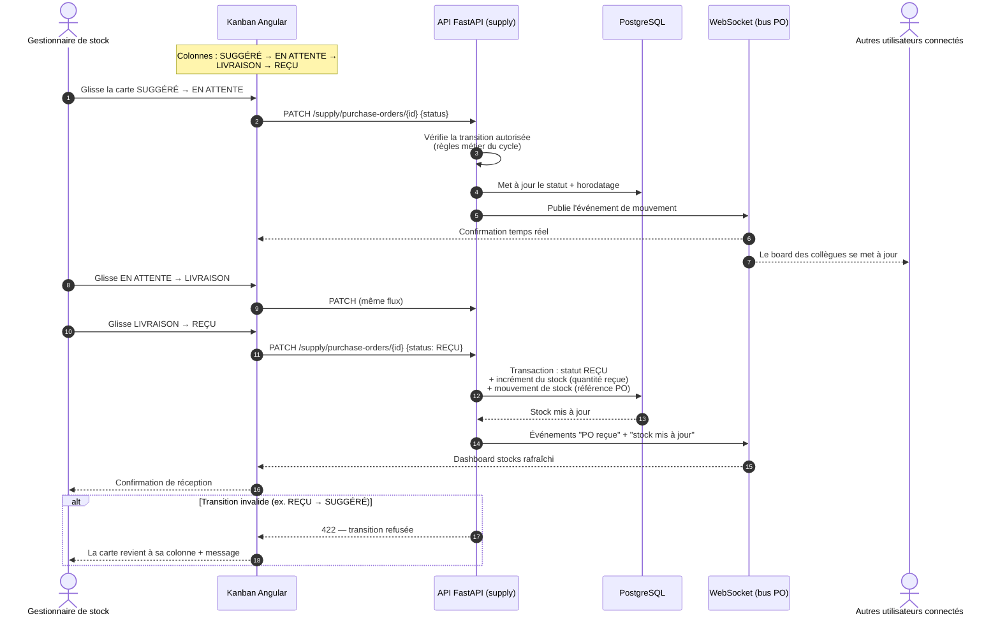

# SEQ-11 — Cycle de vie d'une commande sur le Kanban

**User stories couvertes :** US-9.1, US-9.5, US-9.6 · **Besoins :** BF-3.3, BF-8.5, BNF-3.2

```mermaid
sequenceDiagram
    autonumber
    actor G as Gestionnaire de stock
    participant FE as Kanban Angular
    participant API as API FastAPI (supply)
    participant DB as PostgreSQL
    participant WS as WebSocket (bus PO)
    actor G2 as Autres utilisateurs connectés

    Note over FE: Colonnes : SUGGÉRÉ → EN ATTENTE →<br/>LIVRAISON → REÇU

    G->>FE: Glisse la carte SUGGÉRÉ → EN ATTENTE
    FE->>API: PATCH /supply/purchase-orders/{id} {status}
    API->>API: Vérifie la transition autorisée<br/>(règles métier du cycle)
    API->>DB: Met à jour le statut + horodatage
    API->>WS: Publie l'événement de mouvement
    WS-->>FE: Confirmation temps réel
    WS-->>G2: Le board des collègues se met à jour

    G->>FE: Glisse EN ATTENTE → LIVRAISON
    FE->>API: PATCH (même flux)

    G->>FE: Glisse LIVRAISON → REÇU
    FE->>API: PATCH /supply/purchase-orders/{id} {status: REÇU}
    API->>DB: Transaction : statut REÇU<br/>+ incrément du stock (quantité reçue)<br/>+ mouvement de stock (référence PO)
    DB-->>API: Stock mis à jour
    API->>WS: Événements "PO reçue" + "stock mis à jour"
    WS-->>FE: Dashboard stocks rafraîchi
    FE-->>G: Confirmation de réception

    alt Transition invalide (ex. REÇU → SUGGÉRÉ)
        API-->>FE: 422 — transition refusée
        FE-->>G: La carte revient à sa colonne + message
    end
```
