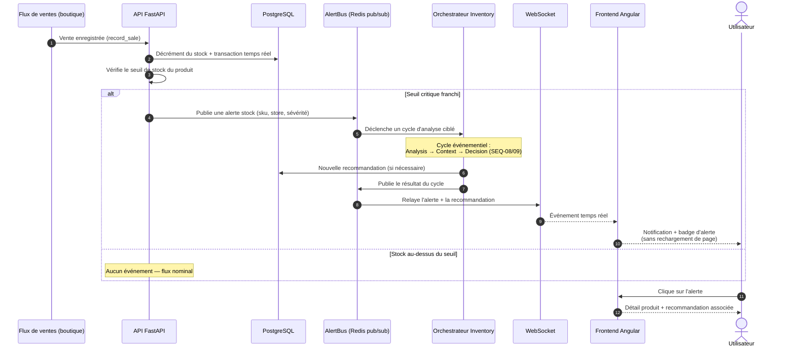

# SEQ-12 — Alertes temps réel et cycle proactif (AlertBus)

**User stories couvertes :** US-9.3, US-9.4 · **Besoins :** BF-6.3, BF-8.5, BNF-1.2

```mermaid
sequenceDiagram
    autonumber
    participant SIM as Flux de ventes (boutique)
    participant API as API FastAPI
    participant DB as PostgreSQL
    participant BUS as AlertBus (Redis pub/sub)
    participant OR as Orchestrateur Inventory
    participant WS as WebSocket
    participant FE as Frontend Angular
    actor U as Utilisateur

    SIM->>API: Vente enregistrée (record_sale)
    API->>DB: Décrément du stock + transaction temps réel
    API->>API: Vérifie le seuil de stock du produit

    alt Seuil critique franchi
        API->>BUS: Publie une alerte stock (sku, store, sévérité)
        BUS->>OR: Déclenche un cycle d'analyse ciblé
        Note over OR: Cycle événementiel :<br/>Analysis → Context → Decision (SEQ-08/09)
        OR->>DB: Nouvelle recommandation (si nécessaire)
        OR->>BUS: Publie le résultat du cycle
        BUS->>WS: Relaye l'alerte + la recommandation
        WS-->>FE: Événement temps réel
        FE-->>U: Notification + badge d'alerte<br/>(sans rechargement de page)
    else Stock au-dessus du seuil
        Note over API: Aucun événement — flux nominal
    end

    U->>FE: Clique sur l'alerte
    FE-->>U: Détail produit + recommandation associée
```
