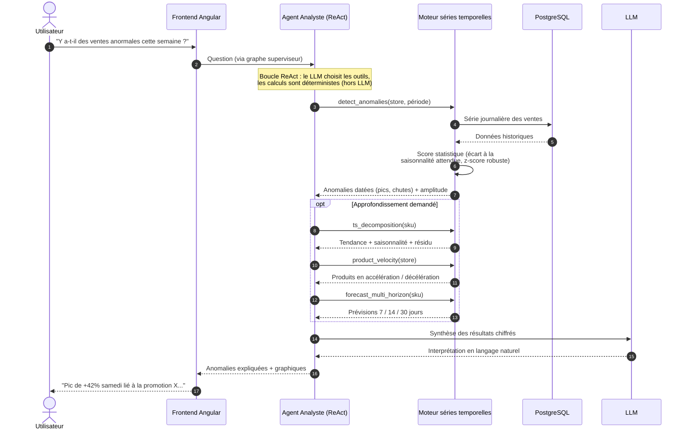

# SEQ-13 — Détection d'anomalies et analyse des séries temporelles

**User stories couvertes :** US-3.4, US-3.5, US-3.6 · **Besoins :** BF-5.3, BNF-5.2

```mermaid
sequenceDiagram
    autonumber
    actor U as Utilisateur
    participant FE as Frontend Angular
    participant AN as Agent Analyste (ReAct)
    participant TS as Moteur séries temporelles
    participant DB as PostgreSQL
    participant LLM as LLM

    U->>FE: "Y a-t-il des ventes anormales cette semaine ?"
    FE->>AN: Question (via graphe superviseur)

    Note over AN: Boucle ReAct : le LLM choisit les outils,<br/>les calculs sont déterministes (hors LLM)

    AN->>TS: detect_anomalies(store, période)
    TS->>DB: Série journalière des ventes
    DB-->>TS: Données historiques
    TS->>TS: Score statistique (écart à la<br/>saisonnalité attendue, z-score robuste)
    TS-->>AN: Anomalies datées (pics, chutes) + amplitude

    opt Approfondissement demandé
        AN->>TS: ts_decomposition(sku)
        TS-->>AN: Tendance + saisonnalité + résidu
        AN->>TS: product_velocity(store)
        TS-->>AN: Produits en accélération / décélération
        AN->>TS: forecast_multi_horizon(sku)
        TS-->>AN: Prévisions 7 / 14 / 30 jours
    end

    AN->>LLM: Synthèse des résultats chiffrés
    LLM-->>AN: Interprétation en langage naturel
    AN-->>FE: Anomalies expliquées + graphiques
    FE-->>U: "Pic de +42% samedi lié à la promotion X..."
```
