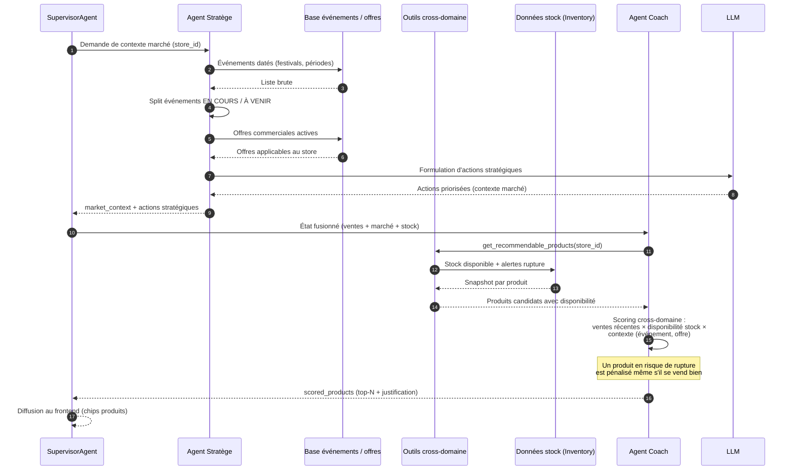

# SEQ-14 — Stratégie cross-domaine et produits recommandés scorés

**User stories couvertes :** US-4.4, US-6.1, US-6.2, US-6.3 · **Besoins :** BF-4.2, BF-6.1, BF-6.2, BF-8.4

```mermaid
sequenceDiagram
    autonumber
    participant SUP as SupervisorAgent
    participant ST as Agent Stratège
    participant EV as Base événements / offres
    participant CD as Outils cross-domaine
    participant INV as Données stock (Inventory)
    participant CO as Agent Coach
    participant LLM as LLM

    SUP->>ST: Demande de contexte marché (store_id)
    ST->>EV: Événements datés (festivals, périodes)
    EV-->>ST: Liste brute
    ST->>ST: Split événements EN COURS / À VENIR
    ST->>EV: Offres commerciales actives
    EV-->>ST: Offres applicables au store
    ST->>LLM: Formulation d'actions stratégiques
    LLM-->>ST: Actions priorisées (contexte marché)
    ST-->>SUP: market_context + actions stratégiques

    SUP->>CO: État fusionné (ventes + marché + stock)
    CO->>CD: get_recommendable_products(store_id)
    CD->>INV: Stock disponible + alertes rupture
    INV-->>CD: Snapshot par produit
    CD-->>CO: Produits candidats avec disponibilité

    CO->>CO: Scoring cross-domaine :<br/>ventes récentes × disponibilité stock ×<br/>contexte (événement, offre)
    Note over CO: Un produit en risque de rupture<br/>est pénalisé même s'il se vend bien

    CO-->>SUP: scored_products (top-N + justification)
    SUP-->>SUP: Diffusion au frontend (chips produits)
```
