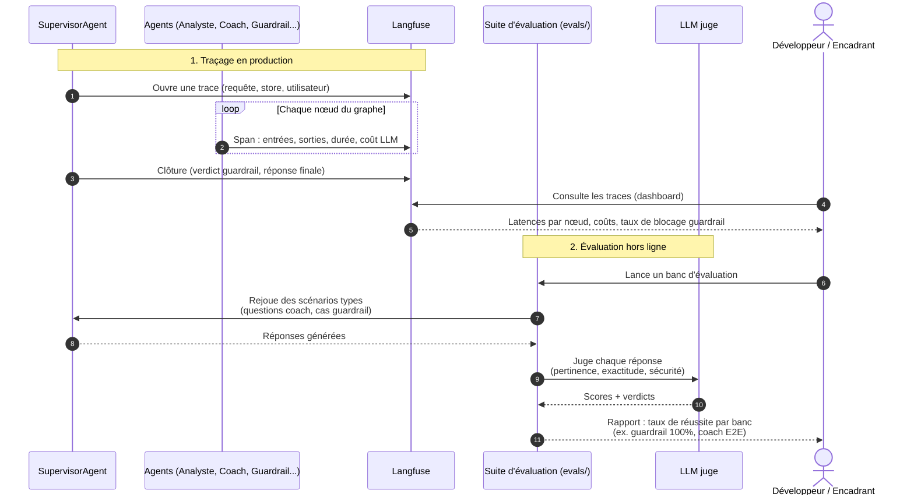

# SEQ-15 — Observabilité et évaluation de la qualité

**User stories couvertes :** US-7.4, US-10.5 · **Besoins :** BNF-5.3, BNF-5.4

```mermaid
sequenceDiagram
    autonumber
    participant SUP as SupervisorAgent
    participant AG as Agents (Analyste, Coach, Guardrail...)
    participant LF as Langfuse
    participant EV as Suite d'évaluation (evals/)
    participant J as LLM juge
    actor D as Développeur / Encadrant

    Note over SUP,LF: 1. Traçage en production

    SUP->>LF: Ouvre une trace (requête, store, utilisateur)
    loop Chaque nœud du graphe
        AG->>LF: Span : entrées, sorties, durée, coût LLM
    end
    SUP->>LF: Clôture (verdict guardrail, réponse finale)

    D->>LF: Consulte les traces (dashboard)
    LF-->>D: Latences par nœud, coûts, taux de blocage guardrail

    Note over EV,J: 2. Évaluation hors ligne

    D->>EV: Lance un banc d'évaluation
    EV->>SUP: Rejoue des scénarios types<br/>(questions coach, cas guardrail)
    SUP-->>EV: Réponses générées
    EV->>J: Juge chaque réponse<br/>(pertinence, exactitude, sécurité)
    J-->>EV: Scores + verdicts
    EV-->>D: Rapport : taux de réussite par banc<br/>(ex. guardrail 100%, coach E2E)
```
